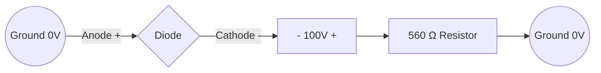
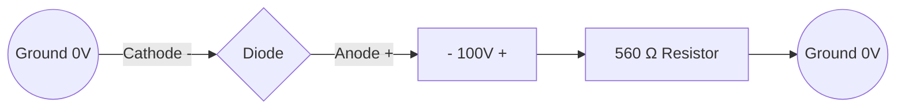

# 二極體電路小考解答 (Diode Circuit Quiz Solutions)
## 📌 核心觀念：完整二極體模型 (Complete Diode Model)

在完整模型下，二極體的等效電路取決於其偏壓狀態：
1.  **順向偏壓 (Forward Bias)**: 等效於 $0.7V$ 電池串聯動態電阻 $r'_d$。
2.  **逆向偏壓 (Reverse Bias)**: 等效於一個巨大的逆向電阻 $r'_R$。

---

## 📝 題目 1：順向偏壓計算 (Forward Bias)

### 1. 電路路徑與偏壓判定

**🔍 偏壓分析 (Biasing Analysis):**
*   **電流路徑**: 電流從接地 (0V) 經過二極體陽極 (Anode)，再流向 100V 電源的負極。
*   **判定結果**: 二極體處於 **順向偏壓 (Forward Bias)** 狀態。

### 2. 給定參數
*   電源電壓 $V_{BIAS} = 100V$
*   限流電阻 $R_{LIMIT} = 560\Omega$
*   順向動態電阻 $r'_d = 10\Omega$
*   障壁電位 $V_B = 0.7V$

### 3. 計算步驟
根據克希荷夫電壓定律 (KVL)：
$$V_{BIAS} = V_B + I_D \cdot r'_d + I_D \cdot R_{LIMIT}$$

**Step 1: 計算電流 $I_D$**
$$100V = 0.7V + I_D(10\Omega + 560\Omega)$$
$$99.3V = I_D \cdot 570\Omega$$
$$I_D = \frac{99.3V}{570\Omega} \approx \mathbf{174.21\,mA}$$

**Step 2: 計算二極體端電壓 $V_D$**
$$V_D = V_B + (I_D \cdot r'_d)$$
$$V_D = 0.7V + (174.21\,mA \cdot 10\Omega)$$
$$V_D = 0.7V + 1.742V = \mathbf{2.442\,V}$$

---

## 📝 題目 2：逆向偏壓計算 (Reverse Bias)

### 1. 電路路徑與偏壓判定

**🔍 偏壓分析 (Biasing Analysis):**
*   **電流路徑**: 由於二極體反接，陰極 (Cathode) 面向正電位端，電流路徑被阻斷。
*   **判定結果**: 二極體處於 **逆向偏壓 (Reverse Bias)** 狀態。

### 2. 給定參數
*   電源電壓 $V_{BIAS} = 100V$
*   限流電阻 $R_{LIMIT} = 560\Omega$
*   逆向電阻 $r'_R = 100\,M\Omega$

### 3. 計算步驟
逆向偏壓下，二極體等效為一個巨大的電阻 $r'_R$：

**Step 1: 計算逆向電流 $I_R$ (或 $I_D$)**
$$I_R = \frac{V_{BIAS}}{r'_R + R_{LIMIT}}$$
$$I_R = \frac{100V}{100,000,000\Omega + 560\Omega} \approx \frac{100V}{10^8\Omega}$$
$$I_R = \mathbf{1\,\mu A}$$

**Step 2: 計算二極體端電壓 $V_D$**
先計算電阻上的微小壓降 $V_{R_{LIMIT}}$：
$$V_{R_{LIMIT}} = I_R \cdot R_{LIMIT} = 1\,\mu A \cdot 560\Omega = 560\,\mu V = 0.00056V$$
根據 KVL：
$$V_D = V_{BIAS} - V_{R_{LIMIT}}$$
$$V_D = 100V - 0.00056V \approx \mathbf{99.999\,V}$$

---

## 💡 期中考解題技巧 (Exam Tips)
1.  **判定優先**：拿到題目先看電池正負極與二極體方向，決定是順向還是逆向。
2.  **模型選擇**：
    *   順向偏壓：算 $I_D$ 時分母要包含 $r'_d$，分子要扣掉 $0.7V$。
    *   逆向偏壓：因為 $r'_R$ 極大，電壓幾乎全部落在二極體上 ($V_D \approx V_{BIAS}$)。
3.  **單位檢查**：$mA$ ($10^{-3}$) 與 $\mu A$ ($10^{-6}$) 的換算最容易出錯。
