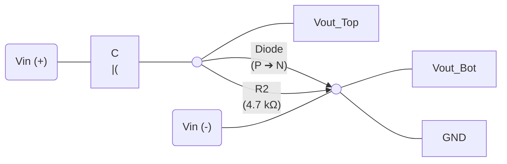

# 二極體電路小考解答 (Diode Circuit Quiz Solutions)
## 中心抽頭全波整流與 PIV (Center-Tapped PIV)

### 1. 電路結構
```mermaid
flowchart LR
    Pri[Input 120Vp-p] -->|4:1| Trans[Transformer]
    Trans --> SecTop[7.5Vp]
    Trans --> SecBot[7.5Vp]
    SecTop -->|Anode (+)| D1{Diode 1}
    SecBot -->|Anode (+)| D2{Diode 2}
    D1 --> Out((V_out))
    D2 --> Out
    Out --> RL[1.0kΩ]
    RL --> GND((Ground))
```

**🔍 偏壓與 PIV 分析:**
*   當 $D_1$ 導通時，$V_{out}$ 處於峰值 $6.8V$。
*   此時 $D_2$ 處於逆向偏壓，其陰極接在 $V_{out} (6.8V)$，陽極接在次級負半週的峰值 $(-7.5V)$。
*   $D_2$ 承受的電位差即為 $PIV = 6.8V - (-7.5V) = 14.3V$。

### 2. 給定參數
*   輸入峰對峰值 $V_{p-p} = 120V$
*   匝數比 $n = 1/4$
*   二極體模型: 實用模型 ($0.7V$)

### 3. 計算步驟
**Step 1: 換算初級峰值**
$$V_{p(pri)} = \frac{120V}{2} = 60V$$

**Step 2: 換算次級總峰值**
$$V_{p(sec)} = 60V \times \frac{1}{4} = 15V$$

**Step 3: 計算單邊峰值與輸出峰值**
$$V_{p(in\_rect)} = \frac{15V}{2} = 7.5V$$
$$V_{p(out)} = 7.5V - 0.7V = \mathbf{6.8V}$$

**Step 4: 計算 PIV (峰值逆向電壓)**
對於中心抽頭整流：
$$PIV = V_{p(sec)} - 0.7V = 15V - 0.7V = \mathbf{14.3V}$$
*(或使用公式 $PIV = 2V_{p(out)} + 0.7V = 13.6V + 0.7V = 14.3V$)*

---

## 📝 題目 2：方波限幅器 (Advanced Square Wave Clipper)

### 1. 電路結構與輸入

```mermaid
flowchart LR
  Vin_Top --- R1["R1 (4.7 kΩ)"]
  R1 --- Node_Top(( ))
  Node_Top --- Vout_Top

  Node_Top -- "(+)Diode(-)" -> R2["R2 (4.7 kΩ)"]

  Vin_Bot --- Node_Bot(( ))
  R2 --- Node_Bot
  Node_Bot --- Vout_Bot

  Node_Bot --- GND

  class Node_Top,Node_Out_Bot nodePoint
```
*   **輸入訊號**: $\pm 8\text{V}$ 的方波 (Square Wave)。
*   **二極體方向**: 箭頭向下 (陽極 Anode 在上，陰極 Cathode 在下)。
*   **測量點**: $V_{out}$ 為輸出端 $Out_Top$ 對 $Out_Bot$ 的電壓。

### 2. 計算步驟與偏壓分析

**Step 1: 正半週分析 ($V_{in} = +8\text{V}$)**
*   **判定**: 二極體陽極 (+) 在上，面對正電位，二極體處於 **順向導通 (ON)**。
*   **計算迴路電流 ($I$)**:
    $$I = \frac{V_{in} - 0.7\text{V}}{R_1 + R_2} = \frac{8\text{V} - 0.7\text{V}}{4.7\text{k}\Omega + 4.7\text{k}\Omega} \approx 0.7766\text{ mA}$$
*   **計算輸出電壓 ($V_{out+}$)**:
    輸出端跨接在二極體與 $R_2$ 上。
    $$V_{out+} = 0.7\text{V} + (I \times R_2) = 0.7\text{V} + (0.7766\text{ mA} \times 4.7\text{k}\Omega) = \mathbf{+4.35\text{V}}$$

**Step 2: 負半週分析 ($V_{in} = -8\text{V}$)**
*   **判定**: 二極體陽極 (+) 在上，面對負電位，二極體處於 **逆向截止 (OFF)**。
*   **計算輸出電壓 ($V_{out-}$)**:
    支路斷開，沒有迴路電流流過 $R_1$，輸出直接跟隨輸入。
    $$V_{out-} = V_{in} = \mathbf{-8\text{V}}$$

### 3. 波形繪製特徵 (Output Waveform)
*   這是一個**正向被限幅的不對稱方波**。
*   **頂部 (Top)**: 被限制在 **$+4.35\text{V}$** 的直線上。
*   **底部 (Bottom)**: 完整保留，維持在 **$-8\text{V}$** 的直線上。

## 📝 題目 3：負向箝位器 (Negative Clamper)

### 1. 電路結構與輸入


**🔍 箝位原理與偏壓分析:**
*   **充電過程**: 當輸入為正半週且超過 $0.7\text{V}$ 時，二極體順向導通 (ON)。電容 $C$ 迅速充電至峰值 $V_{p(in)} - 0.7\text{V}$（極性為左正右負）。
*   **放電過程**: 當輸入電壓下降，二極體進入逆向截止 (OFF)。由於 $R_2 C$ 時間常數通常設計得很大，電容幾乎不放電，視為一個直流電源。
*   **判定結果**: 電容電壓與輸入電壓串聯相加，將波形向下平移 $\rightarrow$ **負向箝位**。

### 2. 計算步驟
*   **給定條件**: 輸入 $V_{in} = \pm 4\text{V}$ (即 $V_{p(in)} = 4\text{V}$)。

**Step 1: 計算電容儲存電壓 ($V_C$)**
當 $V_{in}$ 處於正半週峰值時，二極體導通，電容充電：
$$V_C = V_{p(in)} - 0.7\text{V} = 4\text{V} - 0.7\text{V} = \mathbf{3.3\text{V}}$$

**Step 2: 計算輸出峰值電壓 ($V_{out}$)**
箝位器將波形向下平移 $V_C$ ($3.3\text{V}$)：
$$V_{out} = V_{in} - 3.3\text{V}$$
*   **正峰值 (Peak High)**: $4\text{V} - 3.3\text{V} = \mathbf{+0.7\text{V}}$
*   **負峰值 (Peak Low)**: $-4\text{V} - 3.3\text{V} = \mathbf{-7.3\text{V}}$

### 3. 波形繪製特徵
*   **峰對峰值**: 維持 $8\text{V}$ ($0.7 - (-7.3) = 8\text{V}$)。
*   **箝位效果**: 整個波形被「壓」在 $0.7\text{V}$ 以下。最高點為 $+0.7\text{V}$，最低點為 $-7.3\text{V}$。

