# Ch1 簡介 (Introduction)

---

**📄 Slide 01**

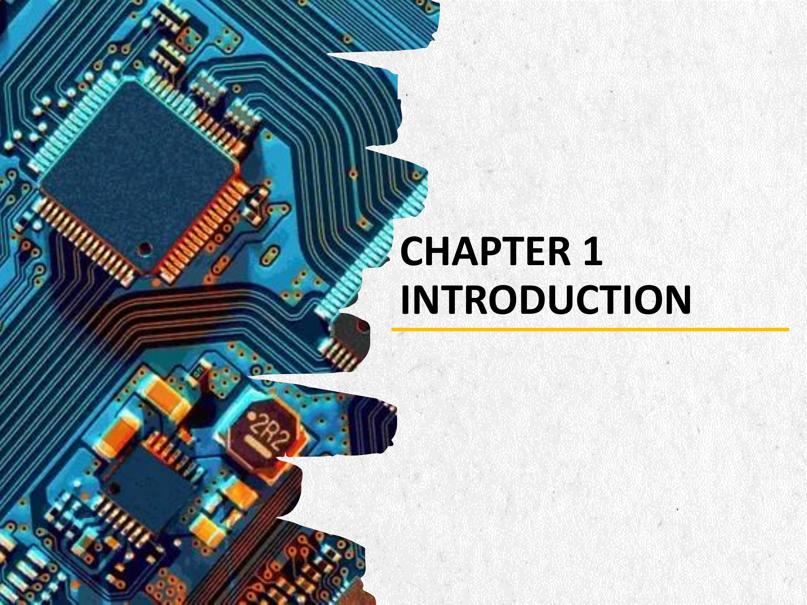

## 第 1 章 簡介 (Chapter 1 Introduction)

---

**📄 Slide 02**

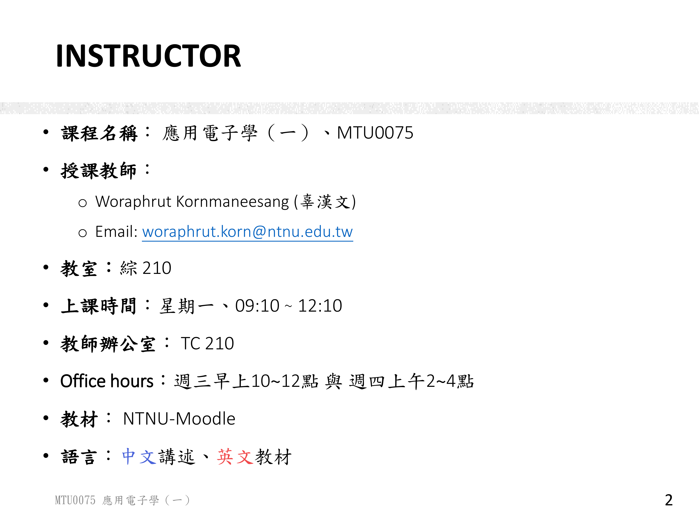

## 授課資訊 (Instructor)

*   **課程名稱**：應用電子學（一）、MTU0075
*   **授課教師**：Woraphrut Kornmaneesang (辜漢文)
*   **Email**：woraphrut.korn@ntnu.edu.tw
*   **教室**：綜 210
*   **上課時間**：星期一、09:10 ~ 12:10
*   **教師辦公室**：TC 210
*   **Office hours**：週三早上 10~12 點 與 週四上午 2~4 點
*   **教材**：NTNU-Moodle
*   **語言**：中文講述、英文教材

---

**📄 Slide 03**

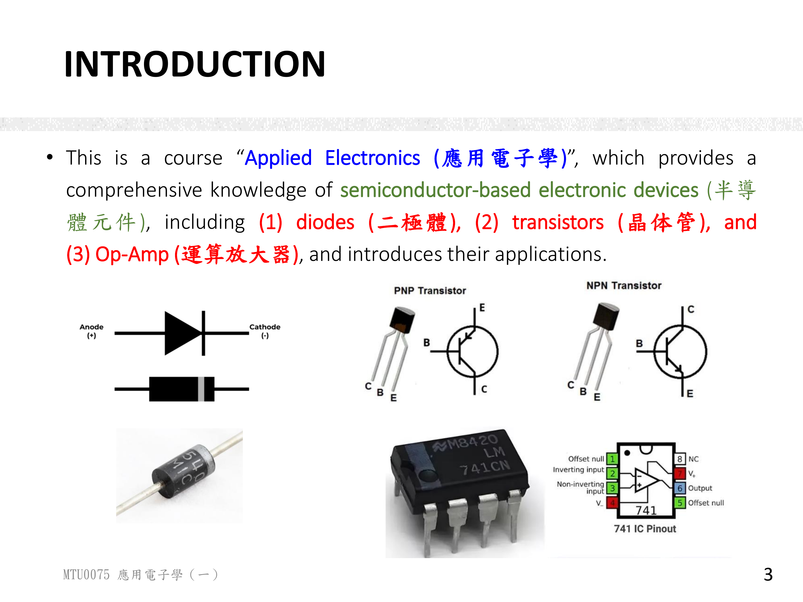

## 課程簡介 (Introduction)

*   本課程為「**應用電子學**」，提供關於**半導體元件（semiconductor-based electronic devices）**的全面性知識。
*   內容包含：
    1.  **二極體（diodes）**
    2.  **電晶體（transistors）**
    3.  **運算放大器（Op-Amp）**
*   本課程同時也將介紹上述元件之應用。

---

**📄 Slide 04**

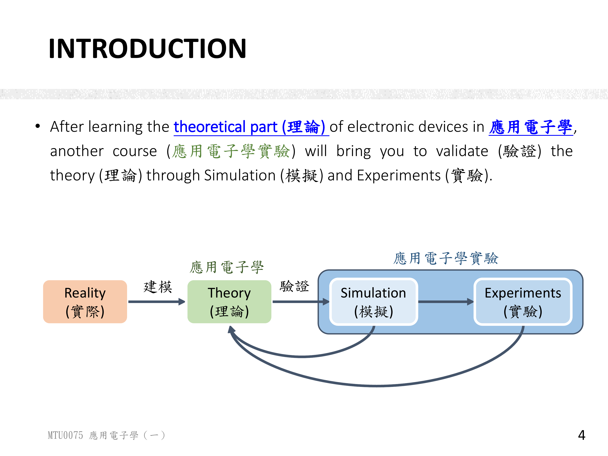

## 理論與實作 (Theory and Practice)

*   在《應用電子學》學習完電子元件的**理論（Theory）**之後，另一門課程《應用電子學實驗》將帶領您透過**模擬（Simulation）**與**實驗（Experiments）**來**驗證（Validate）**這些理論。

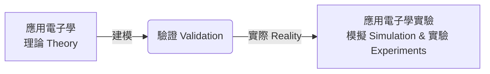
```mermaid
flowchart LR
    A[應用電子學\n理論 Theory] -->|建模| B(驗證 Validation)
    B -->|實際 Reality| C[應用電子學實驗\n模擬 Simulation & 實驗 Experiments]
```

---

**📄 Slide 05**

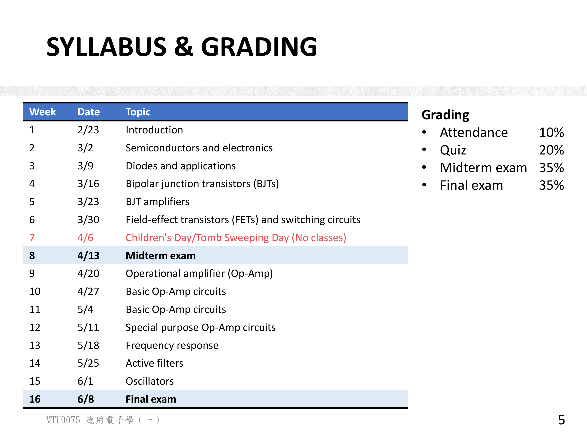

## 課程大綱與評分方式 (Syllabus & Grading)

### 評分標準 (Grading)
*   出席（Attendance）：10%
*   小考（Quiz）：20%
*   期中考（Midterm exam）：35%
*   期末考（Final exam）：35%

### 課程大綱 (Syllabus)

| 週次 (Week) | 日期 (Date) | 主題 (Topic) |
| :---: | :---: | :--- |
| 1 | 2/23 | 簡介 (Introduction) |
| 2 | 3/2 | 半導體與電子學 (Semiconductors and electronics) |
| 3 | 3/9 | 二極體及其應用 (Diodes and applications) |
| 4 | 3/16 | 雙載子接面電晶體 (Bipolar junction transistors, BJTs) |
| 5 | 3/23 | BJT 放大器 (BJT amplifiers) |
| 6 | 3/30 | 場效電晶體與開關電路 (Field-effect transistors (FETs) and switching circuits) |
| 7 | 4/6 | 兒童節/清明節連假 (Children's Day/Tomb Sweeping Day - No classes) |
| 8 | 4/13 | **期中考 (Midterm exam)** |
| 9 | 4/20 | 運算放大器 (Operational amplifier, Op-Amp) |
| 10 | 4/27 | 基本運算放大器電路 (Basic Op-Amp circuits) |
| 11 | 5/4 | 基本運算放大器電路 (Basic Op-Amp circuits) |
| 12 | 5/11 | 特殊用途運算放大器電路 (Special purpose Op-Amp circuits) |
| 13 | 5/18 | 頻率響應 (Frequency response) |
| 14 | 5/25 | 主動濾波器 (Active filters) |
| 15 | 6/1 | 振盪器 (Oscillators) |
| 16 | 6/8 | **期末考 (Final exam)** |

---

**📄 Slide 06**

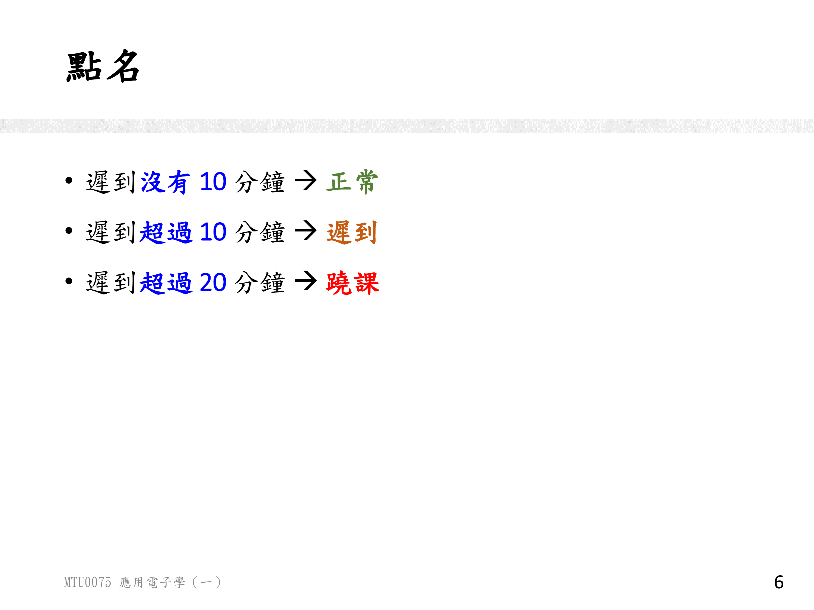

## 點名規定 (Attendance)

*   遲到**未滿** 10 分鐘 $\rightarrow$ **正常**
*   遲到**超過** 10 分鐘 $\rightarrow$ **遲到**
*   遲到**超過** 20 分鐘 $\rightarrow$ **蹺課**

---

**📄 Slide 07**

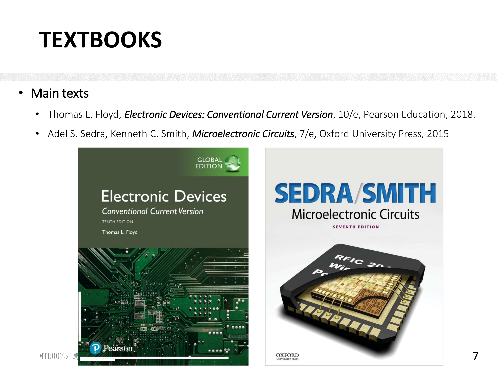

## 教科書 (Textbooks)

### 主要原文書籍 (Main texts)
*   Thomas L. Floyd, *Electronic Devices: Conventional Current Version*, 10/e, Pearson Education, 2018.
*   Adel S. Sedra, Kenneth C. Smith, *Microelectronic Circuits*, 7/e, Oxford University Press, 2015.

---

**📄 Slide 08**

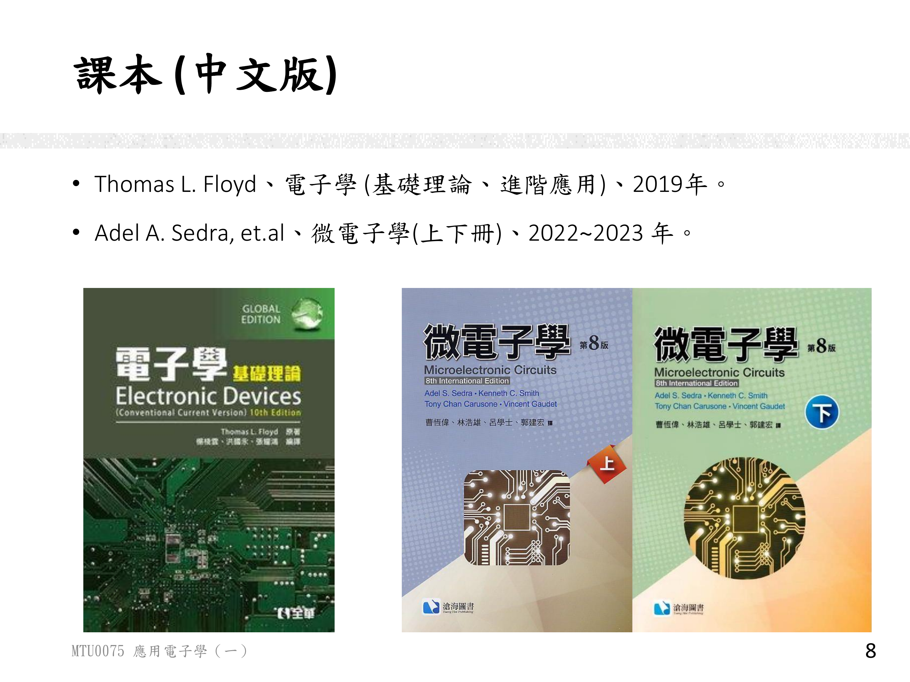

## 課本 (中文版)

*   Thomas L. Floyd 著，《電子學 (基礎理論、進階應用)》，2019 年。
*   Adel A. Sedra, et al. 著，《微電子學(上下冊)》，2022~2023 年。

---

**📄 Slide 09**

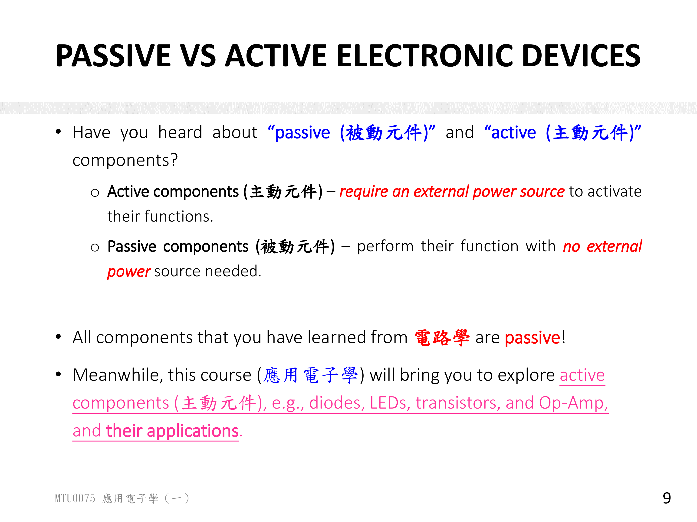

## 被動與主動電子元件 (Passive vs Active Electronic Devices)

*   您聽過「**被動元件 (passive)**」和「**主動元件 (active)**」嗎？
    *   **主動元件 (Active components)**：需要外部電源才能啟動其功能。
    *   **被動元件 (Passive components)**：無需外部電源即可執行其功能。
*   您在《電路學》中學到的所有元件都是**被動的**！
*   同時，本課程（《應用電子學》）將帶您探索**主動元件**，例如：二極體 (diodes)、發光二極體 (LEDs)、電晶體 (transistors) 和運算放大器 (Op-Amp) 及其應用。

---

**📄 Slide 10**

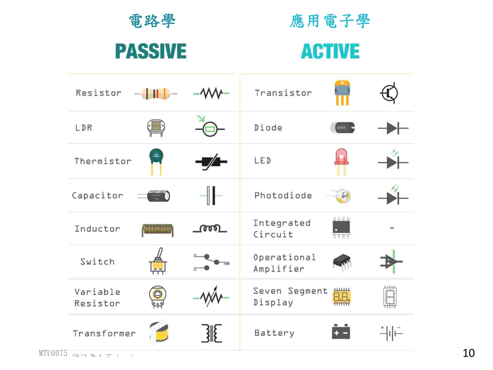

## 電路學 vs 應用電子學

*   **電路學**：主要探討被動元件（電阻、電容、電感）等基礎電路與定理。
*   **應用電子學**：主要探討由半導體構成的主動元件（如 IC、電晶體等）及其應用電路。

---

**📄 Slide 11**

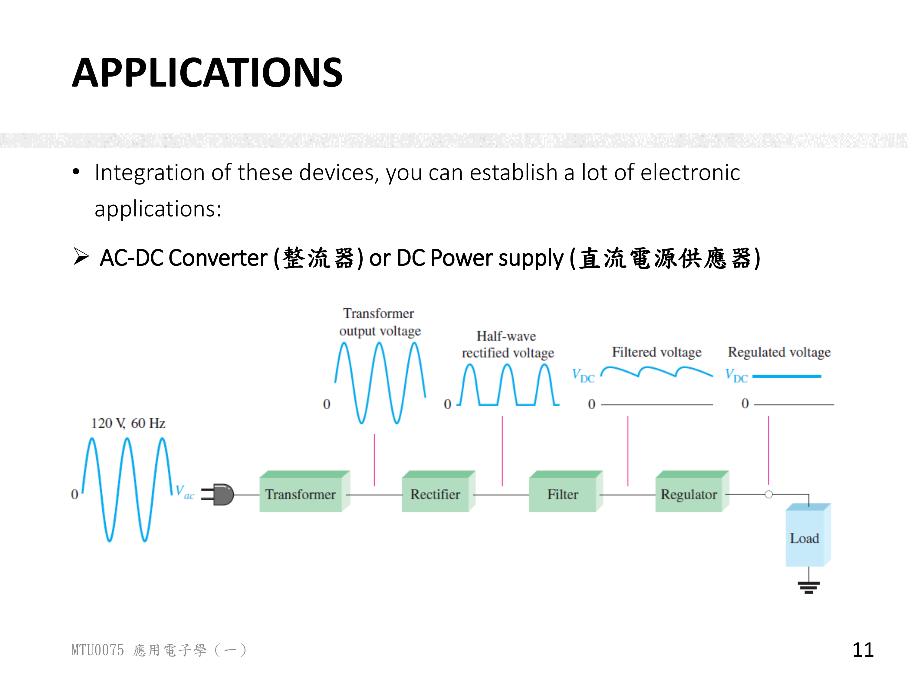

## 應用 (Applications) - 1

*   整合這些電子元件，您可以建立許多電子應用系統：
    *   **交流-直流轉換器 (AC-DC Converter / 整流器)** 或 **直流電源供應器 (DC Power supply)**

---

**📄 Slide 12**

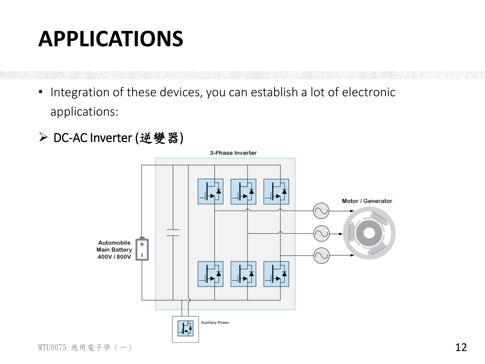

## 應用 (Applications) - 2

*   整合這些電子元件，您可以建立許多電子應用系統：
    *   **直流-交流逆變器 (DC-AC Inverter)**

---

**📄 Slide 13**

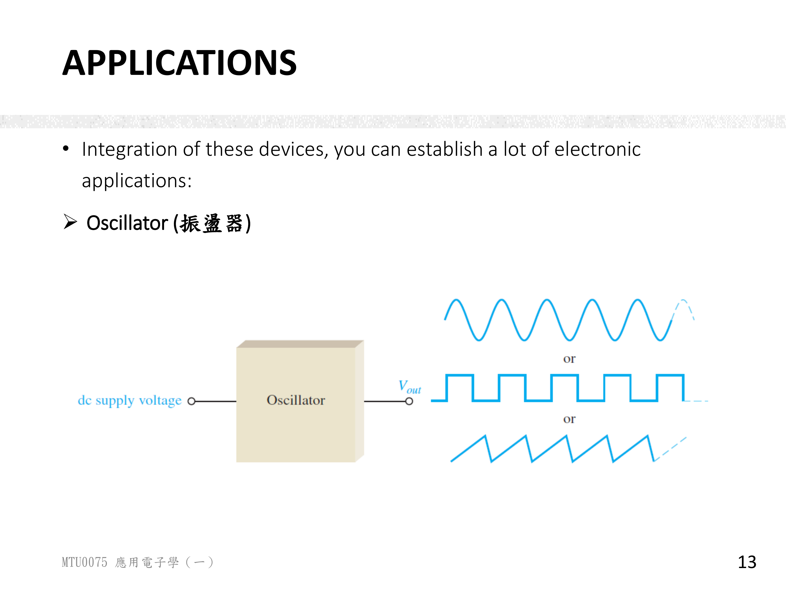

## 應用 (Applications) - 3

*   整合這些電子元件，您可以建立許多電子應用系統：
    *   **振盪器 (Oscillator)**

---

**📄 Slide 14**

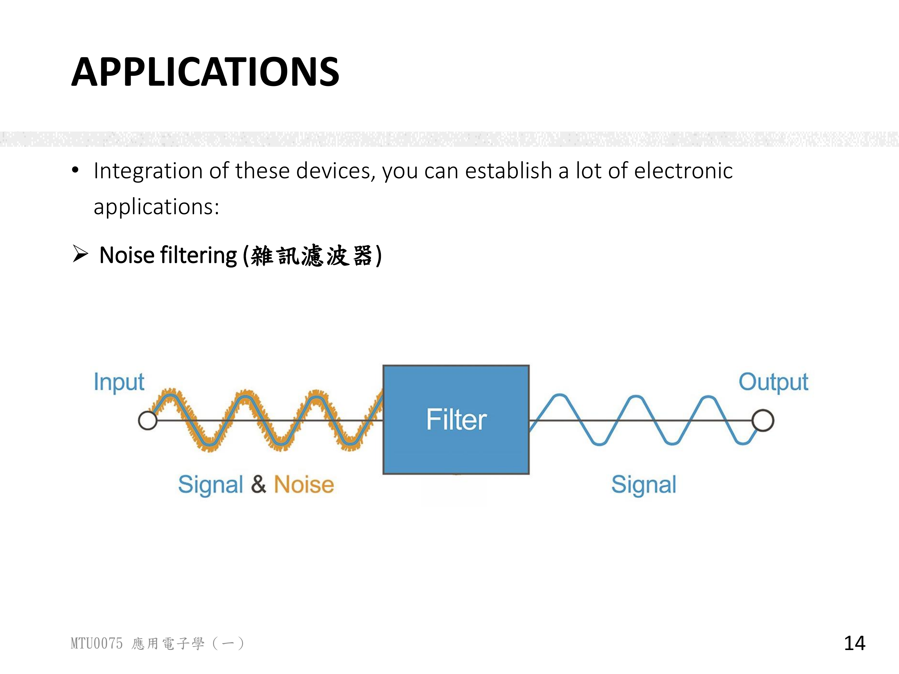

## 應用 (Applications) - 4

*   整合這些電子元件，您可以建立許多電子應用系統：
    *   **雜訊濾波器 (Noise filtering)**

---

**📄 Slide 15**

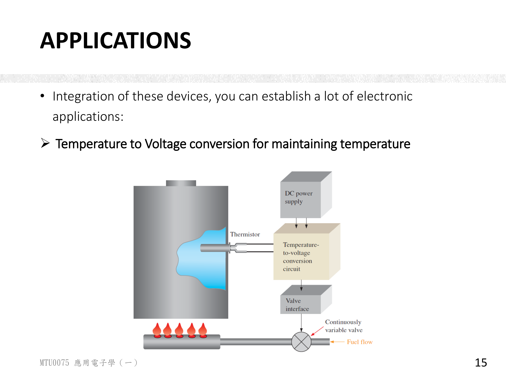

## 應用 (Applications) - 5

*   整合這些電子元件，您可以建立許多電子應用系統：
    *   **溫度轉電壓轉換器 (Temperature to Voltage conversion)**，可用於維持或監控溫度。

---

**📄 Slide 16**

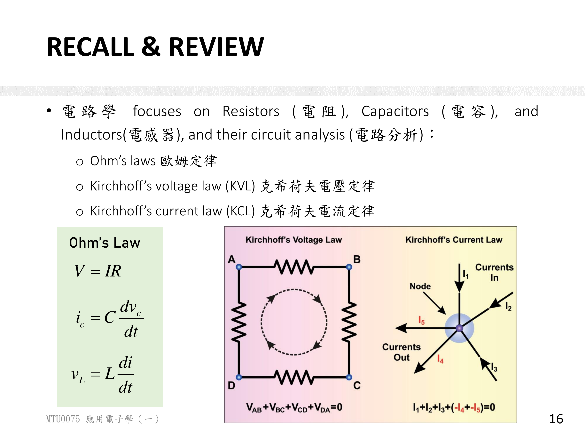

## 回顧與複習 (Recall & Review)

*   《電路學》著重於**電阻 (Resistors)**、**電容 (Capacitors)** 和**電感器 (Inductors)**，及其電路分析 (circuit analysis)：
    *   **歐姆定律 (Ohm’s laws)**: 
        $$V = I R$$
    *   **克希荷夫電壓定律 (Kirchhoff’s voltage law, KVL)**
    *   **克希荷夫電流定律 (Kirchhoff’s current law, KCL)**

*   **元件特性方程式**:
    *   電容 (Capacitor): $$i = C \frac{dv}{dt}$$
    *   電感 (Inductor): $$v = L \frac{di}{dt}$$

---

**📄 Slide 17**

## 課程大綱與評分方式 (Syllabus & Grading)

*(此頁同 Slide 05，再次重申評分標準與課程進度規劃。)*

---

**📄 Slide 18**

## 課堂注意事項 (Better to Know)

*   每 2 週會有一次小考（視情況調整）。
*   如果您在課堂上有問題：
    *   請立即發問
    *   在下課休息時間發問
    *   在下課後發問
    *   在任何地方遇到我時發問
*   **請勿**寫 Email 要求額外加分 (DO NOT email me for extra score!)
*   若需要**授權碼**的同學，請於課後找老師。