# Ch3 二極體 (Diodes)

---

**📄 Slide 01**

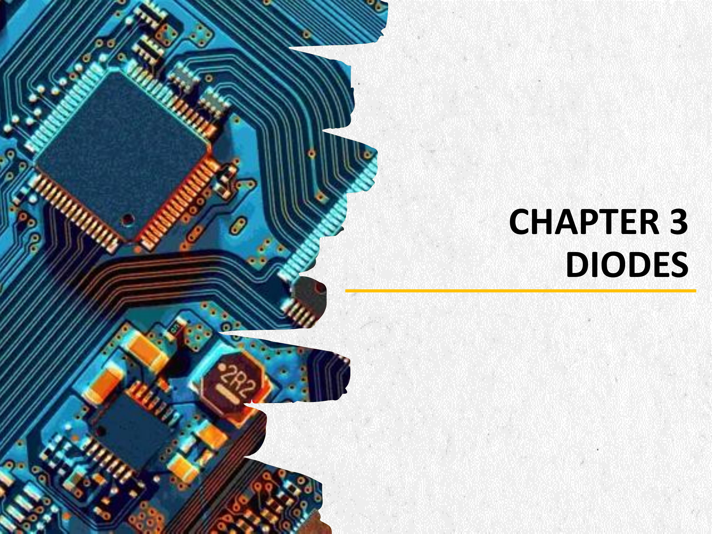

## 第 3 章 二極體 (Chapter 3 Diodes)

---

**📄 Slide 02**

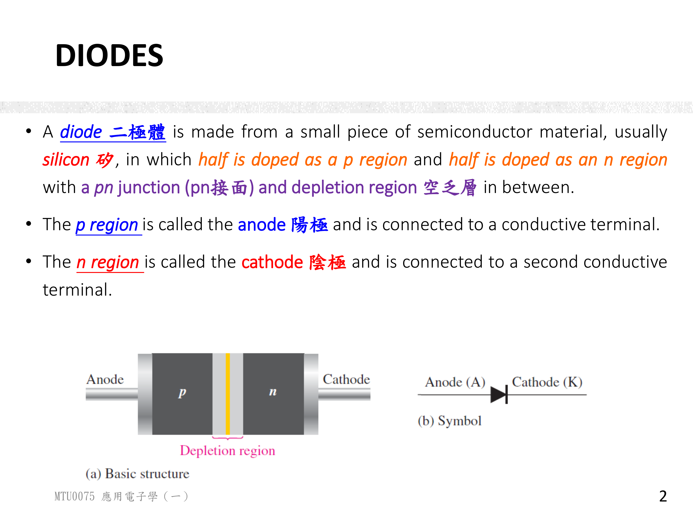

## 二極體 (Diodes)

*   **二極體 (diode)** 由一小塊半導體材料（通常是**矽**）製成，其中一半摻雜為 p 區，另一半摻雜為 n 區，兩者之間有 **pn 接面 (pn junction)** 和**空乏層 (depletion region)**。
*   p 區稱為**陽極 (anode)**，並連接到一個導電端子。
*   n 區稱為**陰極 (cathode)**，並連接到第二個導電端子。

---

**📄 Slide 03**

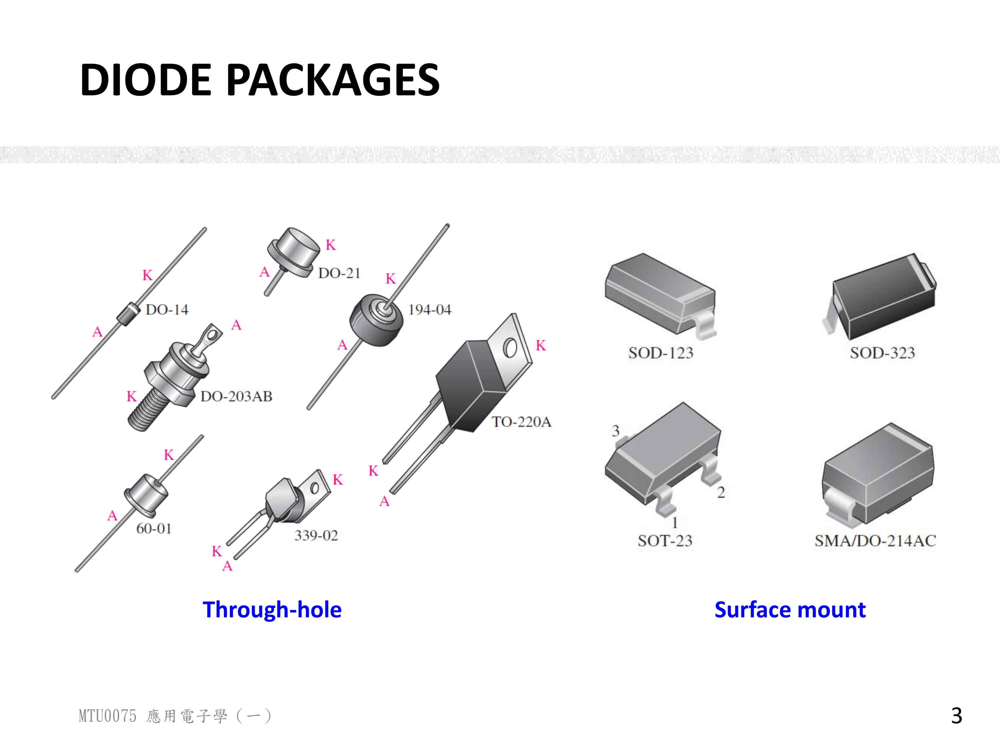

## 二極體封裝 (Diode Packages)

*   穿孔式 (Through-hole)
*   表面黏著式 (Surface mount)

---

**📄 Slide 04**

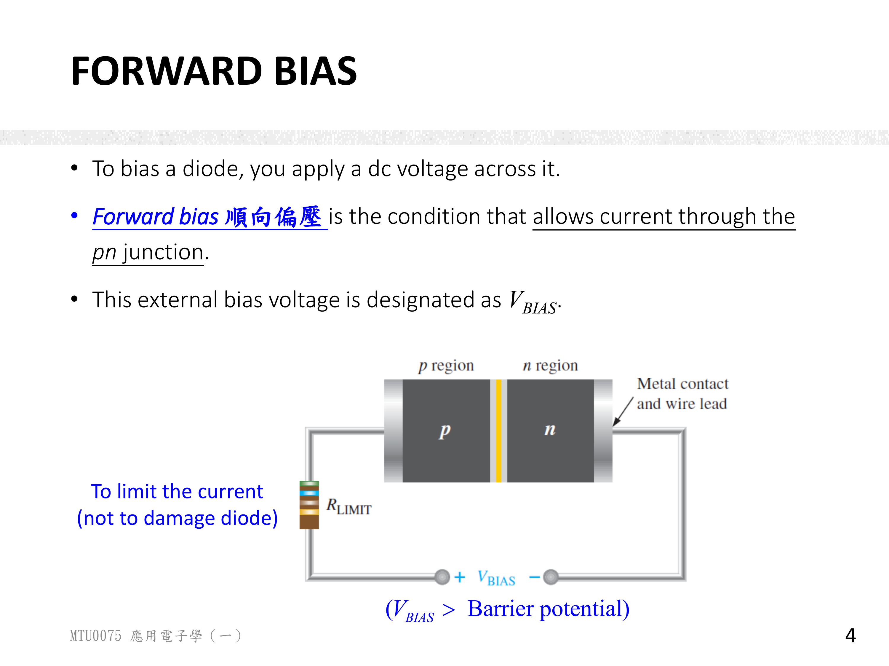

## 順向偏壓 (Forward Bias)

*   要使二極體產生偏壓，需要在其兩端施加直流電壓。
*   **順向偏壓 (Forward bias)** 是允許電流通過 pn 接面的條件。
*   此外部偏壓電壓稱為 $V_{BIAS}$。
*   *(圖片標示：串聯電阻用於限制電流 To limit the current，以避免損壞二極體)*
*   條件：

$$V_{BIAS} > V_{Barrier\ potential}$$

---

**📄 Slide 05**

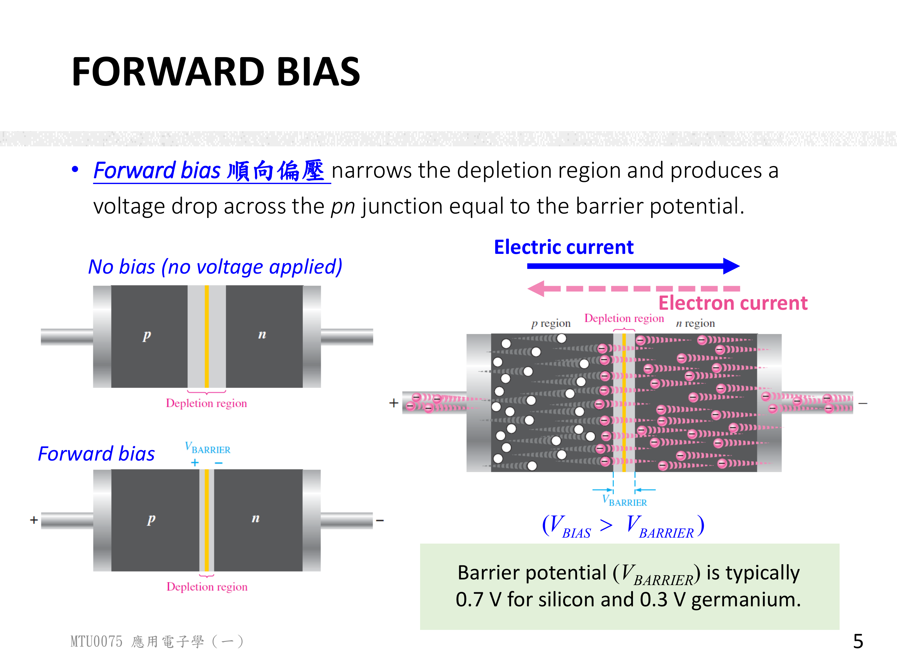

## 順向偏壓 (Forward Bias) - 續

*   **順向偏壓 (Forward bias)** 會使空乏區變窄，並在 pn 接面兩端產生等於障壁電位的電壓降。
*   **無偏壓 (No bias)**：未施加電壓。
*   **順向偏壓 (Forward bias)**：產生電流 (Electric current) 與電子流 (Electron current)。
*   **障壁電位 ($V_{BARRIER}$)** 對於矽 (Silicon) 通常為 $0.7\text{ V}$，對於鍺 (Germanium) 為 $0.3\text{ V}$。
*   條件：

$$V_{BIAS} > V_{BARRIER}$$

---

**📄 Slide 06**

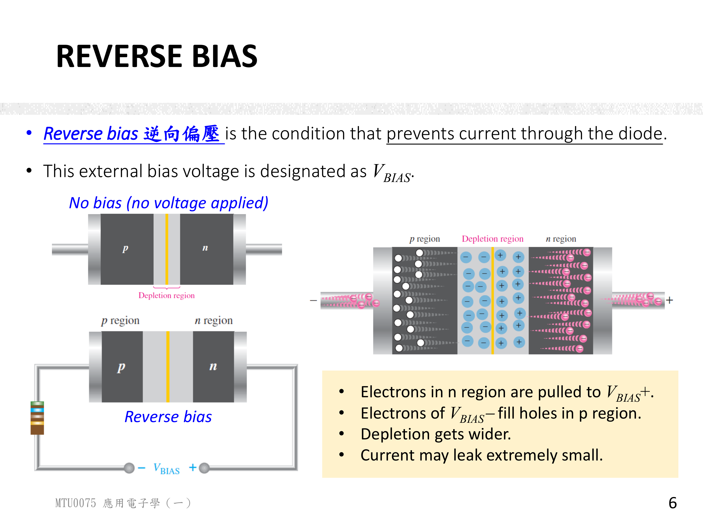

## 逆向偏壓 (Reverse Bias)

*   **逆向偏壓 (Reverse bias)** 是防止電流通過二極體的條件。
*   此外部偏壓電壓稱為 $V_{BIAS}$。
*   **無偏壓 (No bias)**：未施加電壓。
*   **逆向偏壓 (Reverse bias)** 的特性：
    *   n 區的電子被拉向 $V_{BIAS}$ 的正極 ($+$)。
    *   $V_{BIAS}$ 負極 ($-$) 的電子填補了 p 區的電洞。
    *   空乏區變寬 (Depletion gets wider)。
    *   可能會產生極小的漏電流 (Current may leak extremely small)。

---

**📄 Slide 07**

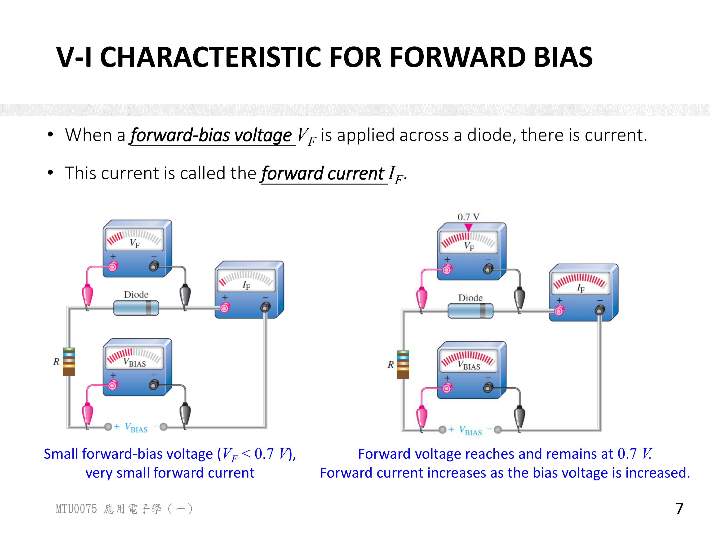

## 順向偏壓的 V-I 特性曲線 (V-I Characteristic for Forward Bias)

*   當在二極體兩端施加順向偏壓 $V_F$ 時，會產生電流。
*   這個電流被稱為**順向電流 (forward current, $I_F$)**。
*   當順向偏壓很小（$V_F < 0.7\text{ V}$）時，順向電流非常小。
*   當順向電壓達到並保持在 $0.7\text{ V}$ 時，順向電流會隨著偏壓的增加而增加。

---

**📄 Slide 08**

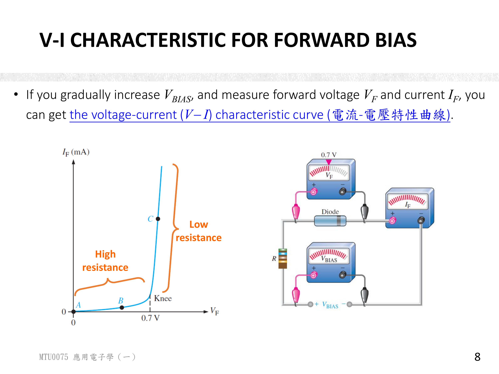

## 順向偏壓的 V-I 特性曲線 - 續

*   如果逐漸增加 $V_{BIAS}$，並測量順向電壓 $V_F$ 和電流 $I_F$，您就可以得到**電壓-電流 ($V-I$) 特性曲線**。
*   *(圖中標示：低電阻 Low resistance、高電阻 High resistance)*

---

**📄 Slide 09**

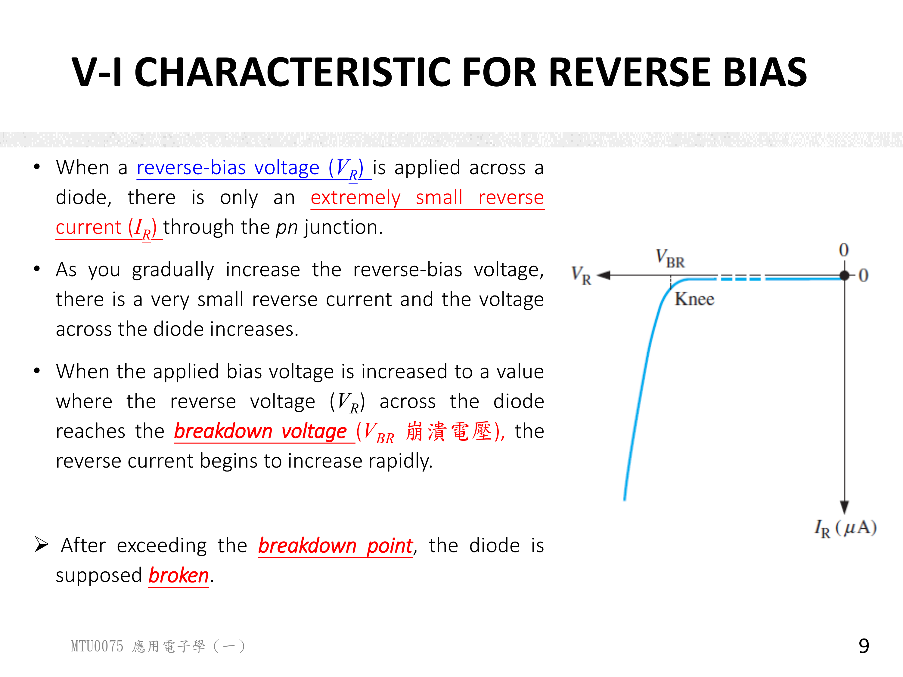

## 逆向偏壓的 V-I 特性曲線 (V-I Characteristic for Reverse Bias)

*   當在二極體兩端施加**逆向偏壓 ($V_R$)** 時，只有極小的**逆向電流 ($I_R$)** 通過 pn 接面。
*   當您逐漸增加逆向偏壓時，逆向電流非常小，且二極體兩端的電壓會增加。
*   當施加的偏壓增加到使二極體兩端的逆向電壓 ($V_R$) 達到**崩潰電壓 ($V_{BR}$)** 的數值時，逆向電流開始快速增加。
    *   $\rightarrow$ 在超過崩潰點後，二極體通常已經損壞。

---

**📄 Slide 10**

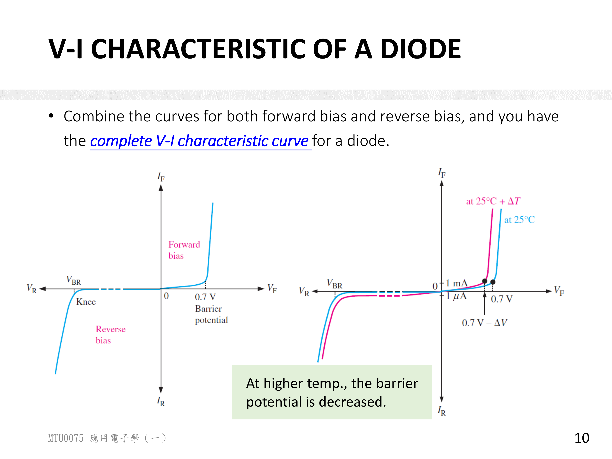

## 二極體的 V-I 特性曲線 (V-I Characteristic of a Diode)

*   結合順向偏壓和逆向偏壓的曲線，您就得到了完整的二極體 $V-I$ 特性曲線。
*   在較高的溫度下，障壁電位會降低 (At higher temp., the barrier potential is decreased)。

---

**📄 Slide 11**

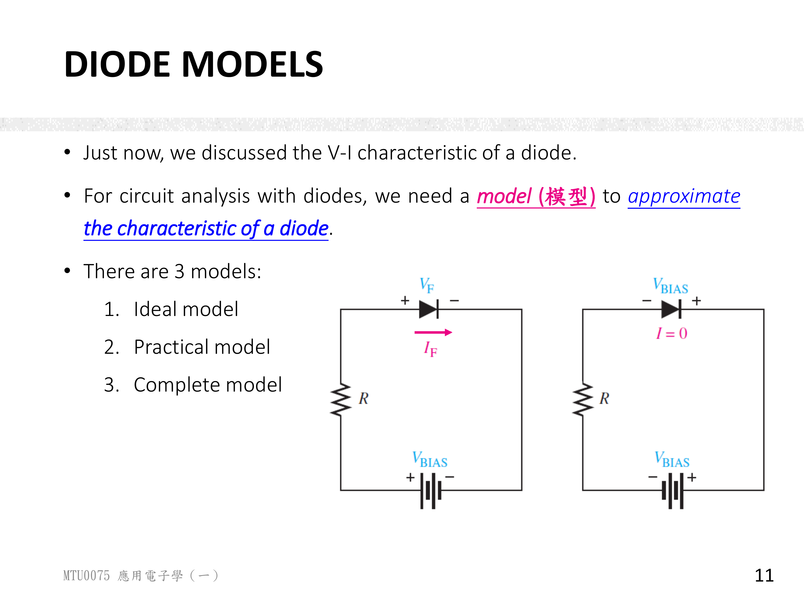

## 二極體模型 (Diode Models)

*   剛剛我們討論了二極體的 $V-I$ 特性。
*   為了進行包含二極體的電路分析，我們需要一個**模型 (model)** 來近似二極體的特性。
*   共有三種模型：
    1.  **理想模型 (Ideal model)**
    2.  **實用模型 (Practical model)**
    3.  **完整模型 (Complete model)**

---

**📄 Slide 12**

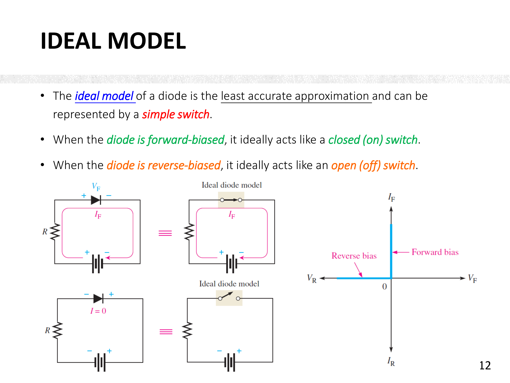

## 理想模型 (Ideal Model)

*   二極體的**理想模型**是最不精確的近似方式，可以表示為一個簡單的開關。
*   當二極體處於順向偏壓時，理想情況下它就像一個**閉合的（開啟的）開關** (closed/on switch)。
*   當二極體處於逆向偏壓時，理想情況下它就像一個**斷開的（關閉的）開關** (open/off switch)。

---

**📄 Slide 13**

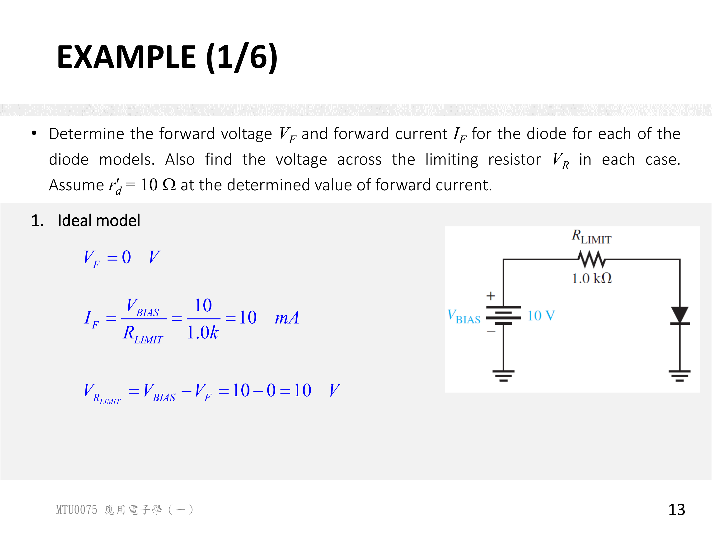

## 範例 (Example) 1/6: 理想模型 - 順向偏壓

*   **條件**: $V_{BIAS} = 10V, R_{LIMIT} = 1k\Omega$。使用**理想模型 (Ideal Model)**。
*   **計算**:
    *   二極體視為短路：$V_F = 0V$
    *   順向電流: $I_F = \frac{V_{BIAS}}{R_{LIMIT}} = \frac{10V}{1k\Omega} = \mathbf{10mA}$
    *   限流電阻壓降: $V_{R_{LIMIT}} = V_{BIAS} - V_F = 10V - 0V = \mathbf{10V}$

---

**📄 Slide 14**

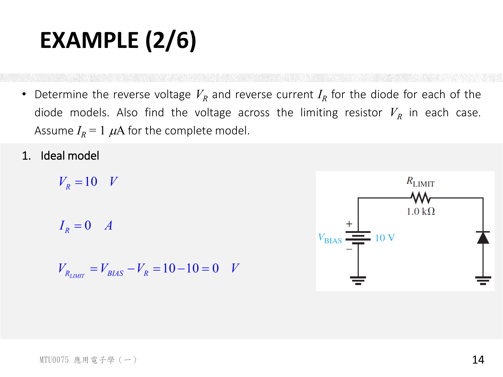

## 範例 (Example) 2/6: 理想模型 - 逆向偏壓

*   **條件**: $V_{BIAS} = 10V, R_{LIMIT} = 1k\Omega$。使用**理想模型 (Ideal Model)**。
*   **計算**:
    *   二極體視為斷路：$I_R = 0A$
    *   逆向電壓: $V_R = V_{BIAS} = \mathbf{10V}$
    *   限流電阻壓降: $V_{R_{LIMIT}} = I_R \cdot R_{LIMIT} = \mathbf{0V}$

---

**📄 Slide 15**

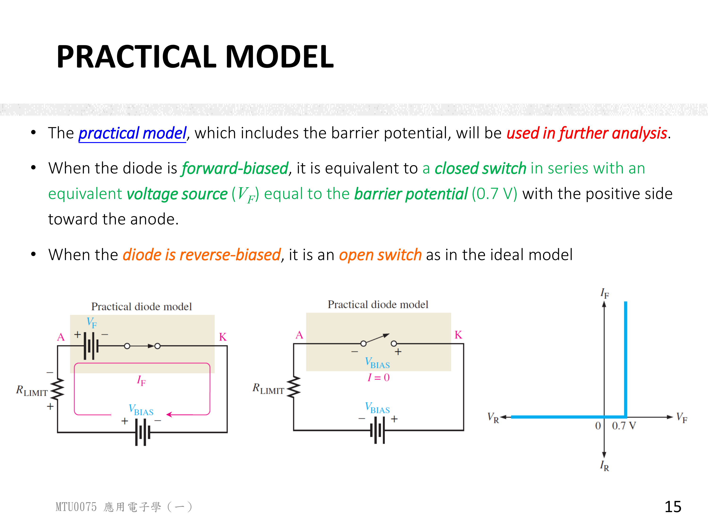

## 實用模型 (Practical Model)

*   **實用模型**包含障壁電位 ($0.7V$)，將在後續的分析中使用。
*   當二極體處於順向偏壓時，它等效於一個閉合開關串聯一個等於障壁電位的等效電壓源（$V_F$），正極朝向陽極。
*   當二極體處於逆向偏壓時，它和理想模型一樣是一個斷開的開關。

---

**📄 Slide 16**

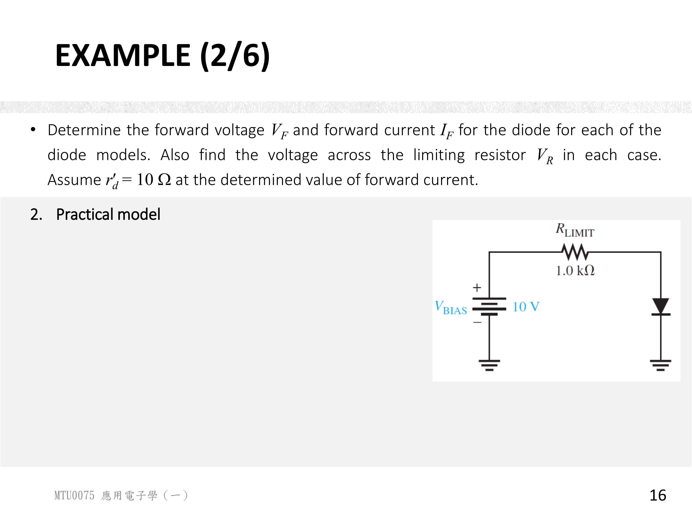

## 範例 (Example) 3/6: 實用模型 - 順向偏壓

*   **條件**: $V_{BIAS} = 10V, R_{LIMIT} = 1k\Omega$。使用**實用模型 (Practical Model)**。
*   **計算**:
    *   考慮障壁電位：$V_F = \mathbf{0.7V}$
    *   順向電流: $I_F = \frac{V_{BIAS} - V_F}{R_{LIMIT}} = \frac{10V - 0.7V}{1k\Omega} = \frac{9.3V}{1k\Omega} = \mathbf{9.3mA}$
    *   限流電阻壓降: $V_{R_{LIMIT}} = V_{BIAS} - V_F = \mathbf{9.3V}$

---

**📄 Slide 17**

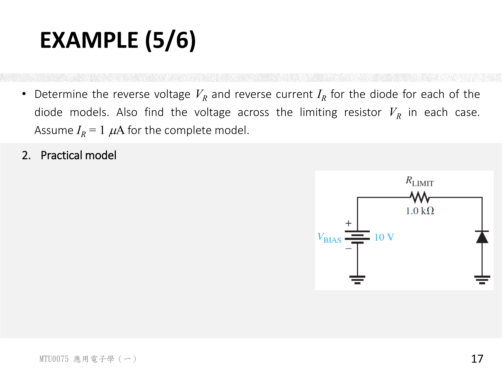

## 範例 (Example) 4/6: 實用模型 - 逆向偏壓

*   **條件**: $V_{BIAS} = 10V, R_{LIMIT} = 1k\Omega$。使用**實用模型 (Practical Model)**。
*   **計算**:
    *   逆向狀態下與理想模型一致：$I_R = 0A$
    *   逆向電壓: $V_R = V_{BIAS} = \mathbf{10V}$
    *   限流電阻壓降: $V_{R_{LIMIT}} = \mathbf{0V}$

---

**📄 Slide 18**

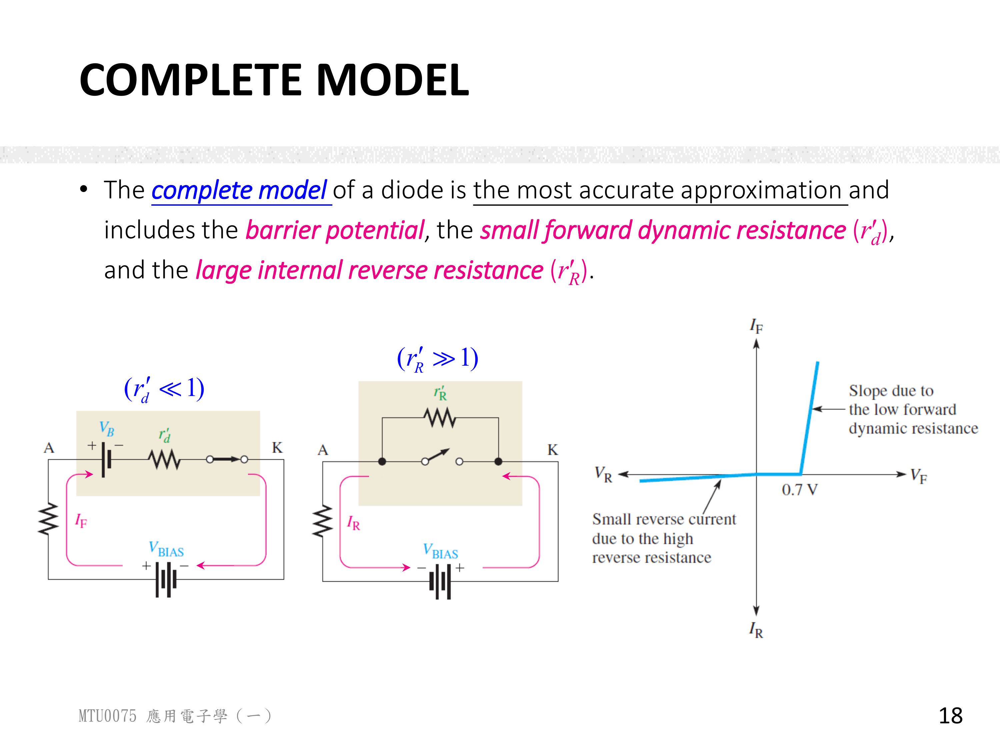

## 完整模型 (Complete Model)

*   二極體的**完整模型**是最精確的近似方式，它包含了障壁電位、微小的順向動態電阻 ($r'_d$) 以及極大的內部逆向電阻 ($r'_R$)。

---

**📄 Slide 19**

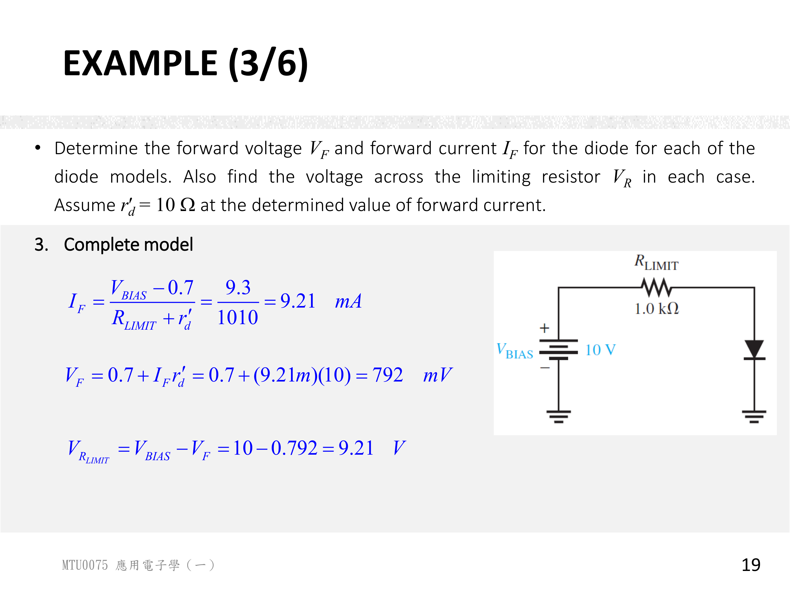

## 範例 (Example) 5/6: 完整模型 - 順向偏壓

*   **條件**: $V_{BIAS} = 10V, R_{LIMIT} = 1k\Omega, r'_d = 10\Omega$。使用**完整模型 (Complete Model)**。
*   **計算**:
    *   順向電流: $I_F = \frac{V_{BIAS} - 0.7V}{R_{LIMIT} + r'_d} = \frac{9.3V}{1010\Omega} \approx \mathbf{9.21mA}$
    *   二極體電壓: $V_F = 0.7V + I_F \cdot r'_d = 0.7V + (9.21mA \cdot 10\Omega) \approx \mathbf{0.792V}$
    *   限流電阻壓降: $V_{R_{LIMIT}} = I_F \cdot R_{LIMIT} = \mathbf{9.21V}$

---

**📄 Slide 20**

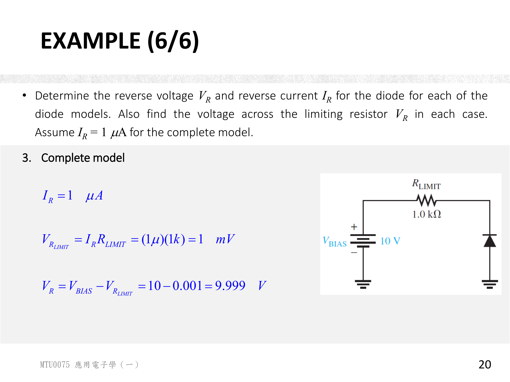

## 範例 (Example) 6/6: 完整模型 - 逆向偏壓

*   **條件**: $V_{BIAS} = 10V, R_{LIMIT} = 1k\Omega, I_R = 1\mu A$。使用**完整模型 (Complete Model)**。
*   **計算**:
    *   逆向電流 (漏電流): $I_R = \mathbf{1\mu A}$
    *   限流電阻壓降: $V_{R_{LIMIT}} = I_R \cdot R_{LIMIT} = 1\mu A \cdot 1k\Omega = \mathbf{1mV}$
    *   逆向電壓: $V_R = V_{BIAS} - V_{R_{LIMIT}} = 10V - 0.001V = \mathbf{9.999V}$
