# Ch4 二極體應用 (Diode Applications)

---

**📄 Slide 01**

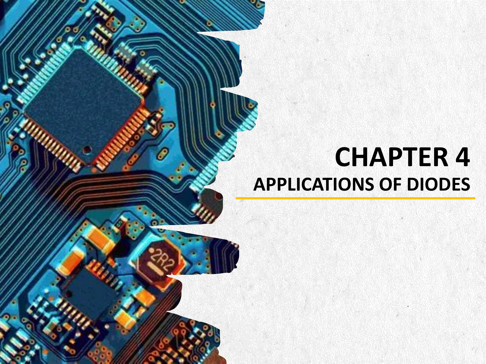

## 第 4 章 二極體應用 (Chapter 4 Applications of Diodes)

---

**📄 Slide 02**

## 二極體應用 (Applications of Diodes)

*   **二極體 (Diodes)** 主要用於**直流電源供應器 (DC power supply)** 或**交流/直流電源轉換器 (AC/DC converter)** 中。
*   其功能是將插座的交流電信號 (AC electric signal) 轉換為直流信號 (DC signal)，以供電給**主動元件 (active electronic devices)**。
*   常見應用範例：手機/筆記型電腦充電器、電視、個人電腦、揚聲器等。

---

**📄 Slide 03**

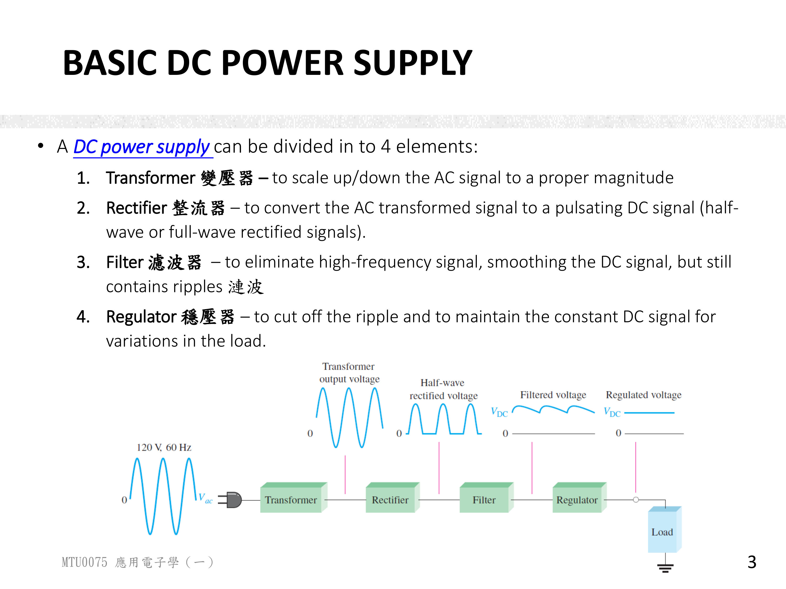

## 基本直流電源供應器 (Basic DC Power Supply)

*   一個直流電源供應器可以分為 4 個基本元件：

1.  **變壓器 (Transformer)**：將交流信號升壓/降壓至適當的幅度。
2.  **整流器 (Rectifier)**：將經過變壓的交流信號轉換為脈動直流信號（半波或全波整流信號）。
3.  **濾波器 (Filter)**：消除高頻信號，平滑化直流信號，但仍會包含**漣波 (ripples)**。
4.  **穩壓器 (Regulator)**：截斷漣波並在負載變化時維持恆定的直流信號。

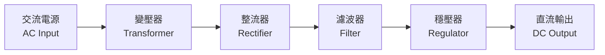
```mermaid
flowchart LR
    A[交流電源\nAC Input] --> B[變壓器\nTransformer]
    B --> C[整流器\nRectifier]
    C --> D[濾波器\nFilter]
    D --> E[穩壓器\nRegulator]
    E --> F[直流輸出\nDC Output]
```

---

**📄 Slide 04**

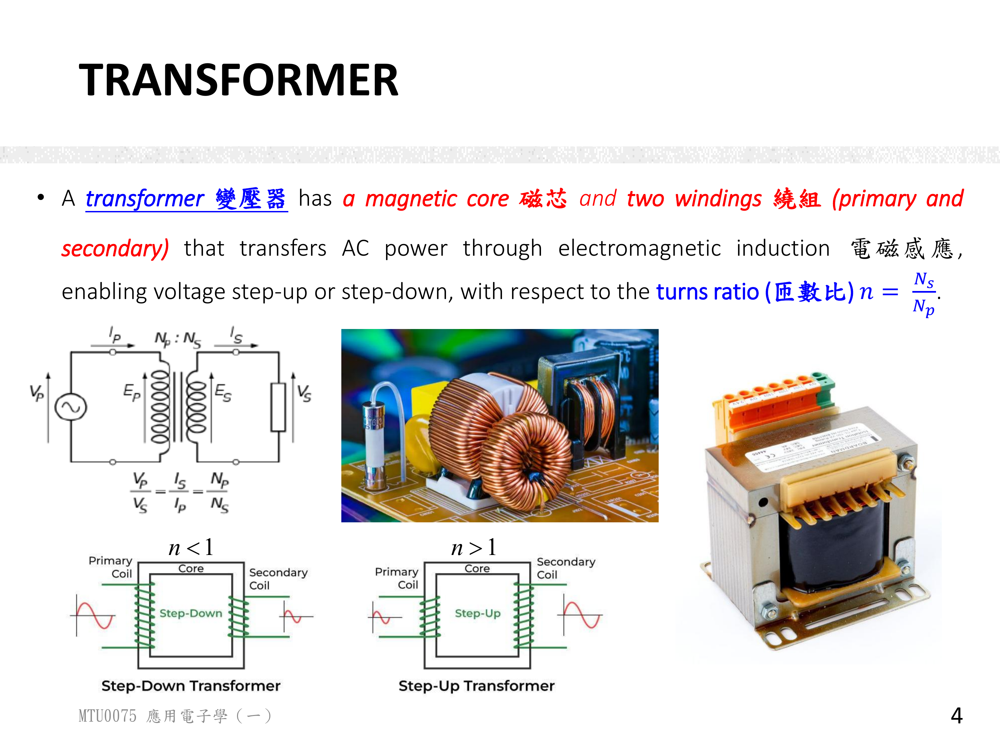

## 變壓器 (Transformer)

*   **變壓器 (Transformer)** 具有一個**磁芯 (magnetic core)** 和兩個**繞組 (windings)**（一次側與二次側）。
*   它透過**電磁感應 (electromagnetic induction)** 傳輸交流電，並根據**匝數比 (turns ratio)** 實現電壓的升壓 (step-up) 或降壓 (step-down)。
*   匝數比定義：
    $$n = \frac{N_s}{N_p}$$
    *   $n < 1$：降壓變壓器
    *   $n > 1$：升壓變壓器

---

**📄 Slide 05**

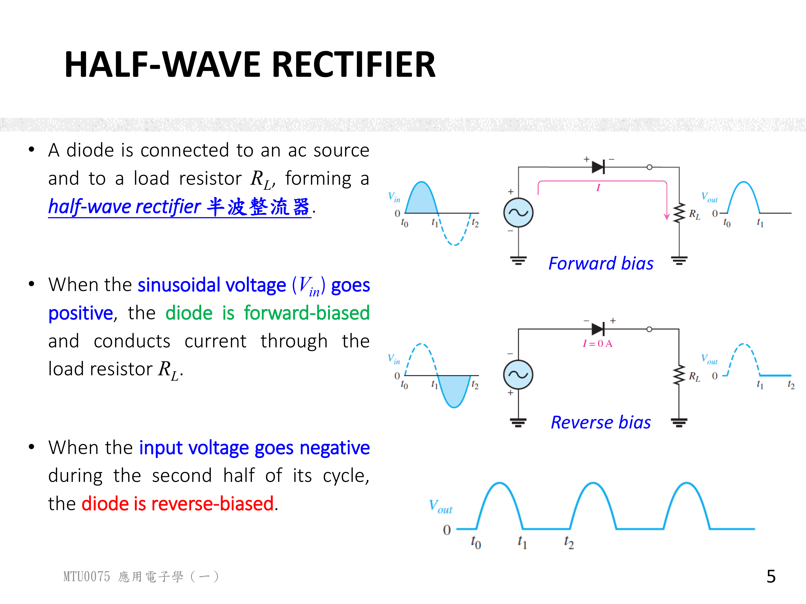

## 半波整流器 (Half-Wave Rectifier)

*   將二極體連接到交流電源與負載電阻 $R_L$，即構成**半波整流器 (half-wave rectifier)**。
*   **順向偏壓 (Forward bias)**：當正弦電壓 ($V_{in}$) 變為正值時，二極體處於順向偏壓，允許電流通過負載電阻 $R_L$。
*   **逆向偏壓 (Reverse bias)**：當輸入電壓在週期的後半段變為負值時，二極體處於逆向偏壓，阻斷電流。

---

**📄 Slide 06**

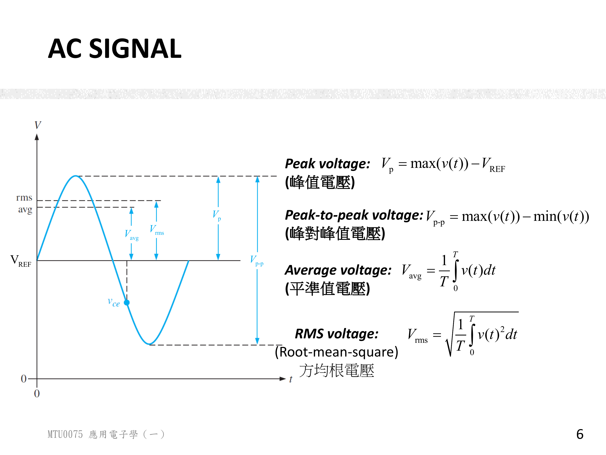

## 交流訊號 (AC Signal)

*   **峰值電壓 (Peak voltage)**: $V_p$
*   **峰對峰值電壓 (Peak-to-peak voltage)**: 
    $$V_{p-p} = \max(v(t)) - \min(v(t))$$
*   **平均電壓 / 平準值電壓 (Average voltage)**: 
    $$V_{avg} = \frac{1}{T} \int_0^T v(t) dt$$
*   **方均根電壓 (RMS voltage, Root-mean-square)**: 
    $$V_{rms} = \sqrt{\frac{1}{T} \int_0^T v(t)^2 dt}$$

---

**📄 Slide 07**

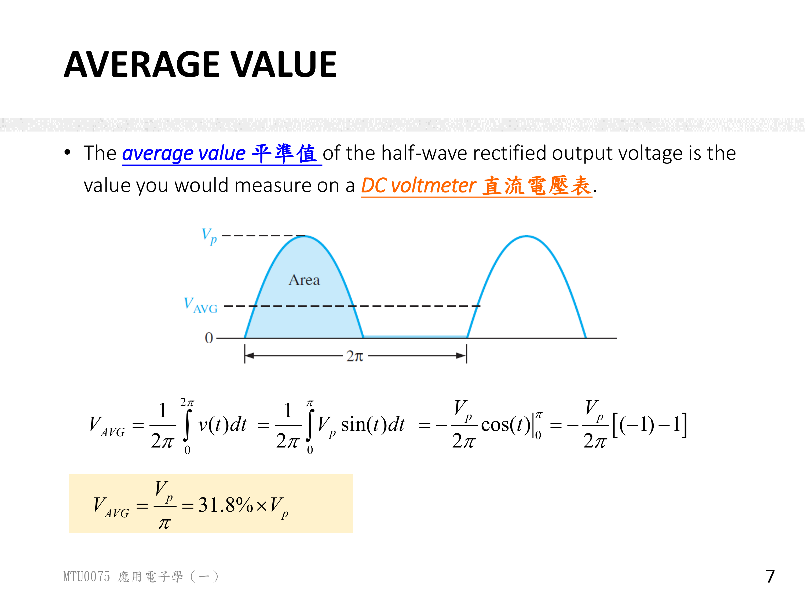

## 平均值 (Average Value)

*   半波整流輸出電壓的**平準值 (average value)**，就是您在**直流電壓表 (DC voltmeter)** 上測量到的數值。

推導過程：
$$V_{AVG} = \frac{1}{2\pi} \int_0^\pi V_p \sin(t) dt$$
$$V_{AVG} = \left[ -\frac{V_p}{2\pi} \cos(t) \right]_0^\pi = \frac{V_p}{2\pi} [-\cos(\pi) - (-\cos(0))] = \frac{V_p}{2\pi} [1 + 1]$$
$$V_{AVG} = \frac{V_p}{\pi}$$
$$V_{AVG} \cong 31.8\% V_p$$

---

**📄 Slide 08**

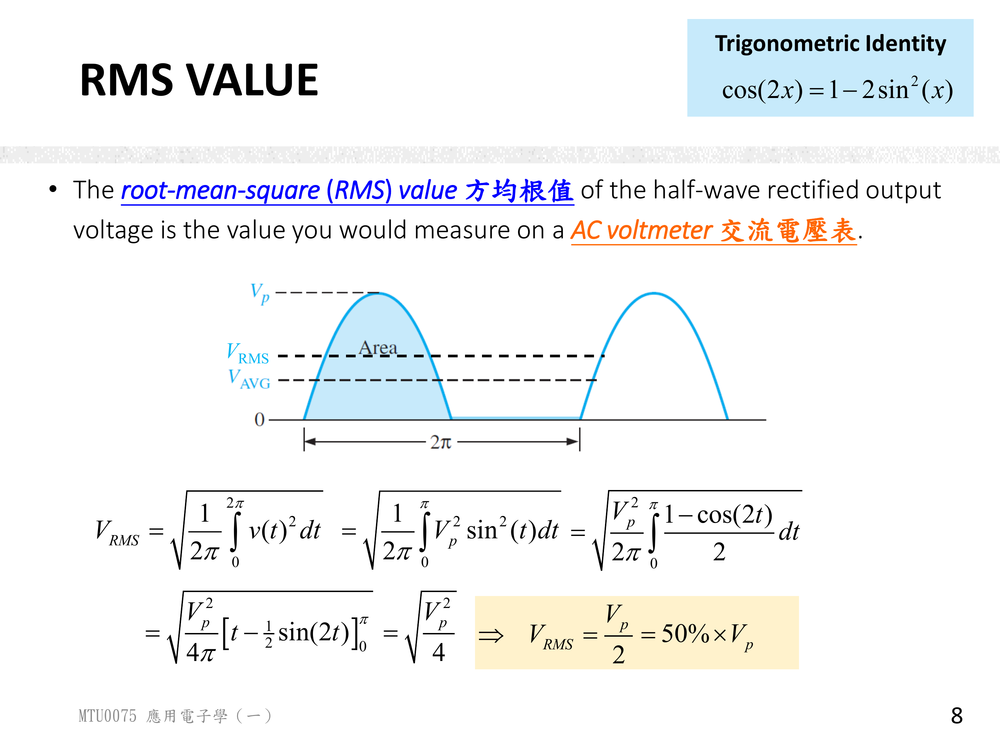

## 方均根值 (RMS Value)

*   半波整流輸出電壓的**方均根值 (RMS value)**，就是您在**交流電壓表 (AC voltmeter)** 上測量到的數值。

利用三角恆等式 $\sin^2(x) = \frac{1 - \cos(2x)}{2}$ 推導：
$$V_{RMS}^2 = \frac{1}{2\pi} \int_0^\pi (V_p \sin(t))^2 dt$$
$$V_{RMS}^2 = \frac{V_p^2}{2\pi} \int_0^\pi \frac{1 - \cos(2t)}{2} dt$$
$$V_{RMS}^2 = \frac{V_p^2}{4\pi} \left[ t - \frac{\sin(2t)}{2} \right]_0^\pi = \frac{V_p^2}{4\pi} [\pi] = \frac{V_p^2}{4}$$
$$V_{RMS} = \frac{V_p}{2} = 50\% V_p$$

---

**📄 Slide 09**

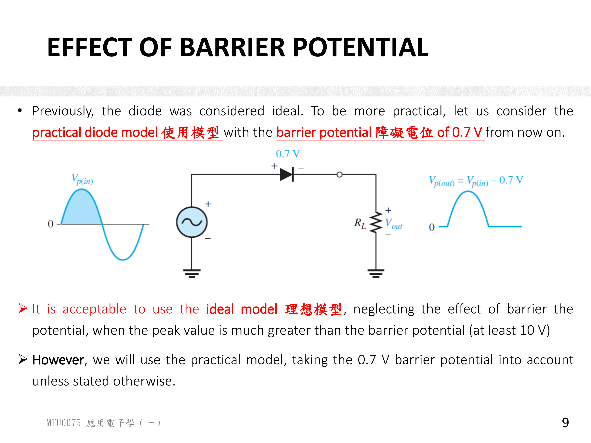

## 障壁電位的影響 (Effect of Barrier Potential)

*   先前，我們將二極體視為理想的。為了更符合實際情況，從現在開始我們將考慮具有 $0.7\text{ V}$ **障礙電位 (barrier potential)** 的**實用二極體模型 (practical diode model)**。
*   當峰值遠大於障礙電位（至少大於 $10\text{ V}$）時，使用**理想模型 (ideal model)** 忽略障礙電位影響是可以接受的。
*   然而，除非另有說明，否則我們將使用**實用模型**，將 $0.7\text{ V}$ 的障礙電位納入考量。

---

**📄 Slide 10**

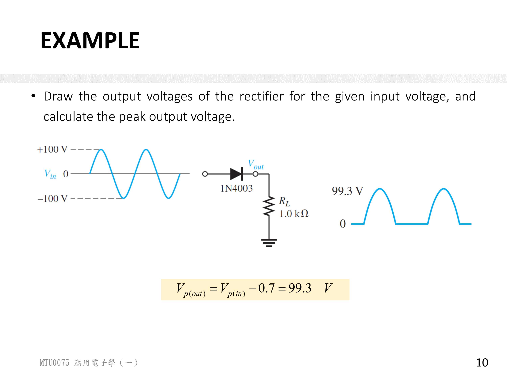

## 範例 (Example)

*   **題目**：畫出給定輸入電壓下的整流器輸出電壓波形，並計算峰值輸出電壓。
*   **計算**：
    考慮實用模型，由於二極體消耗了 $0.7\text{ V}$ 的障礙電位：
    $$V_{p(out)} = V_{p(in)} - 0.7\text{ V} = 10\text{ V} - 0.7\text{ V} = 9.3\text{ V}$$

---

**📄 Slide 11**

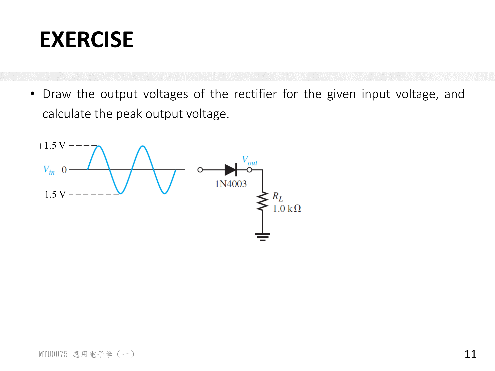

## 練習 (Exercise)

*   **題目**：畫出給定輸入電壓下的整流器輸出電壓波形，並計算峰值輸出電壓。
*   *(給定的輸入電壓為 $V_{in}$，峰值為 $+1.5\text{V}$ 與 $-1.5\text{V}$)*

---

**📄 Slide 12**

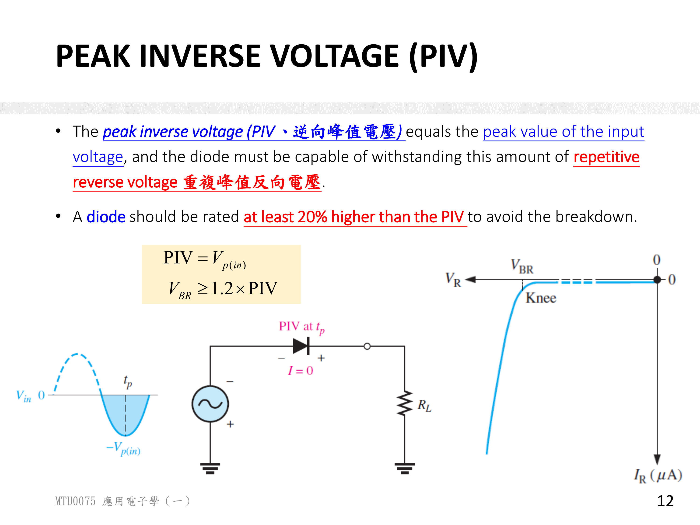

## 逆向峰值電壓 (Peak Inverse Voltage, PIV)

*   **逆向峰值電壓 (PIV)** 等於輸入電壓的峰值，且二極體必須能夠承受這麼大的**重複峰值反向電壓 (repetitive reverse voltage)** 而不致損壞。
    $$\text{PIV} = V_{p(in)}$$
*   為了避免崩潰，二極體的額定電壓應至少比 PIV 高 20%。
    $$V_{BR} \ge 1.2 \times \text{PIV}$$

---

**📄 Slide 13**

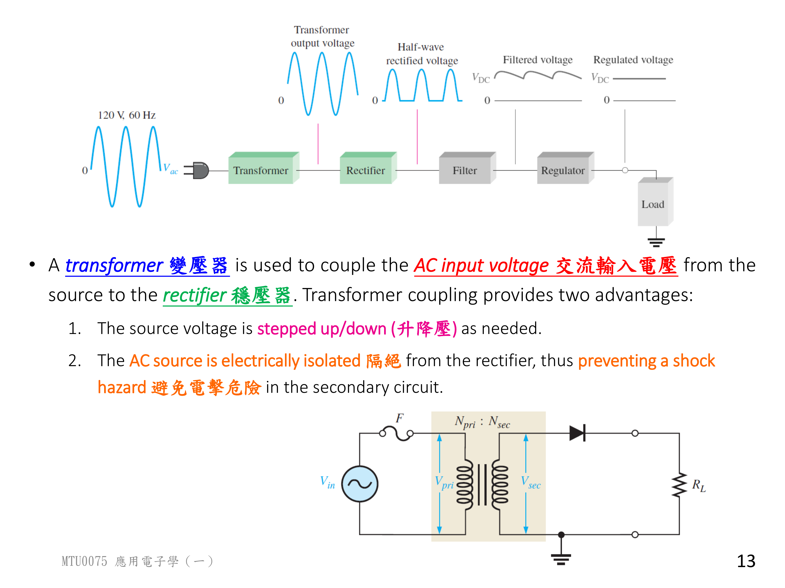

## 變壓器耦合 (Transformer Coupling)

*   **變壓器 (Transformer)** 用於將電源的**交流輸入電壓 (AC input voltage)** 耦合至**整流器 (Rectifier)**。
*   變壓器耦合提供兩個優點：
    1.  可根據需要將電源電壓進行**升壓/降壓 (stepped up/down)**。
    2.  交流電源與整流器在電路上**隔絕 (electrically isolated)**，從而**避免二次側電路發生電擊危險 (preventing a shock hazard)**。

---

**📄 Slide 14**

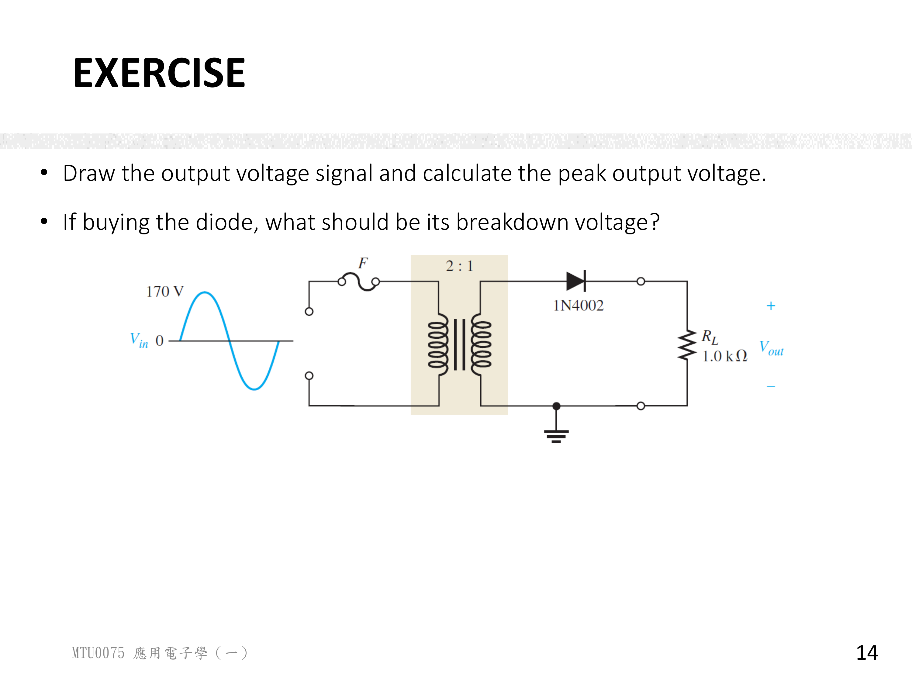

## 練習 (Exercise)

*   **題目**：畫出輸出電壓信號的波形，並計算峰值輸出電壓。
*   **題目**：如果要購買此電路使用的二極體，其崩潰電壓 (breakdown voltage) 應該是多少？

---

**📄 Slide 15**

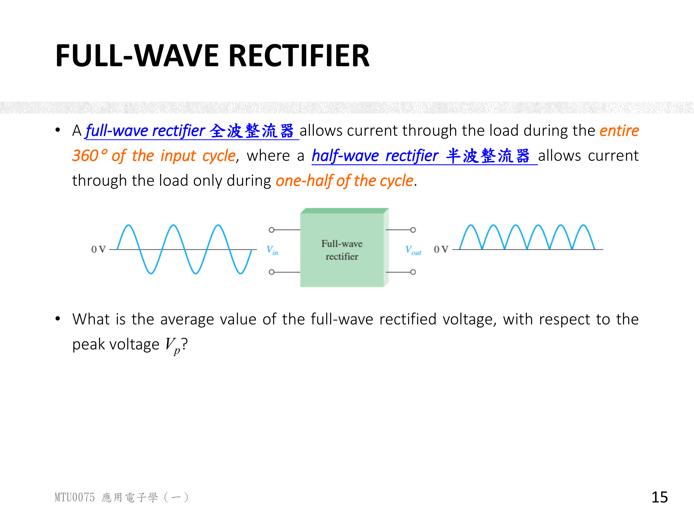

## 全波整流器 (Full-Wave Rectifier)

*   **全波整流器 (Full-wave rectifier)** 允許電流在輸入週期的完整 $360^\circ$ 期間內通過負載，而**半波整流器 (half-wave rectifier)** 只允許電流在半個週期內通過負載。
*   **思考**：相對於峰值電壓 $V_p$，全波整流電壓的平均值是多少？

---

**📄 Slide 16**

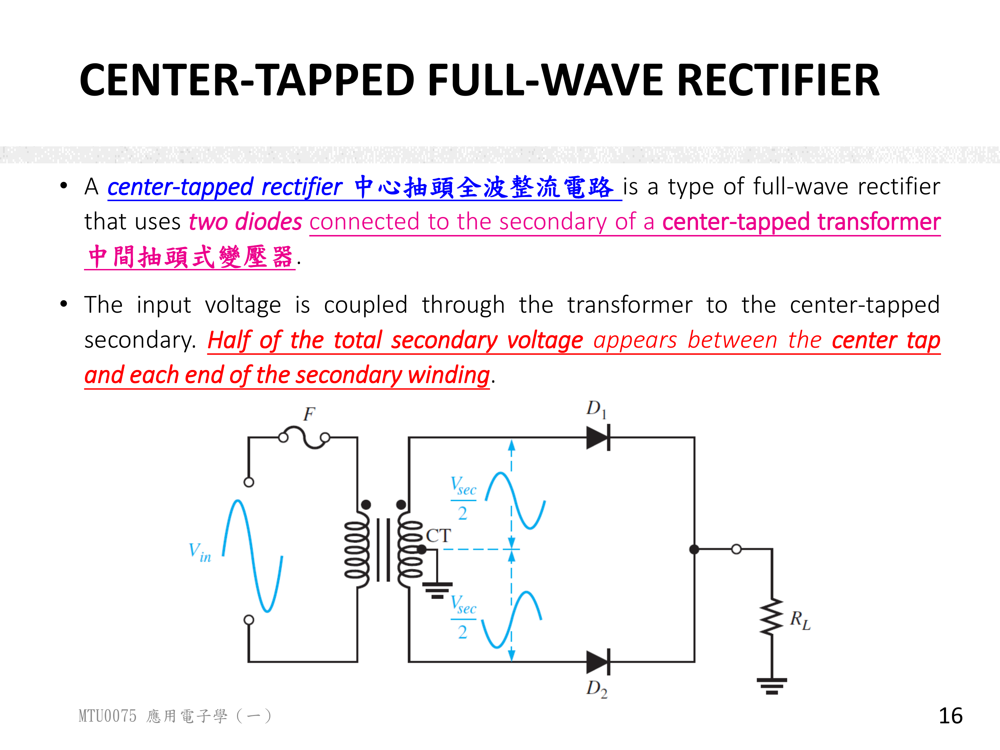

## 中心抽頭全波整流器 (Center-Tapped Full-Wave Rectifier)

*   **中心抽頭整流電路 (Center-tapped rectifier)** 是一種全波整流器，它使用兩個二極體連接到**中間抽頭式變壓器 (center-tapped transformer)** 的二次側。
*   輸入電壓透過變壓器耦合到中心抽頭的二次側。總二次側電壓的一半會出現在中心抽頭與二次繞組各端之間。

---

**📄 Slide 17**

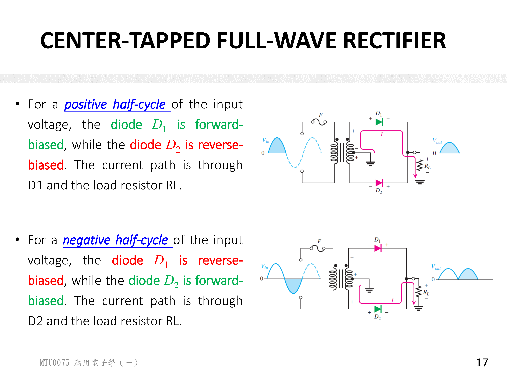

## 中心抽頭全波整流器 (續)

*   **正半週**：在輸入電壓的正半週，二極體 $D_1$ 處於順向偏壓，而二極體 $D_2$ 處於逆向偏壓。電流路徑通過 $D_1$ 及負載電阻 $R_L$。
*   **負半週**：在輸入電壓的負半週，二極體 $D_1$ 處於逆向偏壓，而二極體 $D_2$ 處於順向偏壓。電流路徑通過 $D_2$ 及負載電阻 $R_L$。

---

**📄 Slide 18**

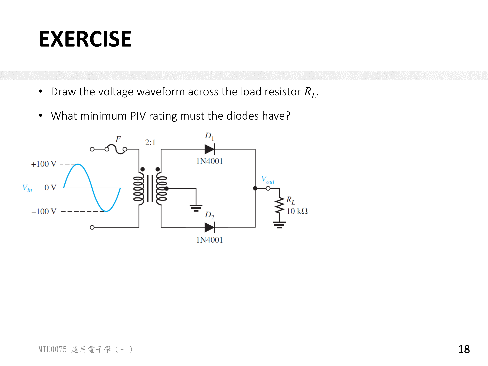

## 練習 (Exercise)

*   **題目**：畫出負載電阻 $R_L$ 兩端的電壓波形。
*   **題目**：二極體必須具備的最小 PIV 額定值是多少？

---

**📄 Slide 19**

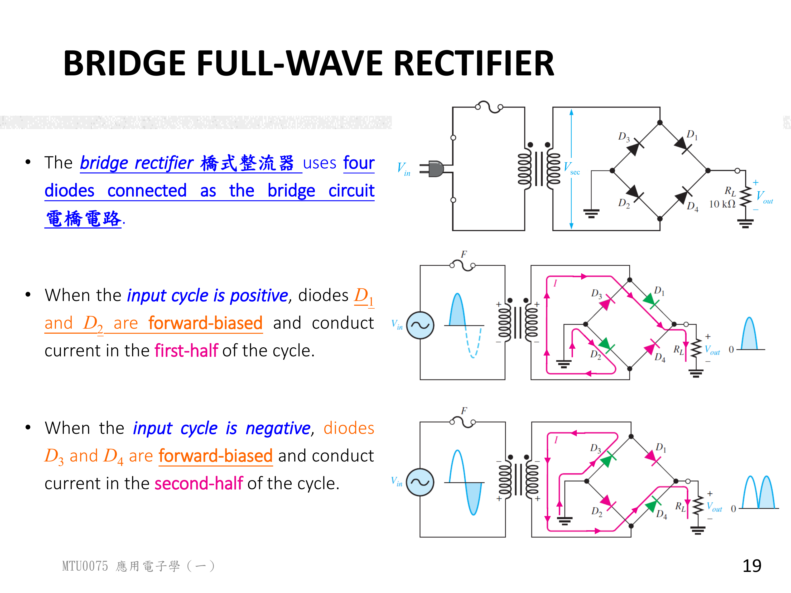

## 橋式全波整流器 (Bridge Full-Wave Rectifier)

*   **橋式整流器 (Bridge rectifier)** 使用連接成**電橋電路 (bridge circuit)** 的四個二極體。
*   **正半週**：當輸入週期為正時，二極體 $D_1$ 和 $D_2$ 處於順向偏壓，並在前半週期內導電。
*   **負半週**：當輸入週期為負時，二極體 $D_3$ 和 $D_4$ 處於順向偏壓，並在後半週期內導電。

---

**📄 Slide 20**

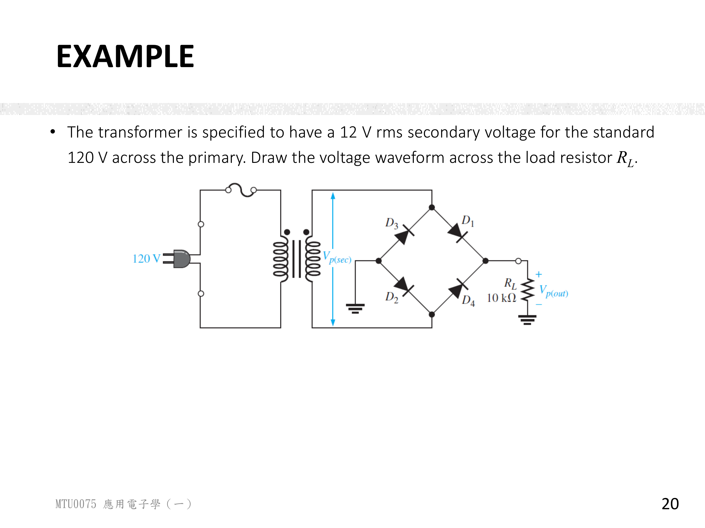

## 範例 (Example)

*   **題目**：對於一次側兩端為標準的 $120\text{ V}$ 電壓，變壓器規格標示其具有 $12\text{ V rms}$ 的二次側電壓。畫出負載電阻 $R_L$ 兩端的電壓波形。

---

**📄 Slide 21**

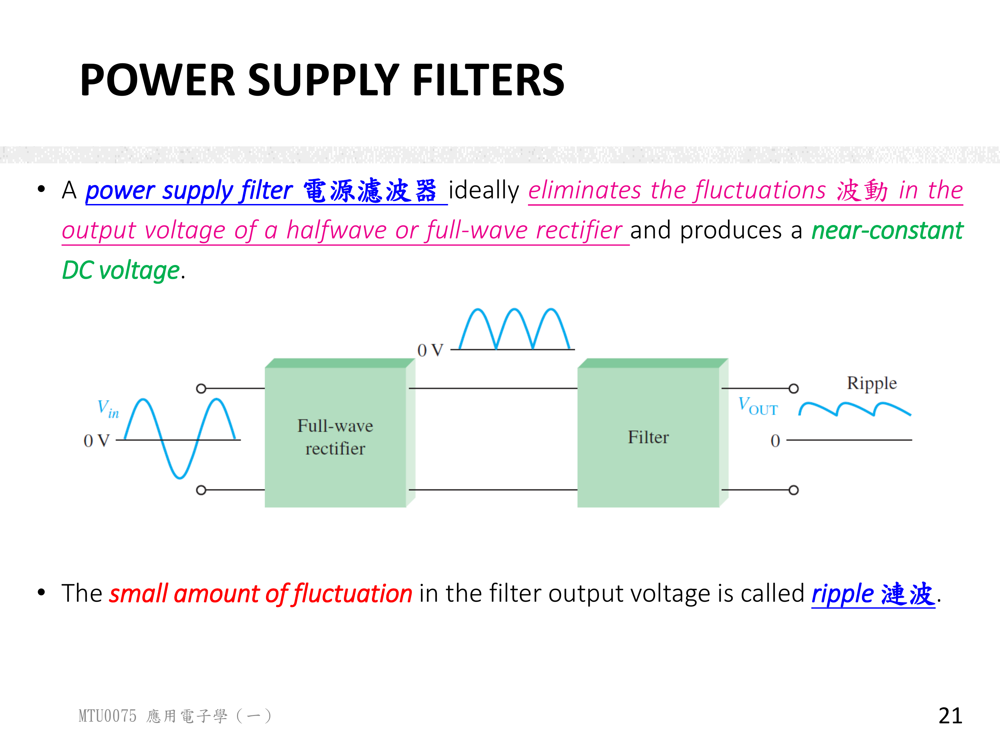

## 電源濾波器 (Power Supply Filters)

*   **電源濾波器 (Power supply filter)** 的理想功能是消除半波或全波整流器輸出電壓的**波動 (fluctuations)**，並產生接近恆定的直流電壓。
*   濾波器輸出電壓中的微小波動稱為**漣波 (ripple)**。

---

**📄 Slide 22**

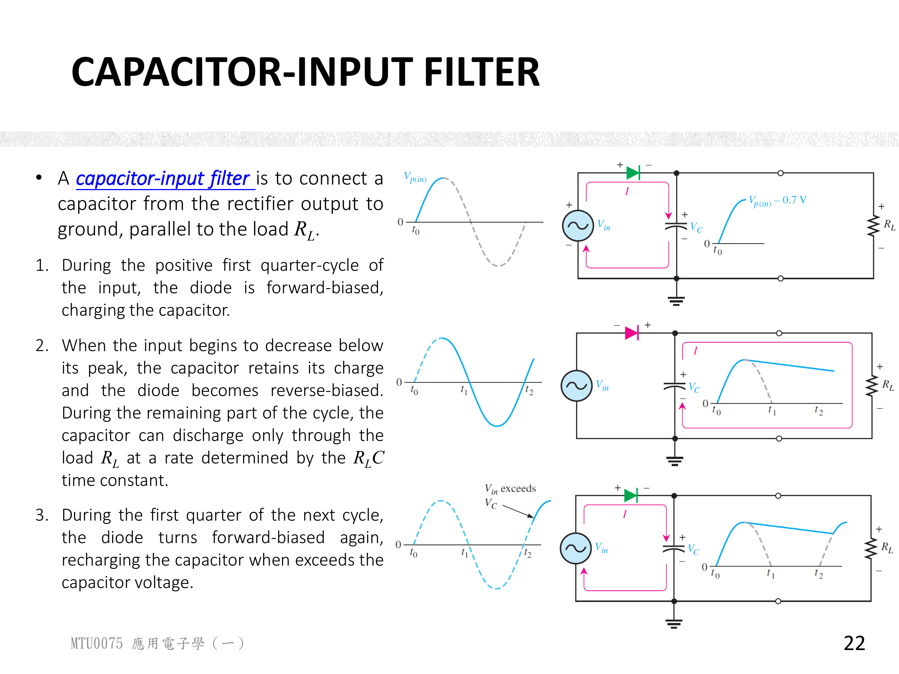

## 電容輸入濾波器 (Capacitor-Input Filter)

*   電容輸入濾波器是將電容從整流器輸出端連接至接地端，與負載 $R_L$ 並聯。

1.  **充電**：在輸入端正半週的前四分之一週期內，二極體處於順向偏壓，對電容充電。
2.  **放電**：當輸入端電壓從峰值開始下降時，電容保持其電荷，二極體變為逆向偏壓。在週期的剩餘部分，電容只能通過負載 $R_L$ 放電，其放電速率由 $RC$ 時間常數決定。
3.  **再充電**：在下一個週期的前四分之一期間，當電壓超過電容電壓時，二極體再次變為順向偏壓，對電容重新充電。

---

**📄 Slide 23**

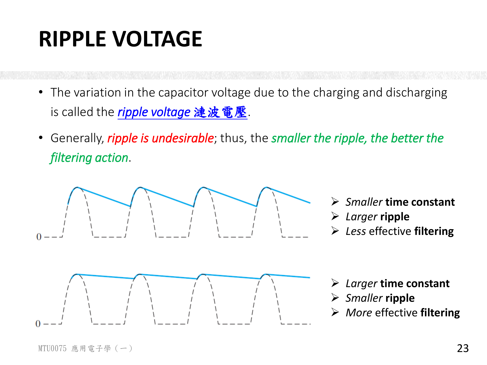

## 漣波電壓 (Ripple Voltage)

*   由於充放電引起的電容電壓變化稱為**漣波電壓 (ripple voltage)**。
*   通常不希望有漣波；因此，漣波越小，濾波效果越好。

*   **較小的時間常數 (Smaller time constant)** $\rightarrow$ 較大的漣波 $\rightarrow$ 濾波效果較差。
*   **較大的時間常數 (Larger time constant)** $\rightarrow$ 較小的漣波 $\rightarrow$ 濾波效果較好。

---

**📄 Slide 24**

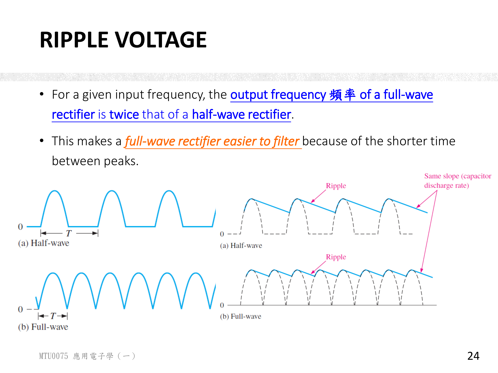

## 漣波電壓 (續)

*   對於給定的輸入頻率，全波整流器的輸出頻率是半波整流器輸出頻率的**兩倍**。
*   這使得全波整流器更容易被濾波，因為峰值之間的時間較短。

---

**📄 Slide 25**

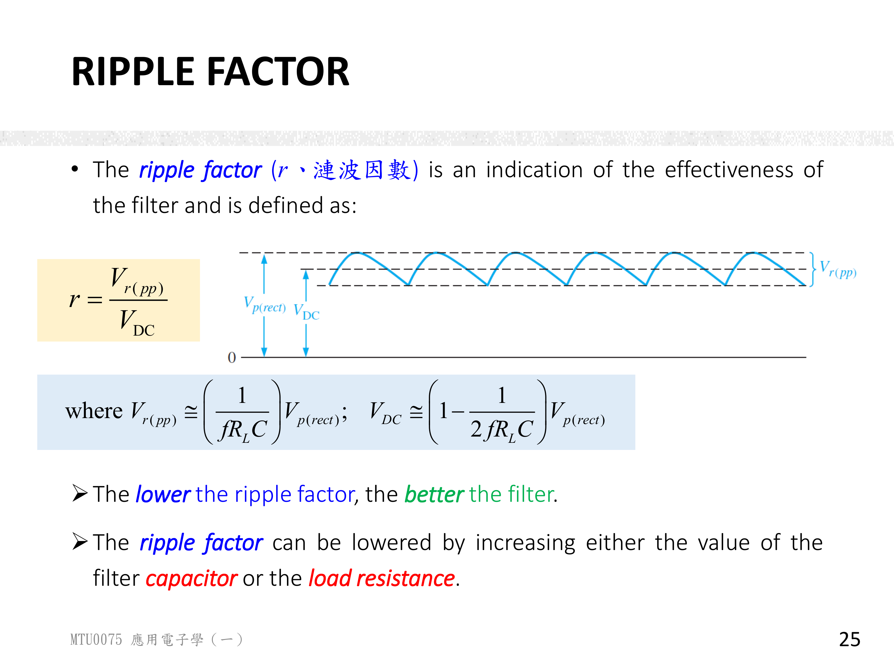

## 漣波因數 (Ripple Factor)

*   **漣波因數 (Ripple factor, $r$)** 是濾波器效果的一項指標，定義如下：
    $$r = \frac{V_{r(pp)}}{V_{DC}}$$
*   漣波因數越低，濾波器越好。
*   可藉由增加濾波電容值或增加負載電阻來降低漣波因數。

其中：
$$V_{DC} \cong \left( 1 - \frac{1}{2f R_L C} \right) V_{p(rect)}$$
$$V_{r(pp)} \cong \left( \frac{1}{f R_L C} \right) V_{p(rect)}$$

---

**📄 Slide 26**

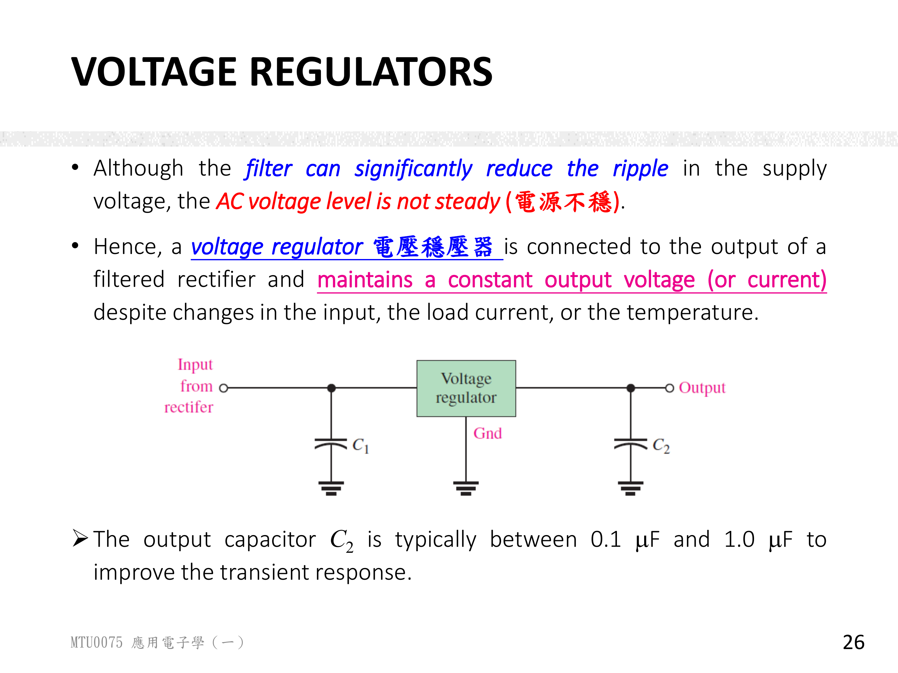

## 電壓穩壓器 (Voltage Regulators)

*   儘管濾波器可顯著降低電源電壓中的漣波，但直流電壓準位仍然不夠穩定 (電源不穩)。
*   因此，會在經過濾波的整流器輸出端連接**電壓穩壓器 (voltage regulator)**，以確保在輸入、負載電流或溫度變化時，仍能維持恆定的輸出電壓（或電流）。
*   通常會在輸出端並聯電容 $C_2$（介於 $0.1\ \mu\text{F}$ 至 $1.0\ \mu\text{F}$ 之間），以改善瞬態響應。

---

**📄 Slide 27**

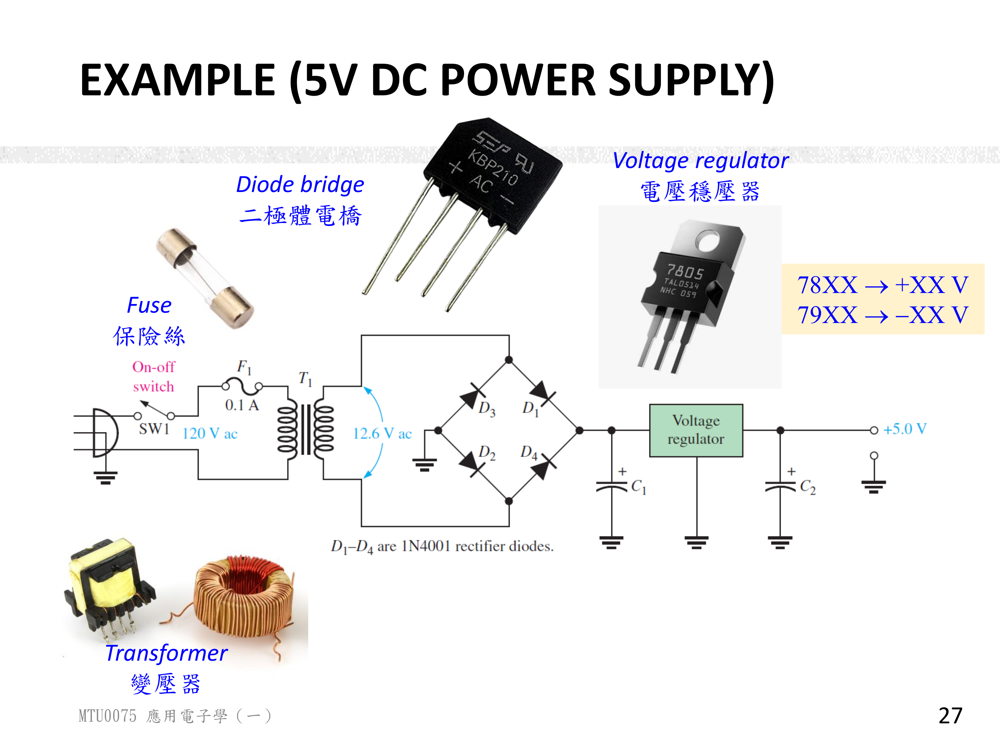

## 範例：5V 直流電源供應器 (Example: 5V DC Power Supply)

*(實體電路圖示範了直流電源供應器的主要結構)*
*   **變壓器 (Transformer)**
*   **二極體電橋 (Diode bridge)**
*   **保險絲 (Fuse)**
*   **電壓穩壓器 (Voltage regulator)**
    *   `78XX` $\rightarrow +XX\text{ V}$
    *   `79XX` $\rightarrow -XX\text{ V}$

---

**📄 Slide 28**

## 特殊應用 (Special Applications)

*(本頁標題頁)*

---

**📄 Slide 29**

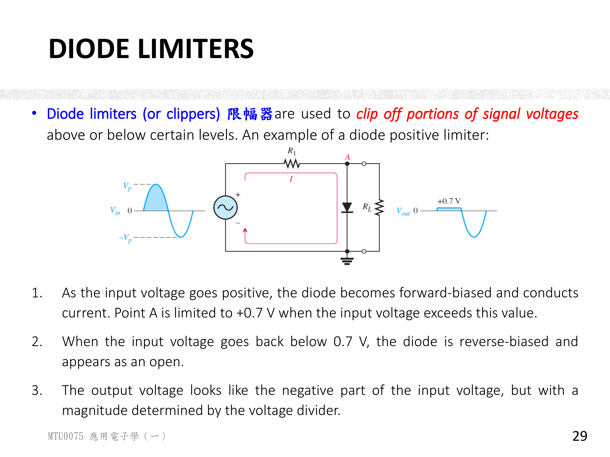

## 二極體限幅器 (Diode Limiters)

*   **二極體限幅器 (Diode limiters 或 clippers)** 用於截斷高於或低於特定準位的信號電壓部分。二極體正向限幅器的範例：
    1.  當輸入電壓變為正時，二極體進入順向偏壓並導通電流。當輸入電壓超過 $+0.7\text{ V}$ 時，A 點的電壓會被限制在 $+0.7\text{ V}$。
    2.  當輸入電壓回落到 $0.7\text{ V}$ 以下時，二極體處於逆向偏壓，等同於開路。
    3.  輸出電壓看起來像輸入電壓的負半部分，但其幅度由分壓器決定。

---

**📄 Slide 30**

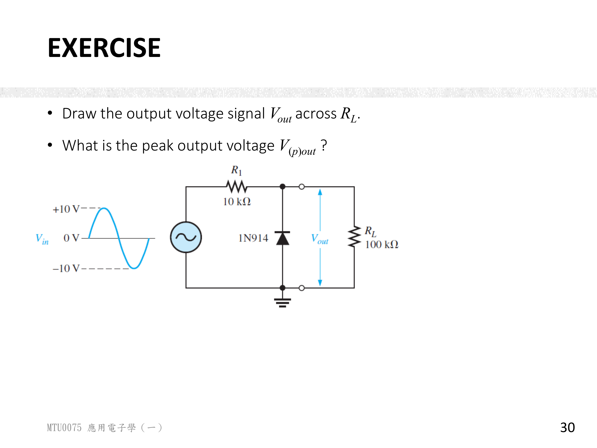

## 練習 (Exercise)

*   **題目**：畫出負載電阻 $R_L$ 兩端的輸出電壓波形 $V_{out}$。
*   **題目**：峰值輸出電壓 $V_{p(out)}$ 是多少？

**解答**：
*   **正半週期**：二極體為逆向偏壓（等同於開路）。此時輸出電壓由 $R_1$ 和 $R_L$ 形成的分壓器決定。
*   **負半週期**：當輸入電壓使輸出端電壓試圖降至 $-0.7\text{ V}$ 以下時，二極體為順向偏壓而導通，將輸出電壓限制（限幅）在 $-0.7\text{ V}$。
*   **峰值輸出電壓**：在正半週期出現，計算如下：
    $$V_{p(out)} = \left( \frac{R_L}{R_1 + R_L} \right) V_{p(in)} = \left( \frac{100\text{ k}\Omega}{10\text{ k}\Omega + 100\text{ k}\Omega} \right) (10\text{ V}) = 9.09\text{ V}$$
*   **輸出波形**：負半週期在 $-0.7\text{ V}$ 處被截斷；正半週期跟隨輸入的正弦波形，但最大正峰值縮小為 $9.09\text{ V}$。

---

**📄 Slide 31**

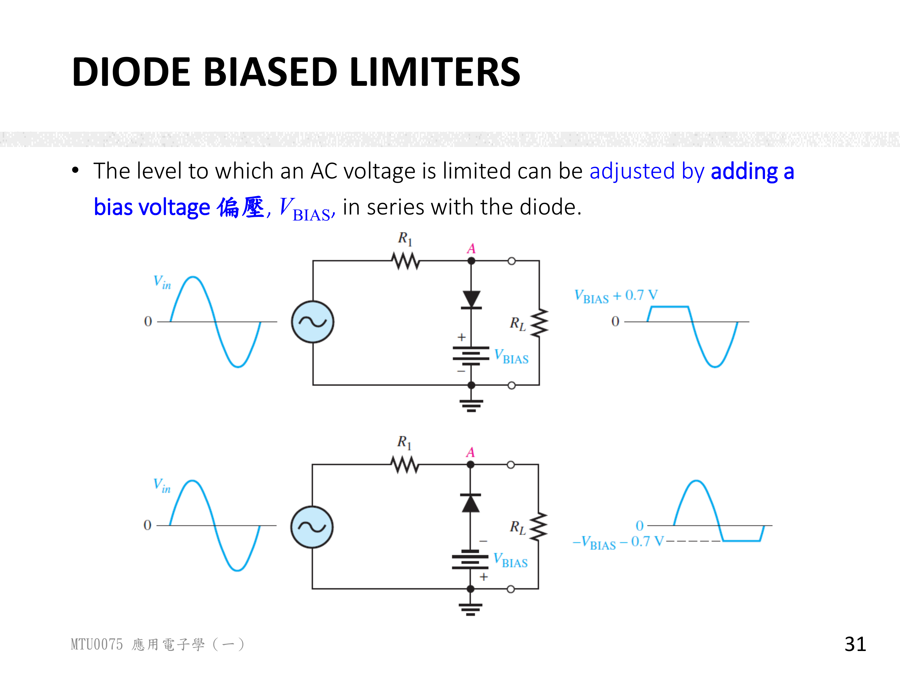

## 二極體偏壓限幅器 (Diode Biased Limiters)

*   可以透過與二極體串聯一個**偏壓 (bias voltage, $V_{BIAS}$)**，來調整交流電壓被限制的準位。

---

**📄 Slide 32**

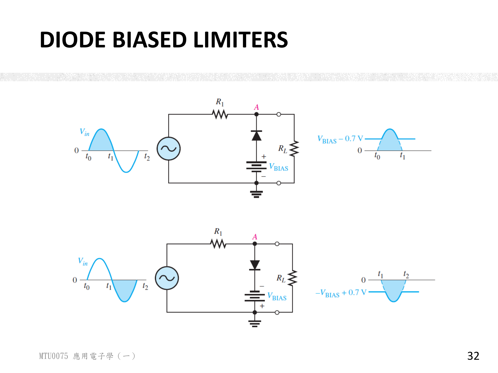

## 二極體偏壓限幅器 (續)

*(此頁展示了限幅器限制電壓的電路和輸出波形圖示)*

---

**📄 Slide 33**

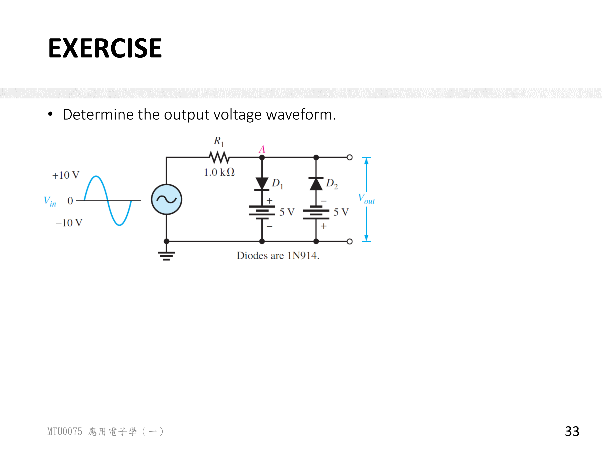

## 練習 (Exercise)

*   **題目**：決定輸出電壓的波形。

**解答**：
這是一個雙向偏壓限幅器（Biased Limiter）。
*   **正半週期**：當輸入電壓超過 $+5.7\text{ V}$（$5\text{ V}$ 偏壓源 $+ 0.7\text{ V}$ 二極體壓降）時，二極體 $D_1$ 導通，將輸出電壓限制在 $+5.7\text{ V}$。
*   **負半週期**：當輸入電壓低於 $-5.7\text{ V}$（$-5\text{ V}$ 偏壓源 $- 0.7\text{ V}$ 二極體壓降）時，二極體 $D_2$ 導通，將輸出電壓限制在 $-5.7\text{ V}$。
*   **輸出波形**：波形的頂部在 $+5.7\text{ V}$ 處被截平，底部在 $-5.7\text{ V}$ 處被截平。在 $-5.7\text{ V}$ 到 $+5.7\text{ V}$ 之間，輸出電壓跟隨輸入正弦波（$V_{out} = V_{in}$）。

---

**📄 Slide 34**

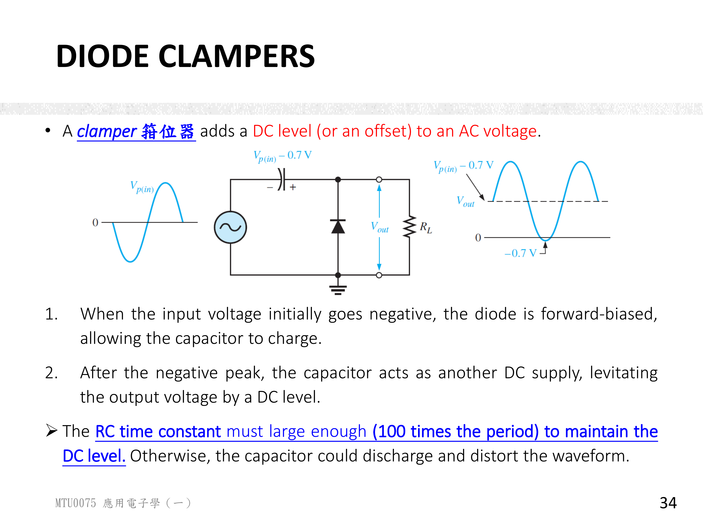

## 二極體箝位器 (Diode Clampers)

*   **箝位器 (Clamper)** 為交流電壓添加一個直流準位（或偏移）。
    1.  當輸入電壓最初變為負值時，二極體處於順向偏壓，允許電容充電。
    2.  經過負峰值之後，電容就像另一個直流電源一樣，將輸出電壓向上提升一個直流準位。
*   $RC$ 時間常數必須夠大（為週期的 100 倍）以維持直流準位。否則電容可能會放電並導致波形失真。

---

**📄 Slide 35**

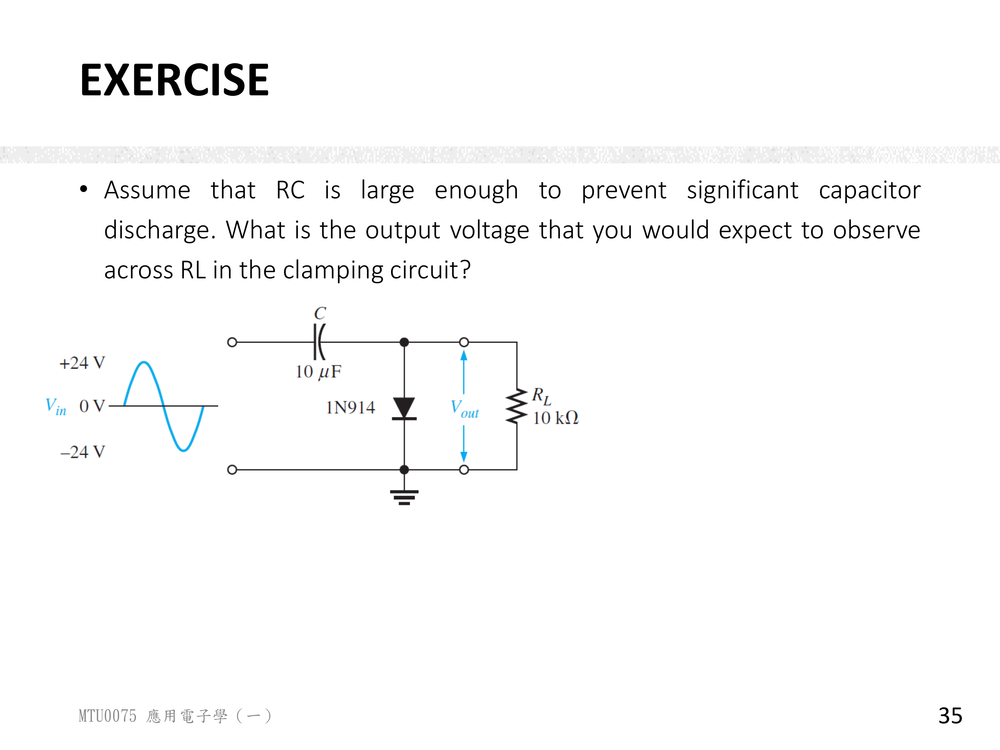

## 練習 (Exercise)

*   假設 $RC$ 夠大，可以防止電容發生明顯放電。
*   **題目**：您預期在箝位電路中觀察到 $R_L$ 兩端的輸出電壓為何？

**解答**：
這是一個負向箝位器（Negative Clamper），會將整個波形向下平移（加入負的直流偏移）。
*   **電容充電**：在輸入電壓的正半週，當 $V_{in}$ 達到正峰值 $+24\text{ V}$ 時，二極體為順向偏壓而導通，將輸出電壓箝制在 $+0.7\text{ V}$。此時電容充電，其跨壓為 $V_C = V_{in(p)} - 0.7\text{ V} = 24\text{ V} - 0.7\text{ V} = 23.3\text{ V}$（左正右負）。
*   **電容放電（極小）**：當 $V_{in}$ 下降時，二極體變為逆向偏壓而截止。因為 $RC$ 時間常數（$10\mu\text{F} \times 10\text{ k}\Omega = 0.1\text{ s}$）相對於一般訊號週期夠大，電容幾乎不放電，相當於一個提供 $-23.3\text{ V}$ 偏移的直流電源。
*   **輸出電壓**：輸出電壓為輸入信號減去電容電壓，即 $V_{out} = V_{in} - 23.3\text{ V}$。
    *   **正峰值**：$+24\text{ V} - 23.3\text{ V} = +0.7\text{ V}$
    *   **負峰值**：$-24\text{ V} - 23.3\text{ V} = -47.3\text{ V}$
*   **結論**：您會觀察到一個峰對峰值不變的正弦波，但整個波形向下偏移了 $23.3\text{ V}$。其電壓將在 $+0.7\text{ V}$ 與 $-47.3\text{ V}$ 之間變化。

---

**📄 Slide 36**

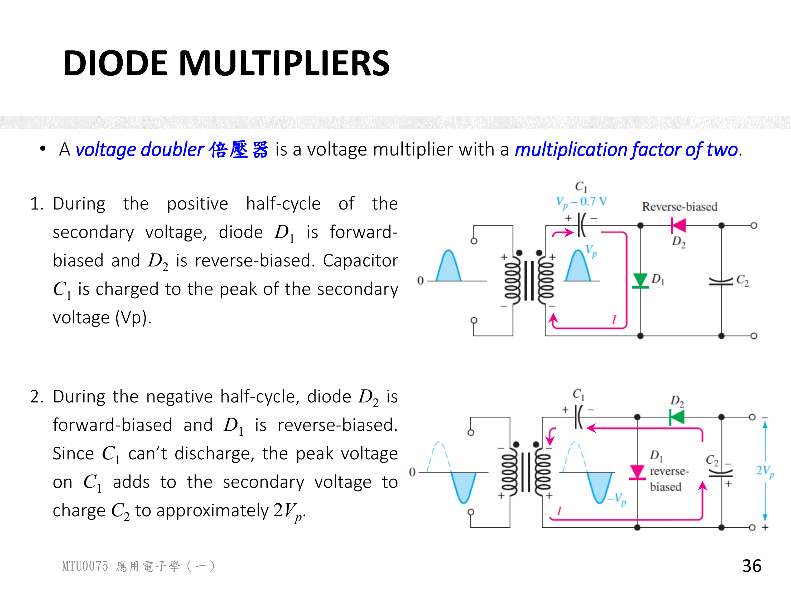

## 二極體倍壓器 (Diode Multipliers)

*   **倍壓器 (Voltage doubler)** 是一種倍增係數為二的電壓倍增器。
    1.  在二次側電壓的**正半週**期間，二極體 $D_1$ 處於順向偏壓，$D_2$ 處於逆向偏壓。電容 $C_1$ 被充電至二次側電壓的峰值 ($V_p$)。
    2.  在**負半週**期間，二極體 $D_2$ 處於順向偏壓，$D_1$ 處於逆向偏壓。由於 $C_1$ 無法放電，$C_1$ 上的峰值電壓與二次側電壓疊加，將 $C_2$ 充電至約 $2V_p$。

---

**📄 Slide 37**

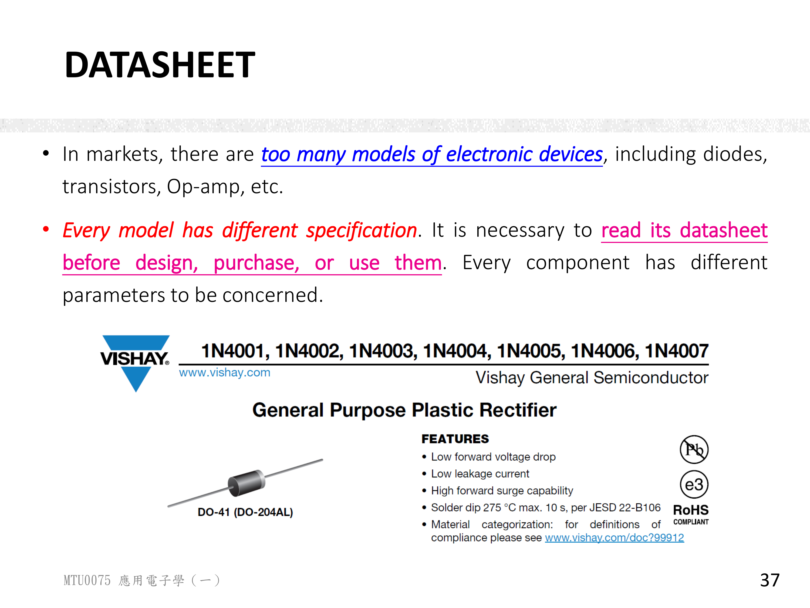

## 產品規格書 (Datasheet)

*   在市場上，有太多型號的電子元件，包括二極體、電晶體、運算放大器等。
*   每個型號都有不同的規格。在設計、購買或使用它們之前，必須先閱讀其**產品規格書 (datasheet)**。每個組件都有不同的參數需要關注。

---

**📄 Slide 38**

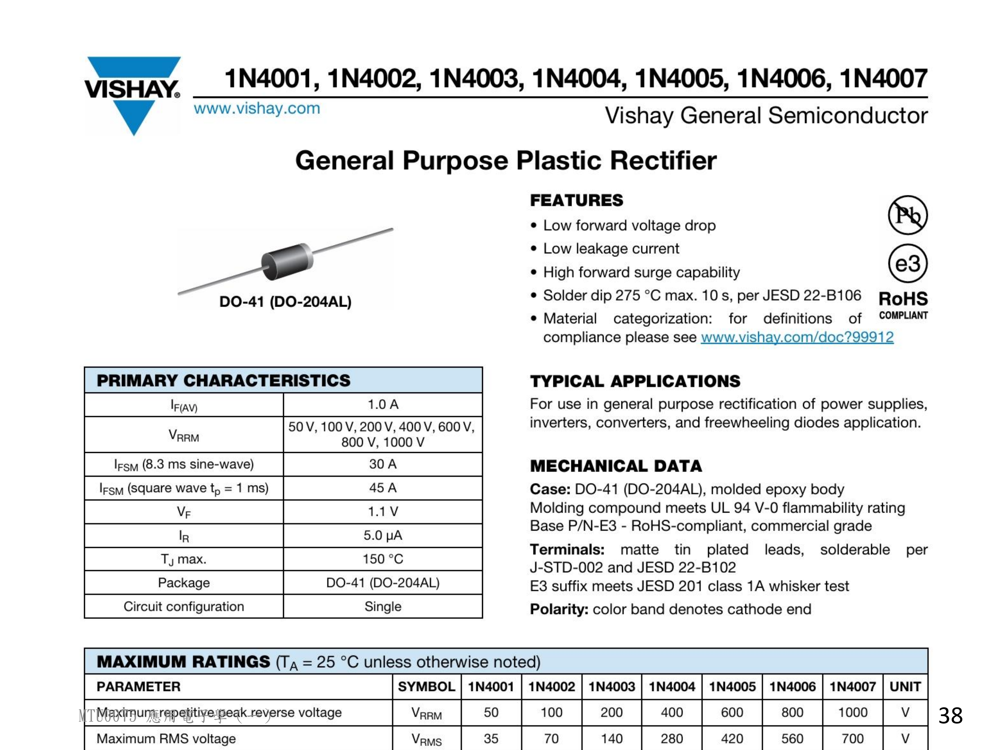

*(本頁無文字內容)*
