# Ch5 Special-purpose Diodes

---
**📄 Slide 01**

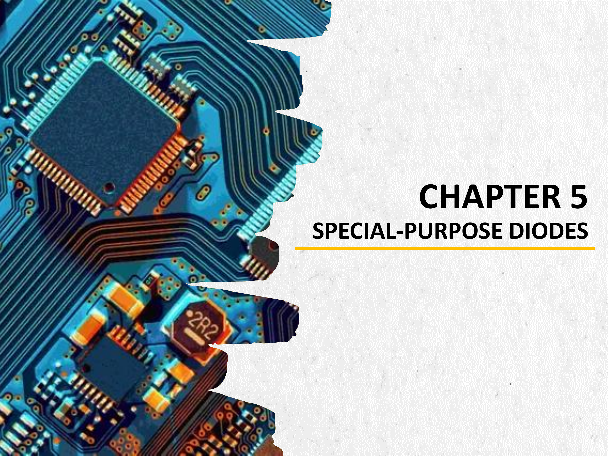

## CHAPTER 5 SPECIAL-PURPOSE DIODES

**note：**
本章節介紹特殊用途二極體 (Special-purpose Diodes)。

---
**📄 Slide 02**

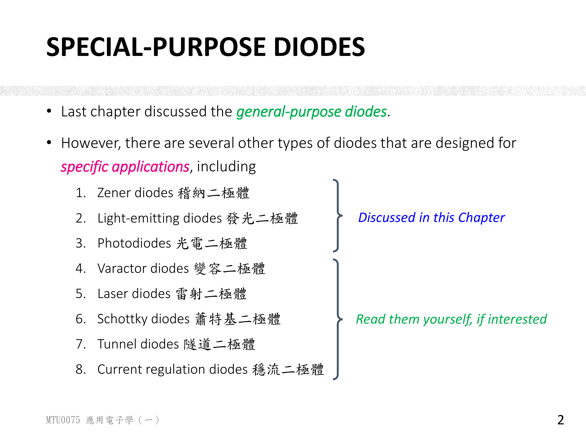

## SPECIAL-PURPOSE DIODES

* Last chapter discussed the general-purpose diodes.
* However, there are several other types of diodes that are designed for specific applications, including:
  1. Zener diodes 稽納二極體
  2. Light-emitting diodes 發光二極體
  *(Discussed in this Chapter)*
  3. Photodiodes 光電二極體
  4. Varactor diodes 變容二極體
  5. Laser diodes 雷射二極體
  6. Schottky diodes 蕭特基二極體
  *(Read them yourself, if interested)*
  7. Tunnel diodes 隧道二極體
  8. Current regulation diodes 穩流二極體

**note：**
除了前一章介紹的一般用途二極體外，本章節主要介紹針對特定應用設計的特殊二極體。課程重點放在「稽納二極體 (Zener diodes)」與「發光二極體 (LED)」，其他如光電二極體、太陽能電池等也會做概念性介紹。

---
**📄 Slide 03**

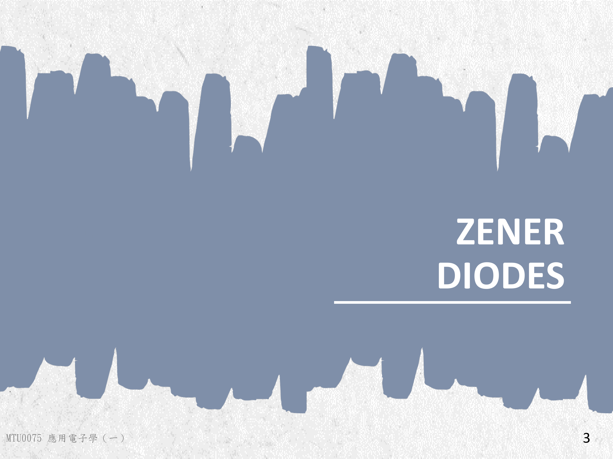

## ZENER DIODES

**note：**
進入第一部分主題：稽納二極體 (Zener Diodes)。

---
**📄 Slide 04**

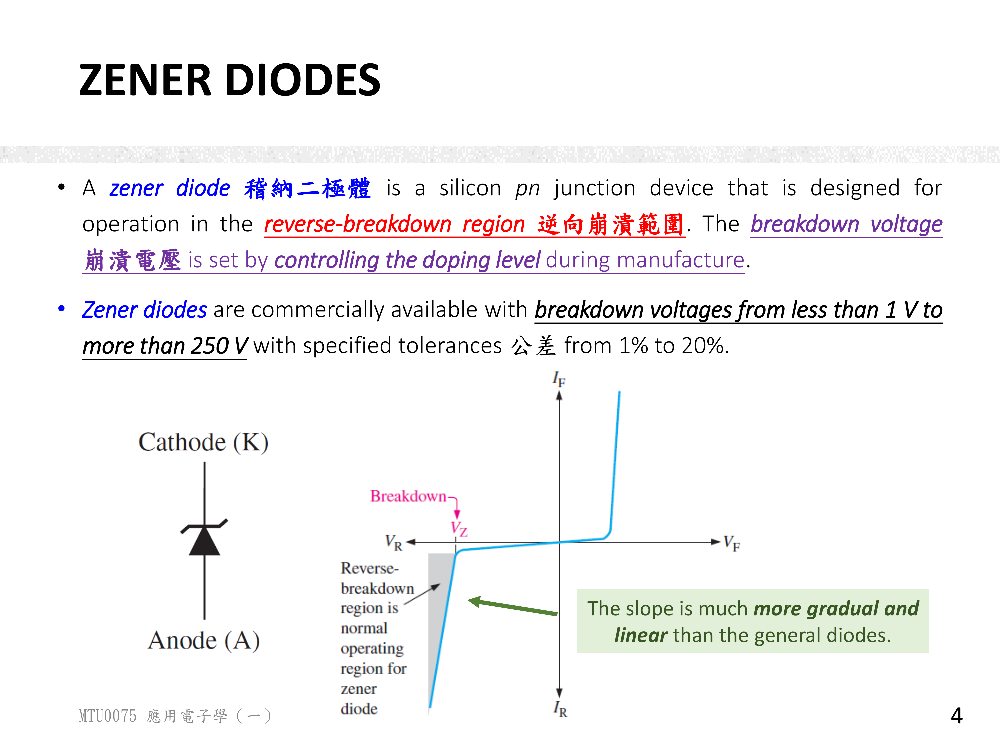

## ZENER DIODES

* A zener diode 稽納二極體 is a silicon pn junction device that is designed for operation in the reverse-breakdown region 逆向崩潰範圍. The breakdown voltage 崩潰電壓 is set by controlling the doping level during manufacture.
* Zener diodes are commercially available with breakdown voltages from less than 1 V to more than 250 V with specified tolerances 公差 from 1% to 20%.
* The slope is much more gradual and linear than the general diodes.

**note：**
稽納二極體是一種矽 PN 介面元件，特別設計運作於「逆向崩潰區」。其崩潰電壓在製造時藉由控制摻雜濃度來設定。市售稽納二極體的崩潰電壓範圍廣泛（<1V 到 >250V），且在崩潰區的 I-V 曲線斜率比一般二極體更平緩且線性。

---
**📄 Slide 05**

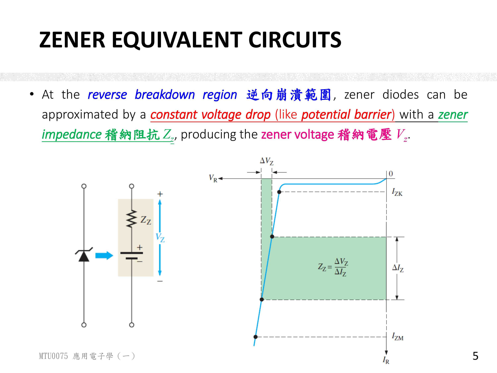

## ZENER EQUIVALENT CIRCUITS

* At the reverse breakdown region 逆向崩潰範圍, zener diodes can be approximated by a constant voltage drop (like potential barrier) with a zener impedance 稽納阻抗 $Z_Z$, producing the zener voltage 稽納電壓 $V_Z$.

**note：**
在逆向崩潰區中，稽納二極體可以近似為一個定電壓降（類似位能障壁）串聯一個稽納阻抗 ($Z_Z$)，進而產生穩定的稽納電壓 ($V_Z$)。

---
**📄 Slide 06**

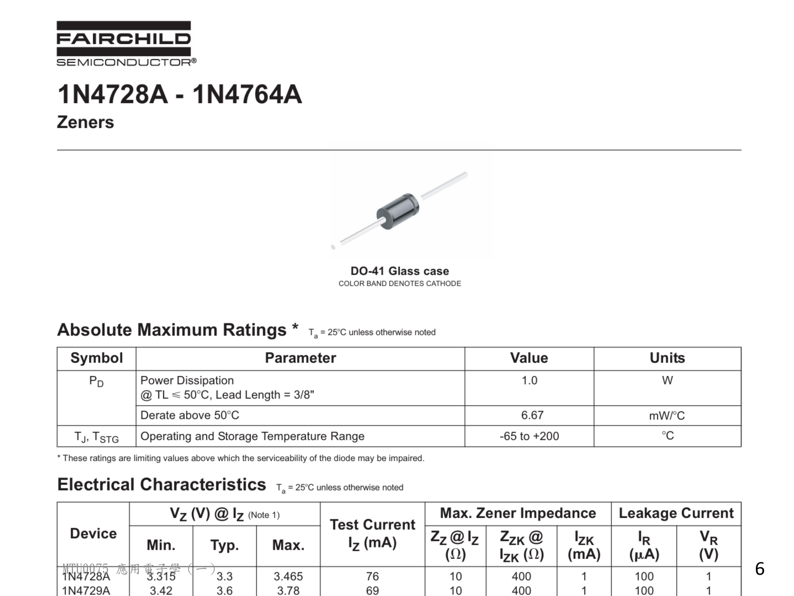

**note：**
此圖為稽納二極體的理想與實際等效電路模型。在實際應用分析時，常將其視為理想的恆定電壓源 $V_Z$ 與內部小阻抗 $Z_Z$ 的串聯。

---
**📄 Slide 07**

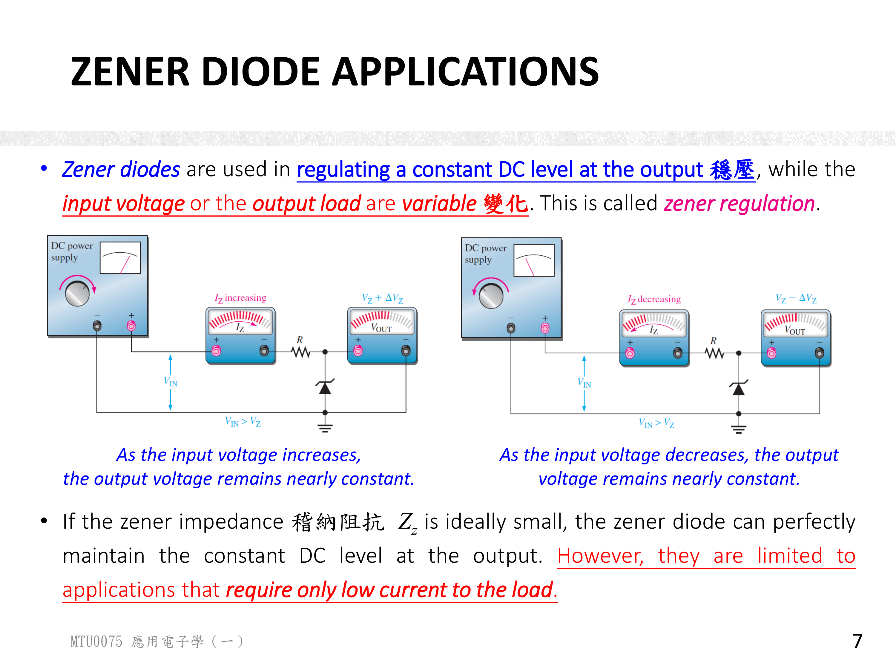

## ZENER DIODE APPLICATIONS

* Zener diodes are used in regulating a constant DC level at the output 穩壓, while the input voltage or the output load are variable 變化. This is called zener regulation.
  * As the input voltage increases, the output voltage remains nearly constant.
  * As the input voltage decreases, the output voltage remains nearly constant.
* If the zener impedance 稽納阻抗 $Z_Z$ is ideally small, the zener diode can perfectly maintain the constant DC level at the output. However, they are limited to applications that require only low current to the load.

**note：**
稽納二極體最常見的應用是「穩壓 (Zener regulation)」。當輸入電壓或負載變動時，它能將輸出維持在恆定的直流電壓。雖然理想上 $Z_Z$ 越小穩壓效果越好，但這種基本穩壓電路通常僅限於低電流負載的應用。

---
**📄 Slide 08**

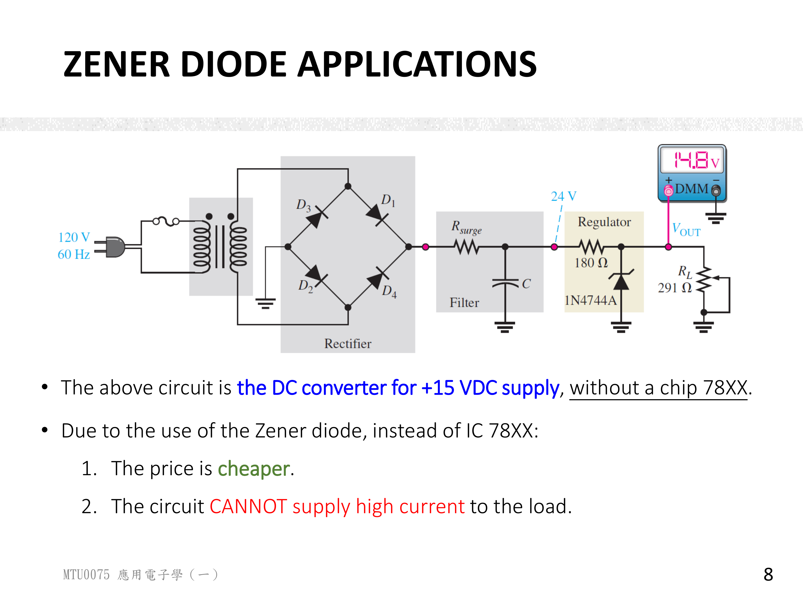

## ZENER DIODE APPLICATIONS

* The above circuit is the DC converter for +15 VDC supply, without a chip 78XX.
* Due to the use of the Zener diode, instead of IC 78XX:
  1. The price is cheaper.
  2. The circuit CANNOT supply high current to the load.

**note：**
此處展示了一個不使用 78XX 系列穩壓 IC，而單純使用稽納二極體建構的 +15V 直流穩壓電路。其優點是成本較低，但缺點是無法提供高電流給後端負載。

---
**📄 Slide 09**

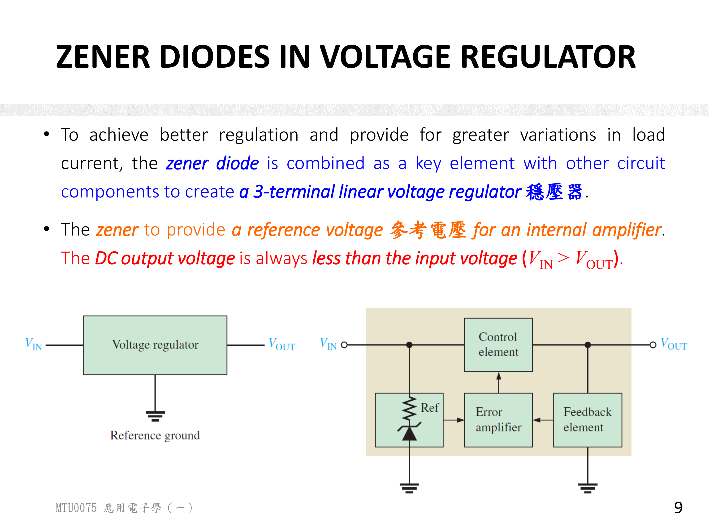

## ZENER DIODES IN VOLTAGE REGULATOR

* To achieve better regulation and provide for greater variations in load current, the zener diode is combined as a key element with other circuit components to create a 3-terminal linear voltage regulator 穩壓器.
* The zener to provide a reference voltage 參考電壓 for an internal amplifier.
* The DC output voltage is always less than the input voltage ($V_{IN} > V_{OUT}$).

**note：**
為了獲得更好的穩壓效果並提供更大的負載電流，通常會將稽納二極體與其他元件（如內部放大器）結合，製作成三端子線性穩壓器（如 IC 78XX）。其中，稽納二極體的作用是提供穩定的「參考電壓」。注意：線性穩壓器的直流輸出電壓必定小於輸入電壓。

---
**📄 Slide 10**

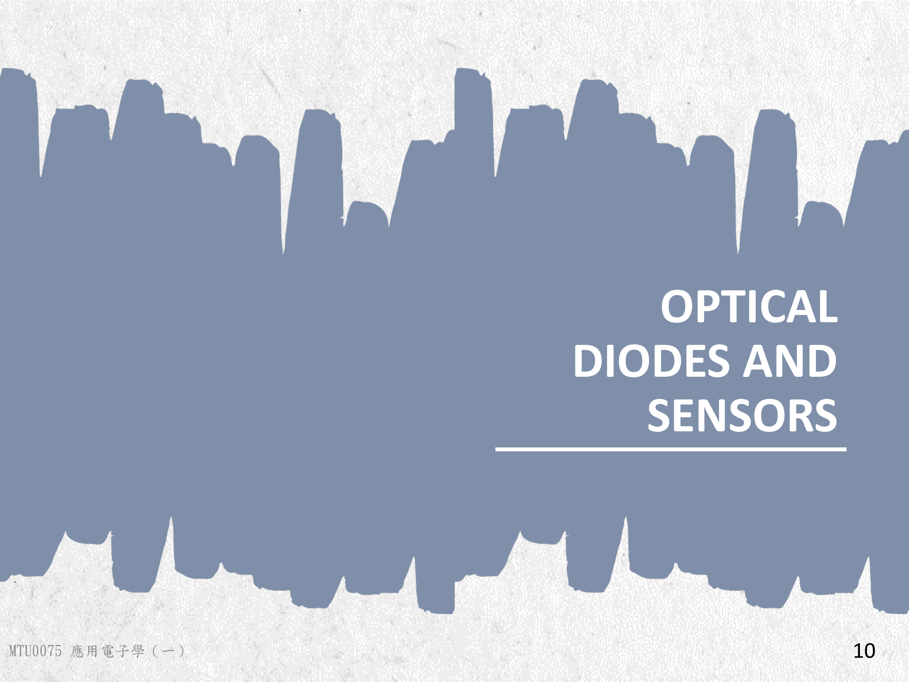

## OPTICAL DIODES AND SENSORS

**note：**
進入第二部分主題：光電二極體與感測器。

---
**📄 Slide 11**

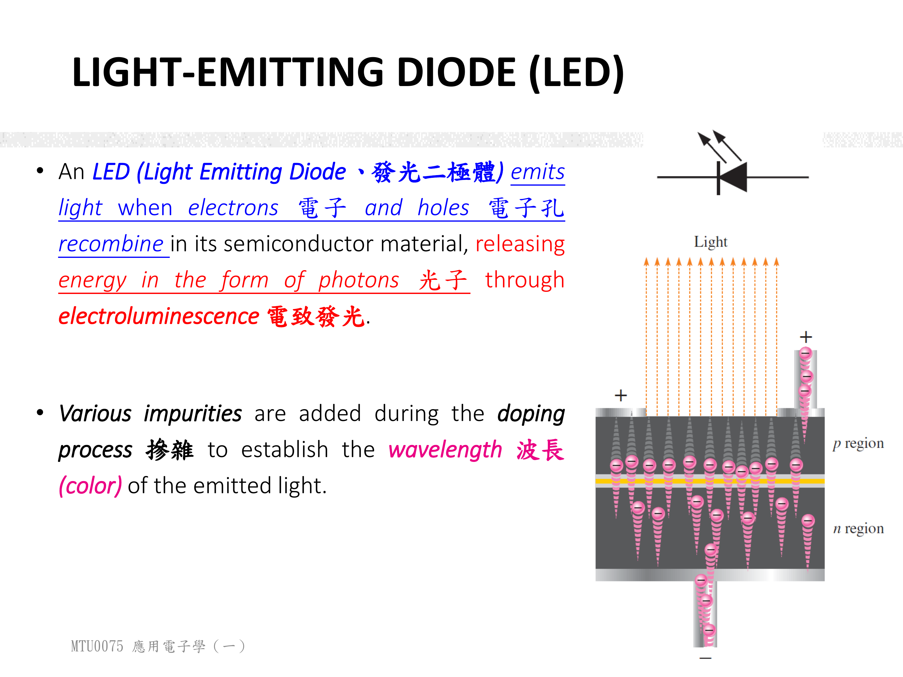

## LIGHT-EMITTING DIODE (LED)

* An LED (Light Emitting Diode、發光二極體) emits light when electrons 電子 and holes 電子孔 recombine in its semiconductor material, releasing energy in the form of photons 光子 through electroluminescence 電致發光.
* Various impurities are added during the doping process 摻雜 to establish the wavelength 波長 (color) of the emitted light.

**note：**
發光二極體 (LED) 透過電子與電洞的復合，以光子形式釋放能量，產生「電致發光」現象。發光顏色（波長）則取決於製造過程中添加的不同摻雜雜質材料。

---
**📄 Slide 12**

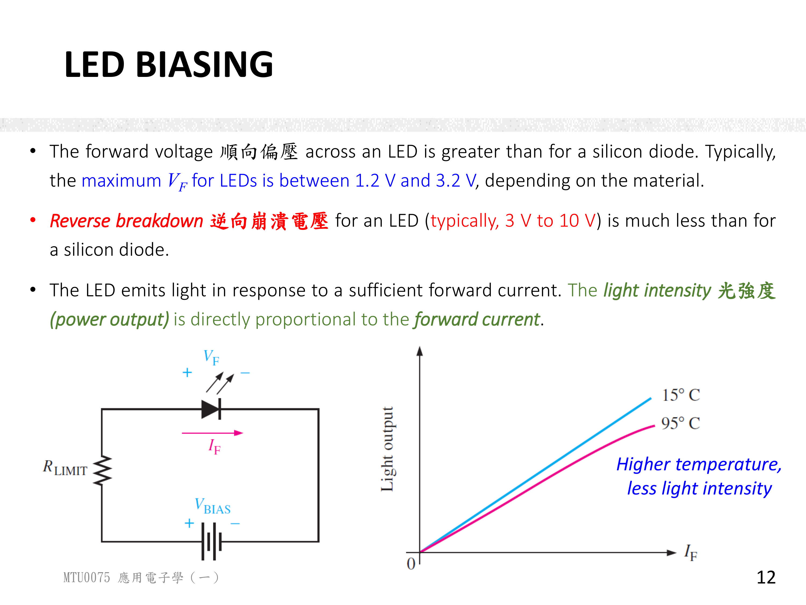

## LED BIASING

* The forward voltage 順向偏壓 across an LED is greater than for a silicon diode. Typically, the maximum $V_F$ for LEDs is between 1.2 V and 3.2 V, depending on the material.
* Reverse breakdown 逆向崩潰電壓 for an LED (typically, 3 V to 10 V) is much less than for a silicon diode.
* The LED emits light in response to a sufficient forward current. The light intensity 光強度 (power output) is directly proportional to the forward current.
* Higher temperature, less light intensity.

**note：**
LED 的順向偏壓 ($V_F$) 通常比一般矽二極體大（約 1.2V 至 3.2V，依材質而定），但逆向崩潰電壓較低（約 3V 至 10V）。LED 需足夠的順向電流才會發光，且光強度與順向電流成正比。另外，環境溫度越高，LED 的光強度會隨之減弱。

---
**📄 Slide 13**

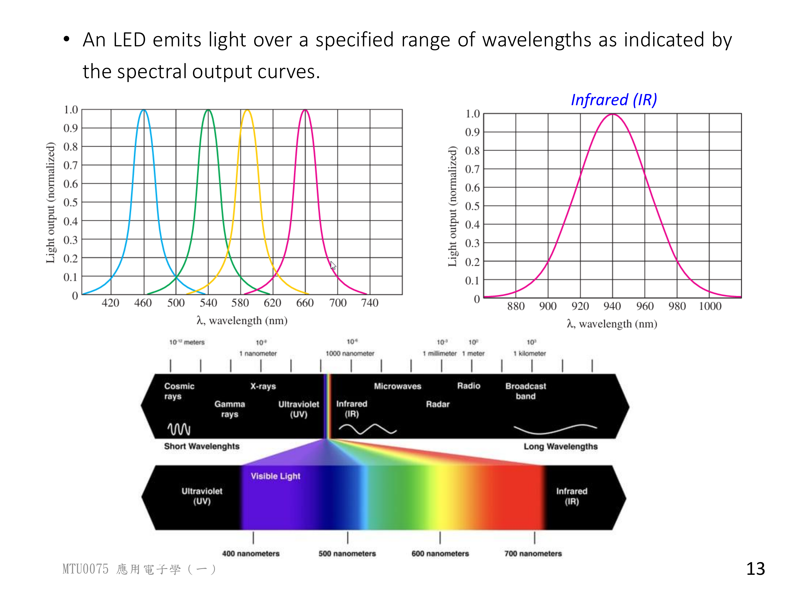

* An LED emits light over a specified range of wavelengths as indicated by the spectral output curves.
* Infrared (IR)

**note：**
每種 LED 都有特定的發光波長範圍（如光譜輸出曲線所示）。除了可見光，也有發射紅外線 (IR) 的 LED。

---
**📄 Slide 14**

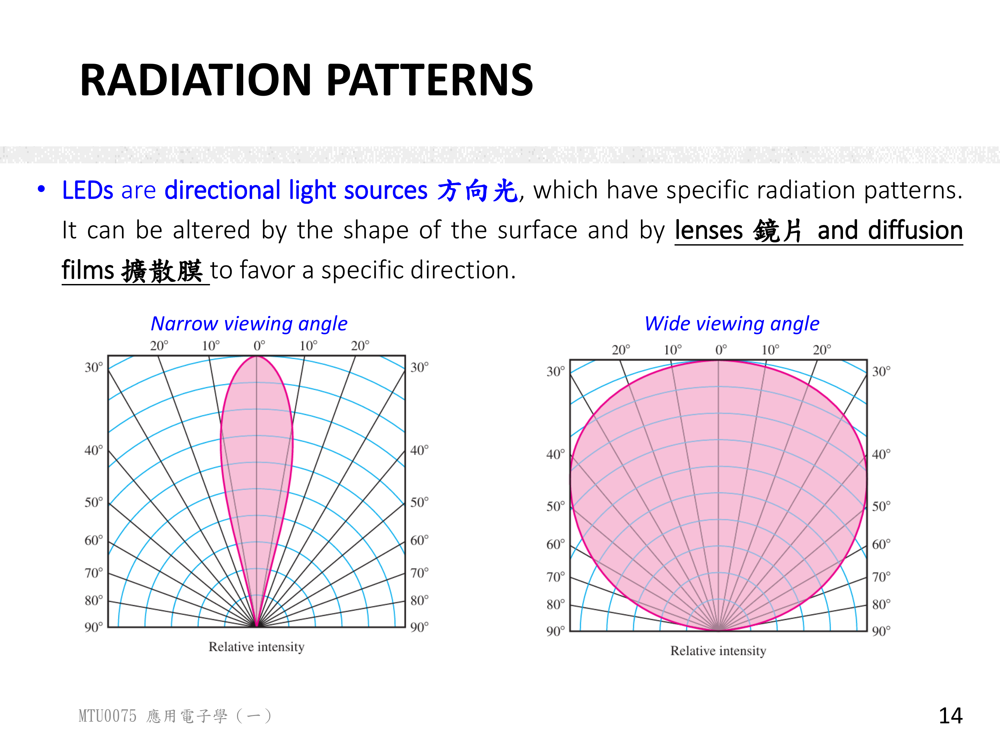

## RADIATION PATTERNS

* LEDs are directional light sources 方向光, which have specific radiation patterns. It can be altered by the shape of the surface and by lenses 鏡片 and diffusion films 擴散膜 to favor a specific direction.
  * Narrow viewing angle
  * Wide viewing angle

**note：**
LED 屬於方向性光源，具有特定的輻射場型（Radiation patterns）。透過改變表面形狀、加裝透鏡或擴散膜，可以改變光的發散角度（例如：窄視角或廣視角）。

---
**📄 Slide 15**

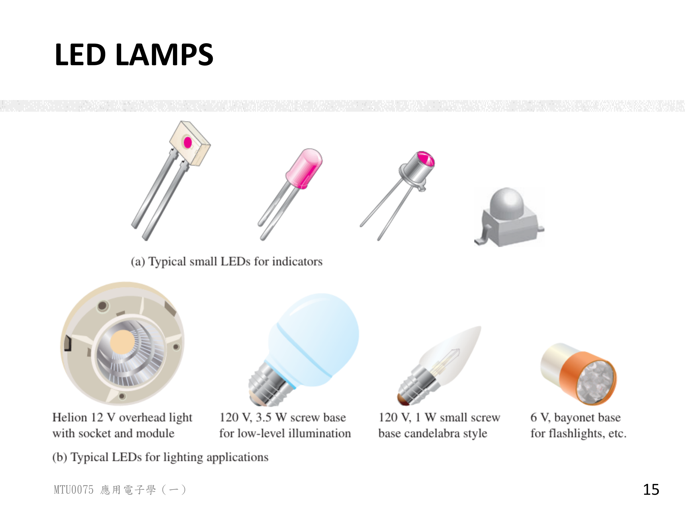

## LED LAMPS

**note：**
展示各種常見的 LED 燈泡與封裝形式 (如直插式 DIP)。

---
**📄 Slide 16**

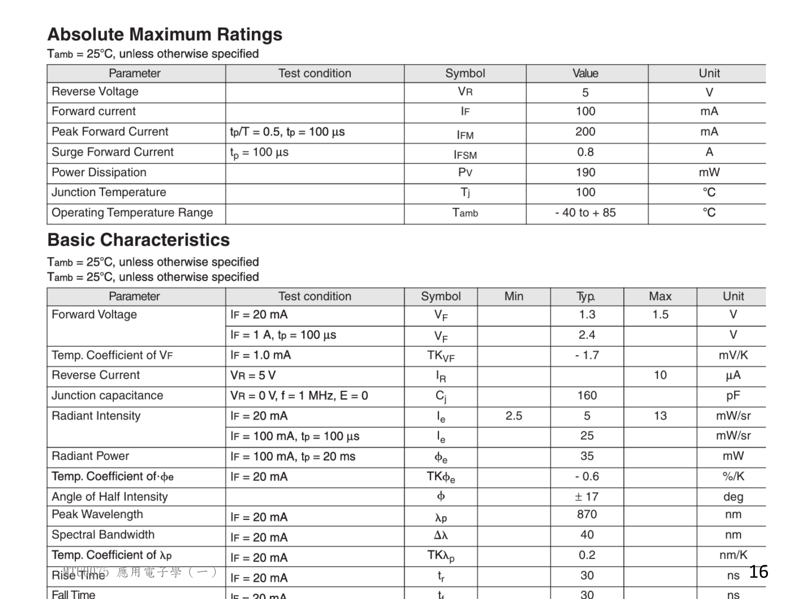

**note：**
展示更多不同封裝型態的 LED 元件，如表面黏著型 (SMD)。

---
**📄 Slide 17**

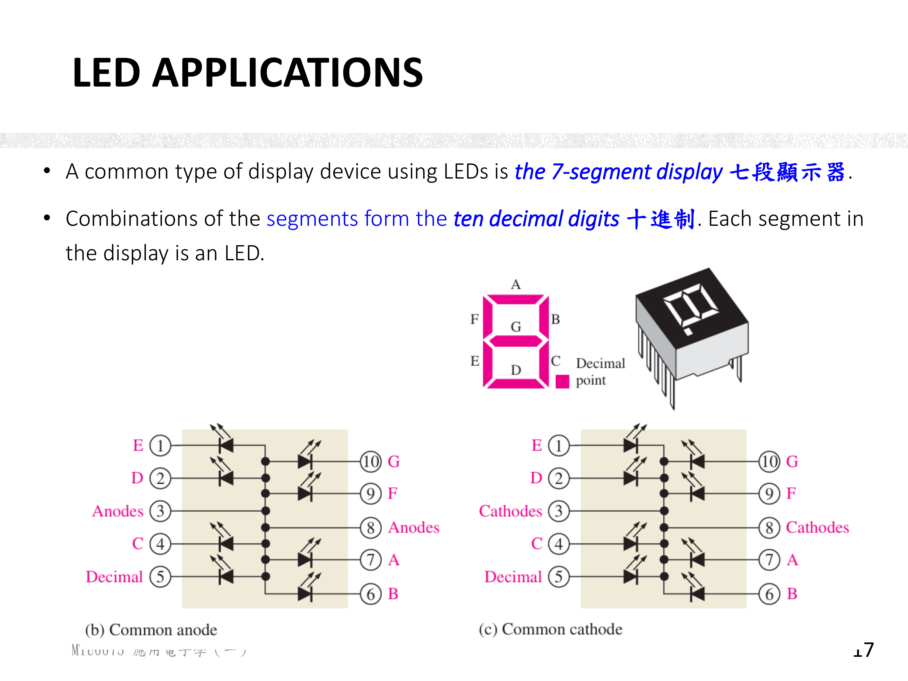

## LED APPLICATIONS

* A common type of display device using LEDs is the 7-segment display 七段顯示器.
* Combinations of the segments form the ten decimal digits 十進制. Each segment in the display is an LED.

**note：**
LED 的常見應用之一是「七段顯示器」。藉由點亮不同區段的 LED，可以組合出 0 到 9 的十進位數字。

---
**📄 Slide 18**

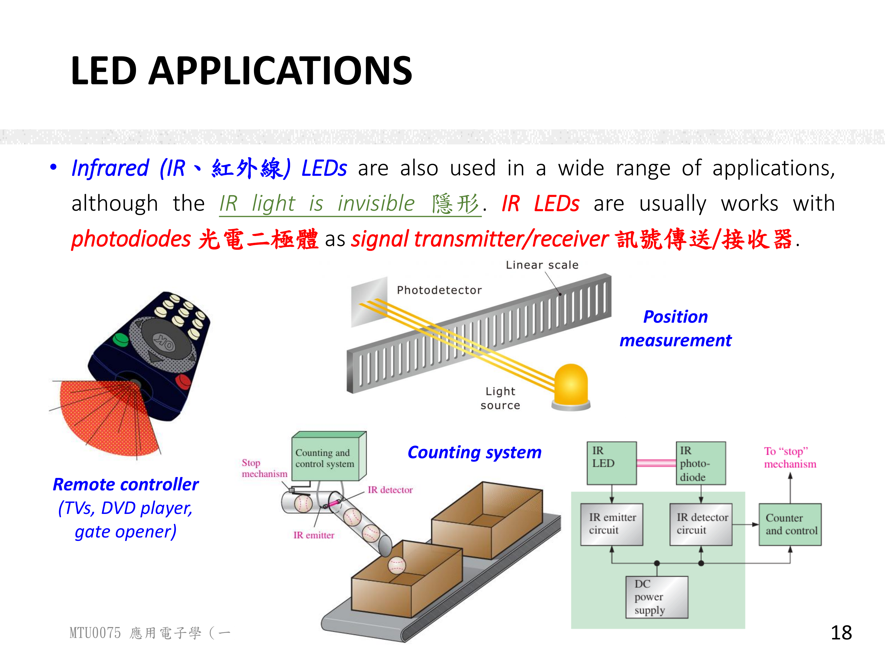

## LED APPLICATIONS

* Infrared (IR、紅外線) LEDs are also used in a wide range of applications, although the IR light is invisible 隱形. IR LEDs are usually works with photodiodes 光電二極體 as signal transmitter/receiver 訊號傳送/接收器.
  * Position measurement
  * Remote controller (TVs, DVD player, gate opener)
  * Counting system

**note：**
紅外線 (IR) LED 雖然發出不可見光，但應用廣泛。通常會搭配光電二極體作為訊號收發器，應用於位置測量、遙控器（電視、DVD 播放器、遙控門）以及計數系統中。

---
**📄 Slide 19**

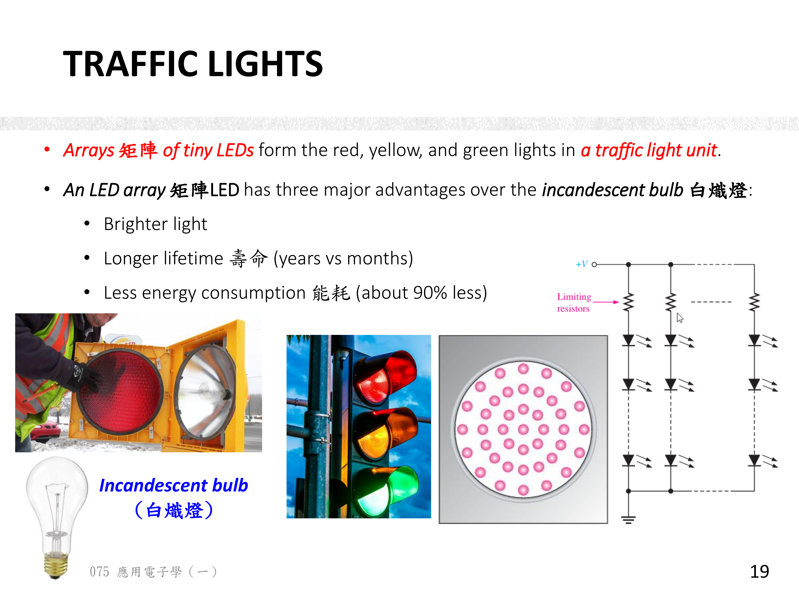

## TRAFFIC LIGHTS

* Arrays 矩陣 of tiny LEDs form the red, yellow, and green lights in a traffic light unit.
* An LED array 矩陣LED has three major advantages over the incandescent bulb 白熾燈:
  * Brighter light
  * Longer lifetime 壽命 (years vs months)
  * Less energy consumption 能耗 (about 90% less)
* Incandescent bulb (白熾燈)

**note：**
交通號誌大量使用 LED 矩陣取代傳統白熾燈，因為 LED 具有更亮、壽命更長（數年 vs. 數個月），且能大幅降低能耗（省電約 90%）等三大優點。

---
**📄 Slide 20**

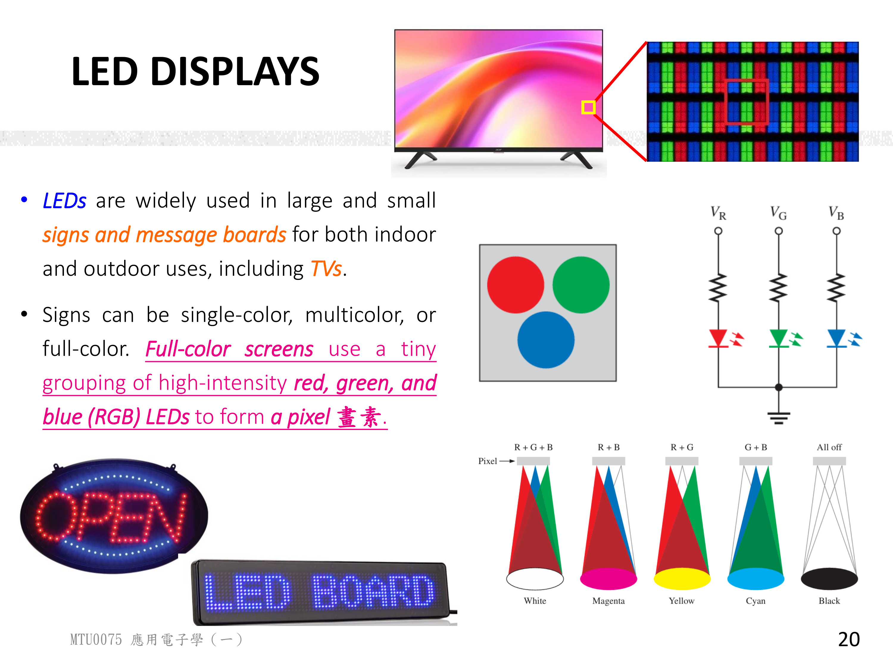

## LED DISPLAYS

* LEDs are widely used in large and small signs and message boards for both indoor and outdoor uses, including TVs.
* Signs can be single-color, multicolor, or full-color. Full-color screens use a tiny grouping of high-intensity red, green, and blue (RGB) LEDs to form a pixel 畫素.

**note：**
LED 也廣泛應用於室內外的各類看板與螢幕。全彩螢幕是透過密集排列的高亮度紅、綠、藍 (RGB) LED 組合而成單一畫素。

---
**📄 Slide 21**

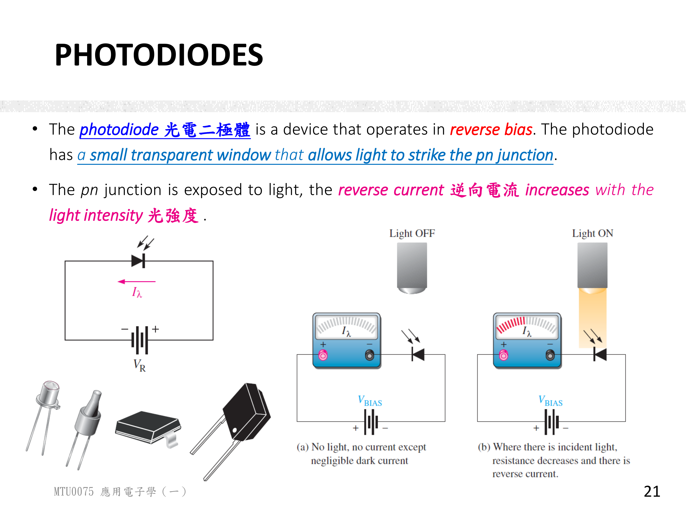

## PHOTODIODES

* The photodiode 光電二極體 is a device that operates in reverse bias. The photodiode has a small transparent window that allows light to strike the pn junction.
* The pn junction is exposed to light, the reverse current 逆向電流 increases with the light intensity 光強度 .

**note：**
光電二極體 (Photodiode) 工作於「逆向偏壓」狀態。元件上有透明視窗讓光線照射至 PN 介面，當光強度增加時，元件的逆向電流也會隨之成正比增加。

---
**📄 Slide 22**

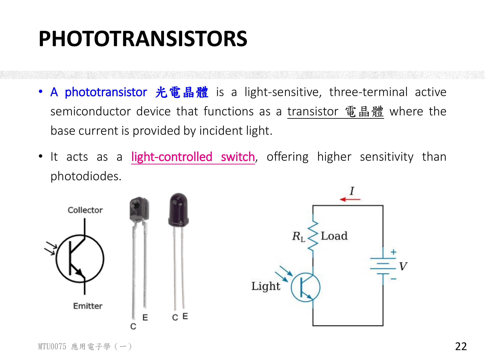

## PHOTOTRANSISTORS

* A phototransistor 光電晶體 is a light-sensitive, three-terminal active semiconductor device that functions as a transistor 電晶體 where the base current is provided by incident light.
* It acts as a light-controlled switch, offering higher sensitivity than photodiodes.

**note：**
光電晶體 (Phototransistor) 是一種對光敏感的三端子主動元件，工作原理類似一般電晶體，但其基極電流是由入射光提供的。它可作為光控開關，且靈敏度高於光電二極體。

---
**📄 Slide 23**

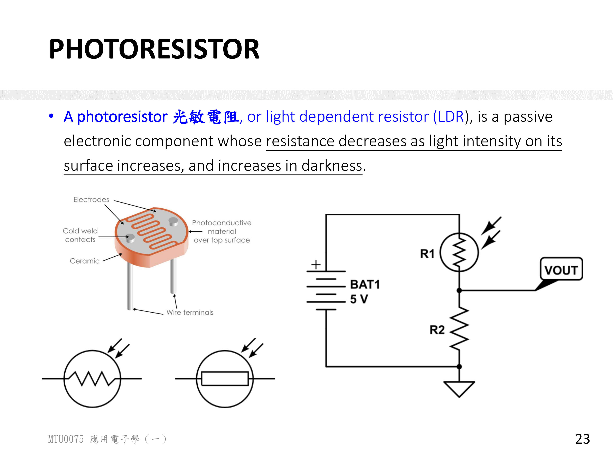

## PHOTORESISTOR

* A photoresistor 光敏電阻, or light dependent resistor (LDR), is a passive electronic component whose resistance decreases as light intensity on its surface increases, and increases in darkness.

**note：**
光敏電阻 (Photoresistor / LDR) 是一種被動元件，其電阻值會隨表面光強度的增加而顯著降低，在黑暗中電阻值最高。

---
**📄 Slide 24**

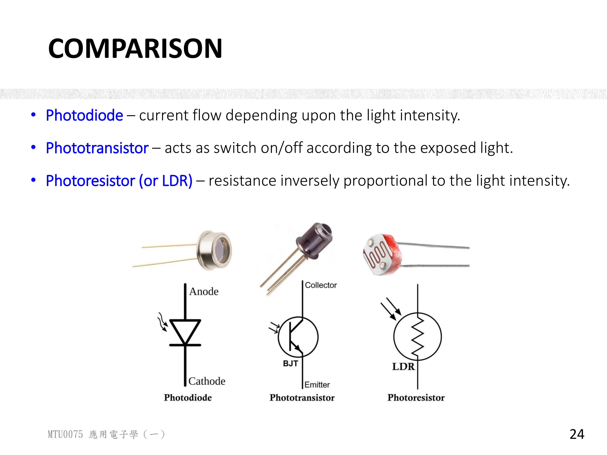

## COMPARISON

* Photodiode – current flow depending upon the light intensity.
* Phototransistor – acts as switch on/off according to the exposed light.
* Photoresistor (or LDR) – resistance inversely proportional to the light intensity.

**note：**
光感測元件比較：光電二極體（電流隨光強變化）、光電晶體（作為光控開關）、光敏電阻（電阻與光強成反比）。

---
**📄 Slide 25**

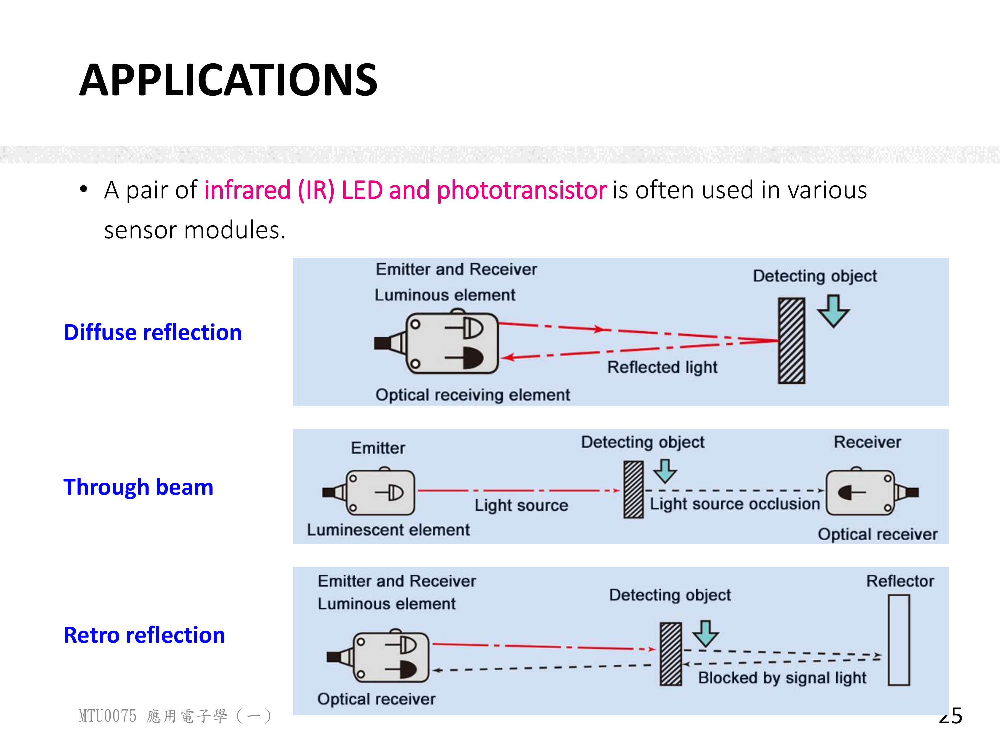

## APPLICATIONS

* A pair of infrared (IR) LED and phototransistor is often used in various sensor modules.
  * Diffuse reflection
  * Through beam
  * Retro reflection

**note：**
紅外線 LED 與光電晶體的組合常被用於感測器模組。依感測方式可分為漫反射式 (Diffuse reflection)、對射式 (Through beam) 與鏡面反射式 (Retro reflection)。

---
**📄 Slide 26**

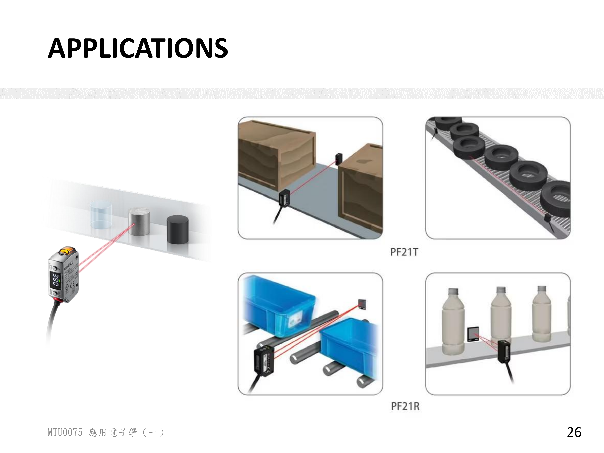

## APPLICATIONS

**note：**
展示更多光電感測器的實際應用範例與模組外觀，例如測距或避障感測。

---
**📄 Slide 27**

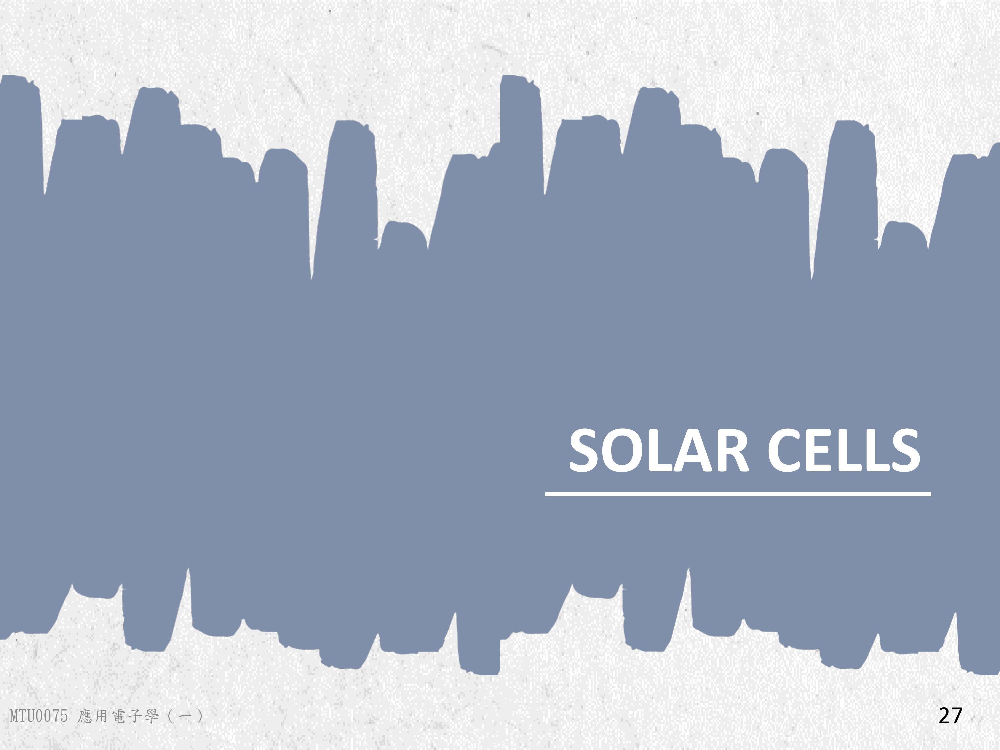

## SOLAR CELLS

**note：**
進入第三部分主題：太陽能電池 (Solar Cells)。

---
**📄 Slide 28**

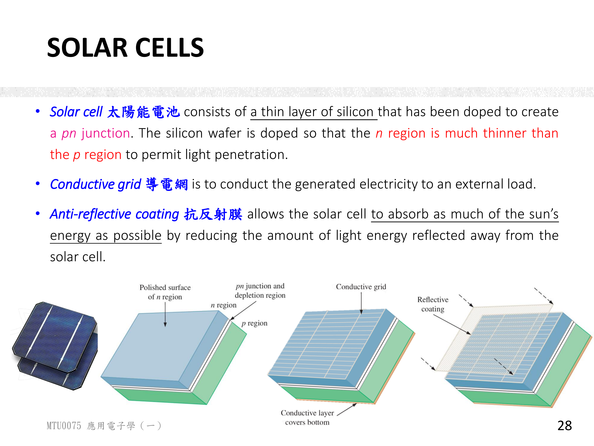

## SOLAR CELLS

* Solar cell 太陽能電池 consists of a thin layer of silicon that has been doped to create a pn junction. The silicon wafer is doped so that the n region is much thinner than the p region to permit light penetration.
* Conductive grid 導電網 is to conduct the generated electricity to an external load.
* Anti-reflective coating 抗反射膜 allows the solar cell to absorb as much of the sun’s energy as possible by reducing the amount of light energy reflected away from the solar cell.

**note：**
太陽能電池由薄矽片製成，表面有導電網負責導出電流，並塗有抗反射膜以吸收最多太陽能。為了讓光線順利穿透，N 型區被設計得比 P 型區薄很多。

---
**📄 Slide 29**

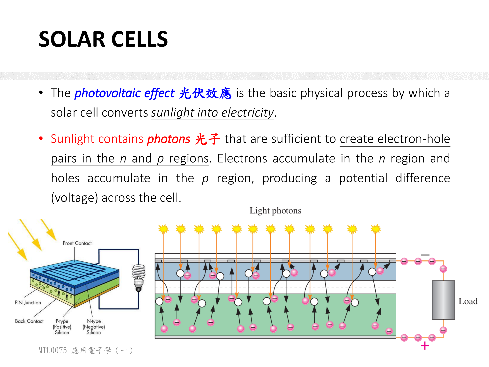

## SOLAR CELLS

* The photovoltaic effect 光伏效應 is the basic physical process by which a solar cell converts sunlight into electricity.
* Sunlight contains photons 光子 that are sufficient to create electron-hole pairs in the n and p regions. Electrons accumulate in the n region and holes accumulate in the p region, producing a potential difference (voltage) across the cell.

**note：**
太陽能電池的核心原理是「光伏效應 (Photovoltaic effect)」。陽光中的光子激發出電子-電洞對，電子在 N 區累積，電洞在 P 區累積，進而在兩端產生電位差（電壓）。

---
**📄 Slide 30**

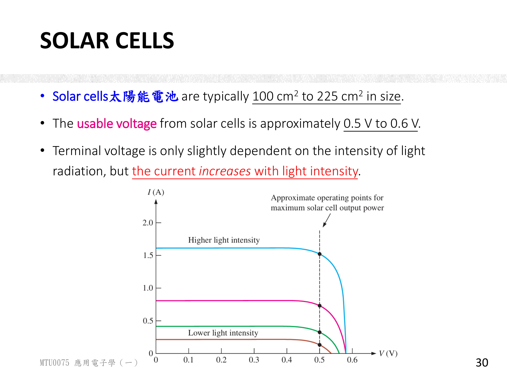

## SOLAR CELLS

* Solar cells太陽能電池 are typically $100 cm^2$ to $225 cm^2$ in size.
* The usable voltage from solar cells is approximately 0.5 V to 0.6 V.
* Terminal voltage is only slightly dependent on the intensity of light radiation, but the current increases with light intensity.

**note：**
單片太陽能電池面積約在 100 到 225 平方公分。其輸出電壓約為 0.5V 到 0.6V 且不受光強太大影響，但輸出的電流會隨著光強度的增加而明顯上升。

---
**📄 Slide 31**

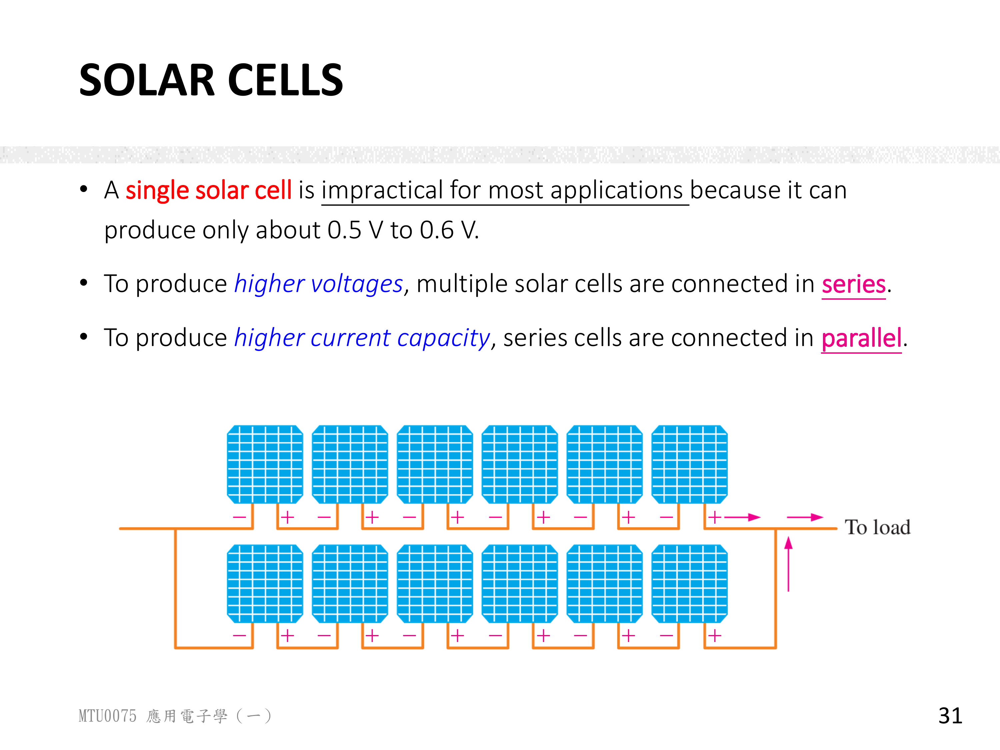

## SOLAR CELLS

* A single solar cell is impractical for most applications because it can produce only about 0.5 V to 0.6 V.
* To produce higher voltages, multiple solar cells are connected in series.
* To produce higher current capacity, series cells are connected in parallel.

**note：**
因為單片太陽能電池的電壓太低（0.5~0.6V），實用上會將多片電池「串聯」以提高電壓，並將串聯後的電池組「並聯」以增加電流容量，組成實用的太陽能板。

---
**📄 Slide 32**

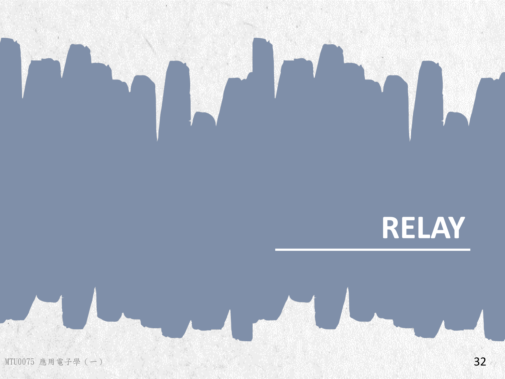

## RELAY

**note：**
進入第四部分主題：繼電器 (Relay)。

---
**📄 Slide 33**

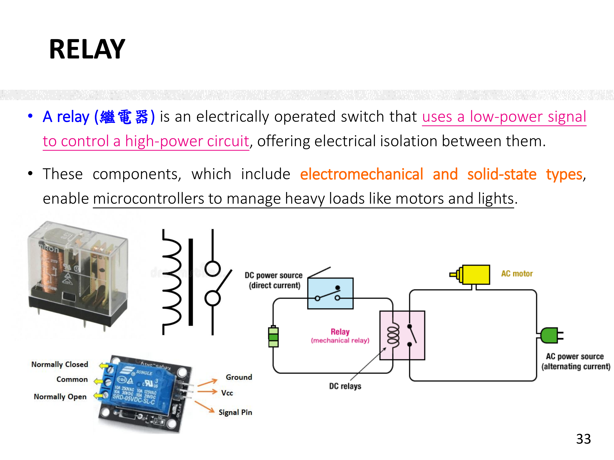

## RELAY

* A relay (繼電器) is an electrically operated switch that uses a low-power signal to control a high-power circuit, offering electrical isolation between them.
* These components, which include electromechanical and solid-state types, enable microcontrollers to manage heavy loads like motors and lights.
---

**note：**
繼電器 (Relay) 是一種電控開關，能用低功率訊號控制高功率電路，並在兩者間提供電氣隔離。這讓微控制器 (MCU) 能安全地控制馬達、高功率燈具等重負載。
