# Ch7 BJT Amplifiers

---

## BJT 放大器分析流程 (BJT Amplifier Analysis Flow)

### Step 1: 直流偏壓分析 (DC Bias Analysis)

1. 電容視為開路 (Capacitors = open circuits)
2. 使用 $\beta_{DC}$ 計算工作點 (Q-point)
3. 求出 $I_{BQ}$, $I_{CQ}$, $V_{CEQ}$

$$I_B = \frac{V_{BB} - V_{BE}}{R_B}$$

$$I_C = \beta_{DC} \cdot I_B$$

$$V_{CE} = V_{CC} - I_C R_C$$

### Step 2: 直流負載線 (DC Load Line)

$$I_{C(sat)} = \frac{V_{CC}}{R_C}$$

$$V_{CE(cutoff)} = V_{CC}$$

> Q-point 必須位於負載線中段，才能獲得最大不失真輸出擺幅。

### Step 3: 交流訊號分析 (AC Signal Analysis)

1. 電容視為短路 (Capacitors = short circuits)
2. 直流電源視為交流接地 (DC sources = AC ground)
3. 使用 $\beta_{ac}$ 計算增益與阻抗

### Step 4: 疊加與波形 (Superposition & Waveform)

- 輸入交流訊號疊加於直流工作點上
- 輸出電壓與輸入電壓相位差 180 度（反相放大）
- 需檢查是否產生截波失真 (Clipping Distortion)

---

**📄 Slide 01**

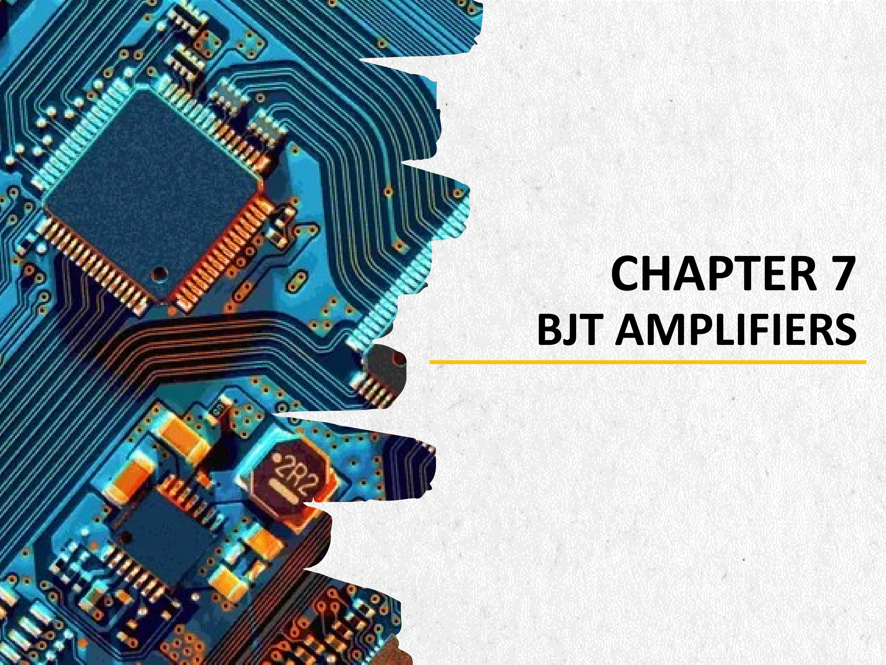

## CHAPTER 7 BJT AMPLIFIERS

**note：**
本章節介紹 BJT 放大器的原理與分析方法，包含直流負載線、工作點設定、交流訊號放大及失真分析。

---

**📄 Slide 02**

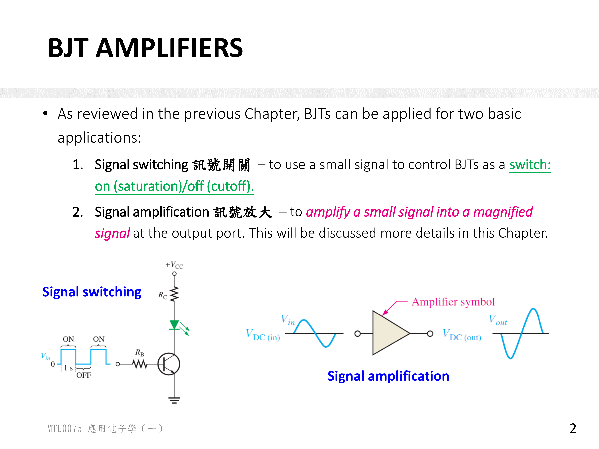

## BJT AMPLIFIERS (BJT 放大器)

* Two basic applications of BJTs:
  1. **Signal switching (訊號開關)** – Use a small signal to control a BJT as a switch: ON (saturation) / OFF (cutoff).
  2. **Signal amplification (訊號放大)** – Amplify a small signal into a magnified signal at output.

* Signal switching: An NPN BJT with $V_{in}$ square wave input, $R_B$, $R_C$, LED, and $V_{CC}$.
* Signal amplification: $V_{in}$ AC signal + $V_{DC(in)}$ enters the amplifier, producing $V_{out}$ which is magnified (inverted 180 degrees).

**note：**
BJT 的兩大基本應用：
1. **訊號開關**：利用小訊號控制 BJT 作為開關，在飽和 (ON) 與截止 (OFF) 之間切換。
2. **訊號放大**：將輸入的小訊號放大為較大的輸出訊號，且輸出訊號與輸入訊號反相 180 度。

---

**📄 Slide 03**

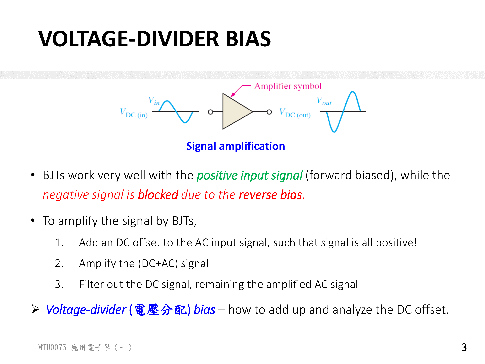

## VOLTAGE-DIVIDER BIAS (電壓分配偏壓)

* BJTs work well with positive input (forward biased). Negative signal is blocked (reverse bias).
* To amplify an AC signal by BJTs:
  1. Add DC offset to AC input so signal is all positive.
  2. Amplify the (DC + AC) signal.
  3. Filter out DC signal, remaining amplified AC signal.

* The voltage-divider (電壓分配) bias establishes the DC offset.
* Diagram: $V_{in}$ AC signal is shifted up by $V_{DC(in)}$, amplified, then $V_{out}$ is produced around $V_{DC(out)}$.

**note：**
* BJT 對正輸入（順向偏壓）可正常工作，但負訊號會被阻擋（逆向偏壓）。
* 為了放大交流訊號，必須：
  1. 將直流偏壓疊加到交流輸入上，使整個訊號為正值
  2. 放大此 (DC + AC) 訊號
  3. 濾除直流成分，留下放大後的交流訊號
* 電壓分配偏壓的功用就是建立此直流偏移量。

---

**📄 Slide 04**

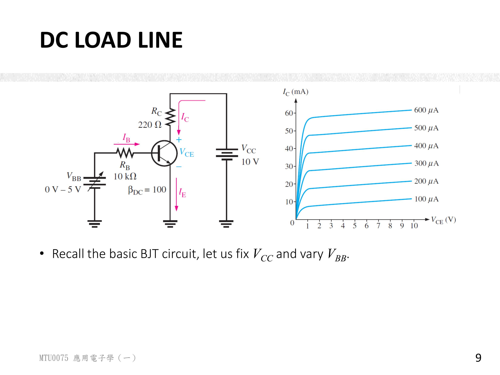

## DC LOAD LINE (直流負載線)

* NPN BJT circuit parameters: $\beta_{DC} = 100$, $V_{BB}$ variable $0 \sim 5V$, $R_B = 10k\Omega$, $V_{CC} = 10V$, $R_C = 220\Omega$.

* Collector characteristic curves for $I_B = 100\mu A$ to $600\mu A$.

* Key formulas:

$$V_{CE} = V_{CC} - I_C R_C$$

$$I_B = \frac{V_{BB} - V_{BE}}{R_B}$$

$$I_C = \beta_{DC} \cdot I_B$$

**note：**
* 直流負載線描述在給定 $V_{CC}$ 與 $R_C$ 下，集極電流 $I_C$ 與集極-射極電壓 $V_{CE}$ 之間的線性關係。
* 公式 $V_{CE} = V_{CC} - I_C R_C$ 為一直線方程式，其斜率由 $R_C$ 決定，與電晶體特性無關。
* 將不同的 $I_B$ 值對應的特性曲線與負載線相交，即可找到各工作點 (Q-point)。

---

**📄 Slide 05**

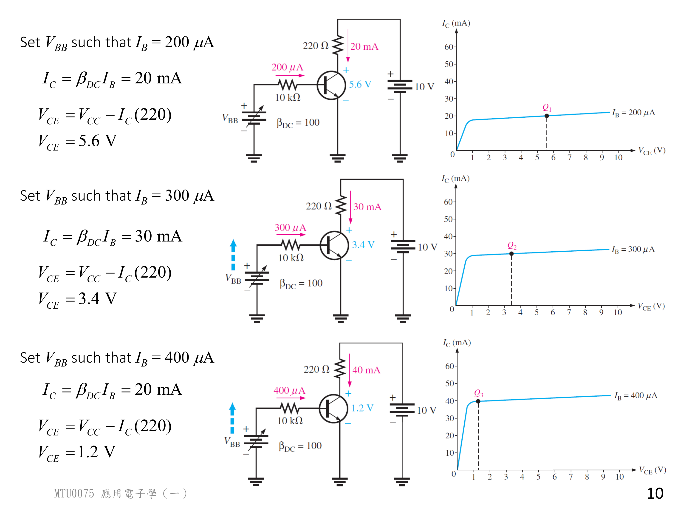

## DC LOAD LINE — Q-POINTS (工作點計算)

Given $\beta_{DC} = 100$, $V_{CC} = 10V$, $R_C = 220\Omega$:

| Q-point | $I_B$ | $I_C = \beta_{DC} I_B$ | $V_{CE} = V_{CC} - I_C R_C$ |
| :--- | :--- | :--- | :--- |
| Q1 | $200\mu A$ | $20 mA$ | $5.6V$ |
| Q2 | $300\mu A$ | $30 mA$ | $3.4V$ |
| Q3 | $400\mu A$ | $40 mA$ | $1.2V$ |

* Saturation current:

$$I_{C(sat)} = \frac{V_{CC}}{R_C} = \frac{10V}{220\Omega} \approx 45.45 mA$$

* Cutoff voltage:

$$V_{CE(cutoff)} = V_{CC} = 10V$$

**note：**
* 三個工作點的計算結果：Q1 ($200\mu A$, $20mA$, $5.6V$)、Q2 ($300\mu A$, $30mA$, $3.4V$)、Q3 ($400\mu A$, $40mA$, $1.2V$)。
* 飽和電流 $I_{C(sat)} \approx 45.45mA$ 為負載線與 Y 軸的交點；截止電壓 $V_{CE(cutoff)} = 10V$ 為負載線與 X 軸的交點。

---

**📄 Slide 06**

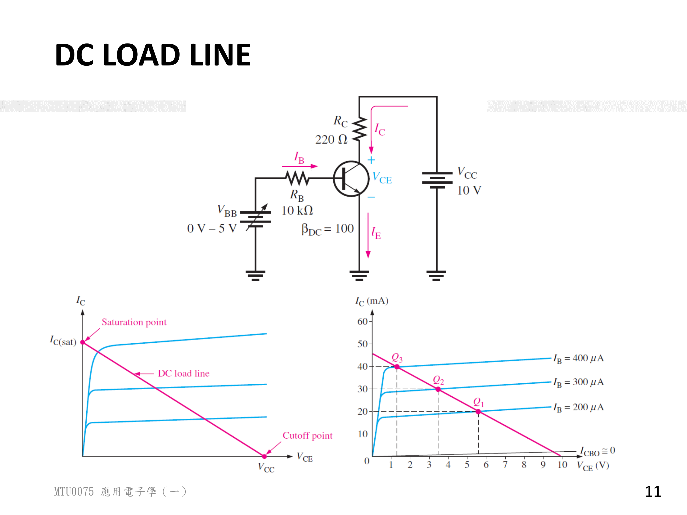

## DC LOAD LINE GRAPH (直流負載線圖)

* Graph: $I_C$ vs $V_{CE}$ with load line plotted.
* Load line equation:

$$V_{CE} = V_{CC} - I_C R_C$$

* Two endpoints:
  * **Saturation point**: $I_{C(sat)} = V_{CC}/R_C = 10V/220\Omega \approx 45.45mA$ (at $V_{CE} = 0$)
  * **Cutoff point**: $V_{CE(cutoff)} = V_{CC} = 10V$ (at $I_C = 0$)

* Q-points on load line:
  * Q1: ($5.6V$, $20mA$)
  * Q2: ($3.4V$, $30mA$)
  * Q3: ($1.2V$, $40mA$)

**note：**
* 負載線圖以 $V_{CE}$ 為橫軸、$I_C$ 為縱軸，是一條從截止點 ($10V$, $0mA$) 到飽和點 ($0V$, $45.45mA$) 的直線。
* 所有的工作點必定落在這條負載線上，位置取決於 $I_B$ 的大小。
* Q1 位於負載線上半段，Q3 接近飽和區。

---

**📄 Slide 07**

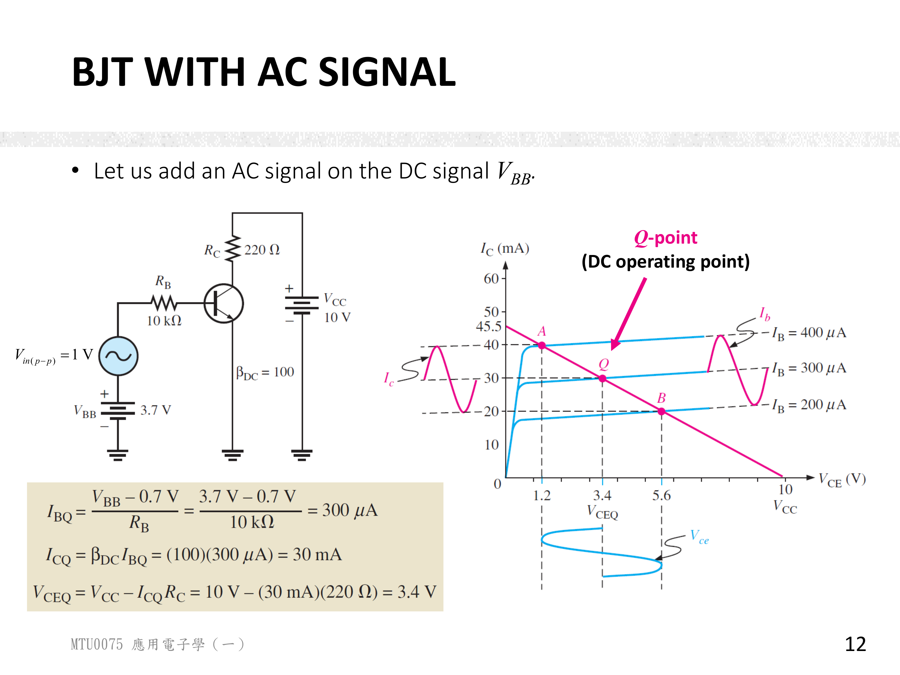

## BJT WITH AC SIGNAL (BJT 加上交流訊號)

* Circuit parameters: $V_{BB} = 3.7V$, $V_{CC} = 10V$, $R_B = 10k\Omega$, $R_C = 220\Omega$, $\beta_{DC} = 100$.
* AC input: $V_{in(p-p)} = 1V$ superimposed on $V_{BB}$.

* Q-point calculation:

$$I_{BQ} = \frac{V_{BB} - V_{BE}}{R_B} = \frac{3.7V - 0.7V}{10k\Omega} = 300\mu A$$

$$I_{CQ} = \beta_{DC} \cdot I_{BQ} = 100 \times 300\mu A = 30mA$$

$$V_{CEQ} = V_{CC} - I_{CQ} R_C = 10V - 30mA \times 220\Omega = 3.4V$$

* Signal swing with AC input:
  * $I_B$ swings $\pm 100\mu A$ ($200\mu A \sim 400\mu A$)
  * $I_C$ swings $\pm 10mA$ ($20mA \sim 40mA$)
  * $V_{CE}$ swings $1.2V \sim 5.6V$
  * **180 degree phase shift**: $V_{CE}$ is inverted relative to $I_C$ and $I_B$.

**note：**
* 當交流訊號 (峰對峰值 $1V$) 疊加於直流偏壓 $V_{BB} = 3.7V$ 時，工作點以 Q2 ($3.4V$, $30mA$) 為中心上下擺動。
* $I_B$ 在 $200\mu A \sim 400\mu A$ 間擺動，$I_C$ 在 $20mA \sim 40mA$ 間擺動，$V_{CE}$ 在 $1.2V \sim 5.6V$ 間擺動。
* 重要特性：$V_{CE}$ 與 $I_C$、$I_B$ 的變化方向相反（180 度反相），這是共射極放大器的固有特性。

---

**📄 Slide 08**

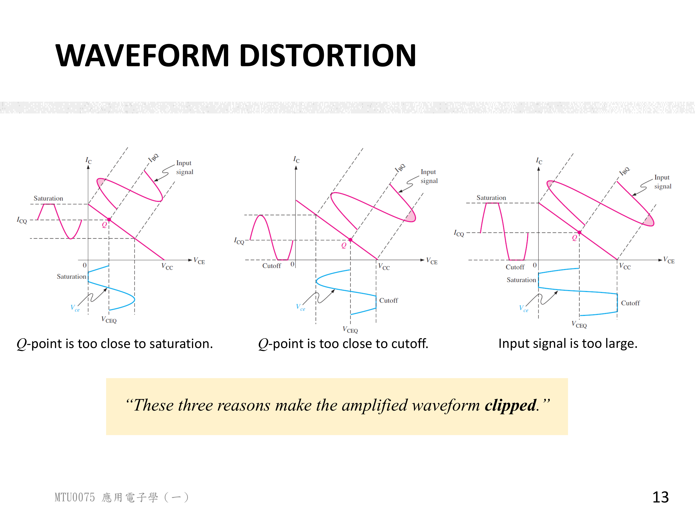

## WAVEFORM DISTORTION (波形失真)

* Clipping causes:
  1. **Q-point too close to saturation** — output clipped at saturation level.
  2. **Q-point too close to cutoff** — output clipped at cutoff level.
  3. **Input signal too large** — clipping at both peaks.

**note：**
波形失真（截波失真）的三種原因：
1. **工作點過高（接近飽和區）**：輸出波形的正半週被截斷（飽和截波）。
2. **工作點過低（接近截止區）**：輸出波形的負半週被截斷（截止截波）。
3. **輸入訊號過大**：同時在兩端產生截波，上下皆被截斷。

> 為避免失真，Q-point 應設定在負載線的中央，使輸出訊號能有最大的不失真擺幅。

---

**📄 Slide 09**

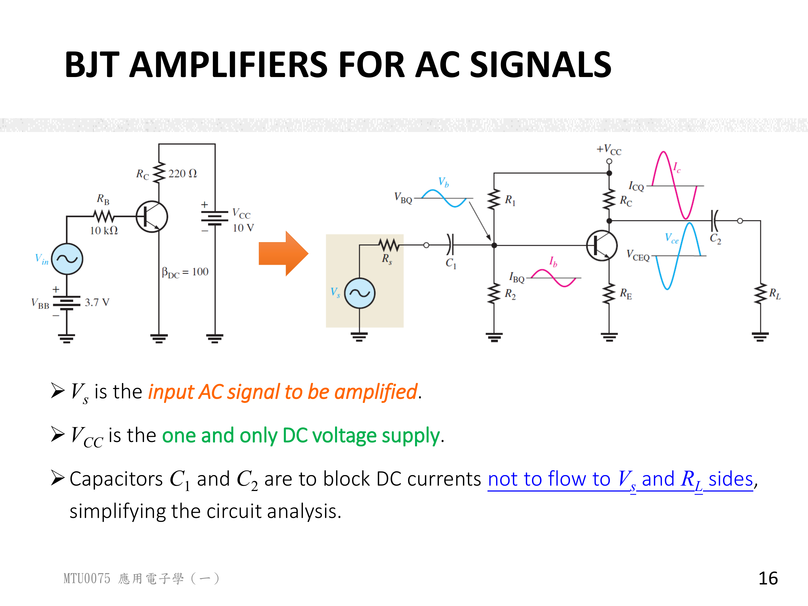

## BJT AMPLIFIERS FOR AC SIGNALS (交流訊號放大器電路)

* NPN transistor in voltage-divider bias configuration.

| Component | Function |
| :--- | :--- |
| $V_s$ | Input AC signal with $R_s$ internal resistance |
| $V_{CC}$ | Single DC supply |
| $C_1$, $C_2$ | Coupling capacitors (block DC currents from $V_s$ and $R_L$) |
| $R_1$, $R_2$ | Voltage divider for DC operating point |
| $R_C$ | Collector resistor |
| $R_E$ | Emitter resistor |
| $R_L$ | Load resistor |

**note：**
* 交流放大器的標準電壓分配偏壓組態包含：
  * **耦合電容** $C_1$, $C_2$：阻隔訊號源與負載的直流電流，僅允許交流訊號通過。
  * **電壓分配電阻** $R_1$, $R_2$：建立電晶體的直流工作點。
  * **集極電阻** $R_C$ 與**射極電阻** $R_E$：決定放大器的增益與穩定性。
  * **負載電阻** $R_L$：接收放大後的交流訊號。

---

**📄 Slide 10**

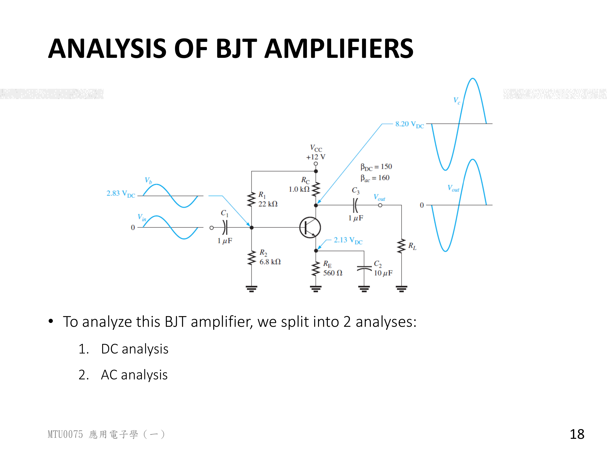

## ANALYSIS OF BJT AMPLIFIERS (BJT 放大器分析方法)

* Split into 2 analyses:

### Example Circuit Parameters

| Parameter | Value |
| :--- | :--- |
| $V_{CC}$ | $+12V$ |
| $\beta_{DC}$ | $150$ |
| $\beta_{ac}$ | $160$ |
| $R_1$ | $22k\Omega$ |
| $R_2$ | $6.8k\Omega$ |
| $R_C$ | $1.0k\Omega$ |
| $R_E$ | $560\Omega$ |
| $C_1$ | $1\mu F$ |
| $C_2$ | $10\mu F$ |
| $C_3$ | $1\mu F$ |

### DC Bias Voltages (from DC Analysis)

| Node | Voltage |
| :--- | :--- |
| $V_B$ (base) | $2.83V$ |
| $V_E$ (emitter) | $2.13V$ |
| $V_C$ (collector) | $8.20V$ |

### 1. DC Analysis (直流分析)
* Capacitors = **open circuits** (開路)
* Use $\beta_{DC}$
* Find Q-point ($I_{BQ}$, $I_{CQ}$, $V_{CEQ}$)

### 2. AC Analysis (交流分析)
* Capacitors = **short circuits** (短路)
* DC sources = **AC ground** (交流接地)
* Use $\beta_{ac}$
* Find voltage gain, current gain, input/output impedance

**note：**
BJT 放大器的分析分為兩部分：
1. **直流分析**：將所有電容視為開路（因為直流無法通過電容），使用 $\beta_{DC}$ 求出靜態工作點 Q-point。
2. **交流分析**：將所有電容視為短路（因為電容對交流訊號的阻抗極小），直流電源視為交流接地，使用 $\beta_{ac}$ 計算電壓增益、電流增益及輸入/輸出阻抗。

> 直流分析確保電晶體偏壓在主動區；交流分析則決定放大器的性能指標。

---

**📄 Slide 11**

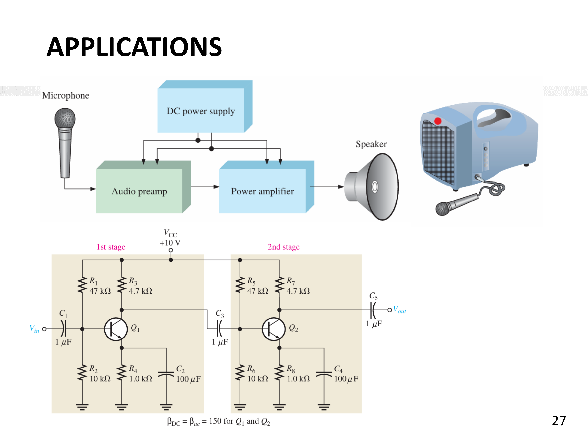

## APPLICATIONS — TWO-STAGE AUDIO AMPLIFIER (應用：二級音頻放大器)

* System block diagram: Microphone $\rightarrow$ Audio preamp $\rightarrow$ Power amplifier $\rightarrow$ Speaker
* Two-stage common-emitter amplifier circuit.
* $V_{CC} = +10V$, $\beta_{DC} = \beta_{ac} = 150$ for both Q1 and Q2.

| Stage | Name | Base Bias | Collector Resistor | Emitter Resistor | Coupling / Bypass |
| :--- | :--- | :--- | :--- | :--- | :--- |
| Stage 1 | Audio Preamp | $R_1 = 47k\Omega$, $R_2 = 10k\Omega$ | $R_3 = 4.7k\Omega$ | $R_4 = 1.0k\Omega$ | $C_1 = 1\mu F$, $C_2 = 100\mu F$, $C_3 = 1\mu F$ |
| Stage 2 | Power Amp | $R_5 = 47k\Omega$, $R_6 = 10k\Omega$ | $R_7 = 4.7k\Omega$ | $R_8 = 1.0k\Omega$ | $C_3 = 1\mu F$, $C_4 = 100\mu F$, $C_5 = 1\mu F$ |

**note：**
* 二級音頻放大器的系統架構：麥克風訊號先經過「音頻前置放大器 (Audio Preamp)」進行初步放大，再送入「功率放大器 (Power Amp)」驅動揚聲器。
* 第一級與第二級皆採用共射極 (Common-Emitter) 組態，電壓分配偏壓電路設定工作點。
* $C_1$ 為輸入耦合電容，$C_3$ 為級間耦合電容，$C_5$ 為輸出耦合電容，$C_2$ 與 $C_4$ 為射極旁路電容（提供交流旁路以提升增益）。
* 每一級的 $C_2$/$C_4 = 100\mu F$ 為射極旁路電容，在交流分析中將 $R_E$ 短路，可大幅提高電壓增益。

---

## 章節重點總結 (Chapter Summary)

本章介紹 BJT 放大器的核心概念，包含直流偏壓、負載線、交流訊號分析與失真：

### 1. BJT 的兩大應用
* **訊號開關 (Signal Switching)**：操作於截止區 (OFF) 與飽和區 (ON) 之間。
* **訊號放大 (Signal Amplification)**：操作於主動區，利用 $\beta_{DC}$ 將小訊號放大。

### 2. 電壓分配偏壓 (Voltage-Divider Bias)
* 為了讓 BJT 能放大交流訊號，必須先加上直流偏壓，使整個訊號保持在正值範圍內。
* 電壓分配偏壓電路 ($R_1$, $R_2$) 提供穩定的直流工作點。

### 3. 直流負載線 (DC Load Line)
* 負載線方程式：$V_{CE} = V_{CC} - I_C R_C$
* 飽和點：$I_{C(sat)} = V_{CC}/R_C$（$V_{CE} = 0$）
* 截止點：$V_{CE(cutoff)} = V_{CC}$（$I_C = 0$）
* 工作點 (Q-point) 位於負載線上，位置由 $I_B$ 決定。

### 4. 交流訊號與反相放大
* 交流訊號疊加於直流工作點上，使 $I_B$, $I_C$, $V_{CE}$ 在 Q-point 附近擺動。
* 輸出電壓 $V_{CE}$ 與輸入訊號反相 180 度（共射極放大器的特性）。

### 5. 波形失真 (Waveform Distortion)
* Q-point 過高 $\rightarrow$ 飽和截波；Q-point 過低 $\rightarrow$ 截止截波；訊號過大 $\rightarrow$ 雙端截波。
* 為避免失真，Q-point 應設在負載線中點。

### 6. BJT 放大器分析方法
* **直流分析**：電容 = 開路，使用 $\beta_{DC}$，求 Q-point。
* **交流分析**：電容 = 短路，DC 電源 = AC 接地，使用 $\beta_{ac}$，求增益與阻抗。

### 7. 二級音頻放大器
* 系統架構：麥克風 $\rightarrow$ 前置放大 $\rightarrow$ 功率放大 $\rightarrow$ 揚聲器。
* 每級使用電壓分配偏壓的共射極放大器，級間以耦合電容連接。

---

[Source: Ch7_BJT_Amplifiers.pdf](../course-materials/Ch7_BJT_Amplifiers.pdf)

