# Ch9 Operational Amplifiers (Op-Amps)

---

## Op-Amp 核心概念速覽 (Op-Amp Key Concepts Overview)

### 三種基本 Op-Amp 電路比較

| 特性 | 非反相放大器 (Noninverting) | 電壓隨耦器 (Voltage-Follower) | 反相放大器 (Inverting) |
| :--- | :--- | :--- | :--- |
| 閉迴路增益 $A_{cl}$ | $1 + \frac{R_f}{R_i}$ | $1$ | $-\frac{R_f}{R_i}$ |
| 輸入阻抗 $Z_{in(cl)}$ | $(1 + A_{ol}B)Z_{in}$ | $(1 + A_{ol})Z_{in}$ | $\approx R_i$ |
| 輸出阻抗 $Z_{out(cl)}$ | $\frac{Z_{out}}{1 + A_{ol}B}$ | $\frac{Z_{out}}{1 + A_{ol}}$ | $\frac{Z_{out}}{1 + A_{ol}B}$ |
| 回授因子 $B$ | $\frac{R_i}{R_i + R_f}$ | $1$ | $\frac{R_i}{R_i + R_f}$ |

### 理想 Op-Amp 特性

| 參數 | 理想值 | 說明 |
| :--- | :--- | :--- |
| 輸入阻抗 $Z_{in}$ | $\infty$ | 輸入端不消耗電流 |
| 輸出阻抗 $Z_{out}$ | $0$ | 輸出不受負載影響 |
| 電壓增益 $A_v$ | $\infty$ | 極大的開迴路增益 |

### 核心公式

$$V_{out} = A_v(V_{in}^+ - V_{in}^-)$$

$$B = \frac{R_i}{R_i + R_f}$$

---

**📄 Slide 01**

## CHAPTER 9 OPERATIONAL AMPLIFIER (OP-AMP)

**note：**
本章節介紹運算放大器 (Operational Amplifier, Op-Amp)。背景為藍色印刷電路板 (PCB) 上的積體電路 (IC) 與表面黏著元件 (Surface-Mount Components)。

---

**📄 Slide 02**

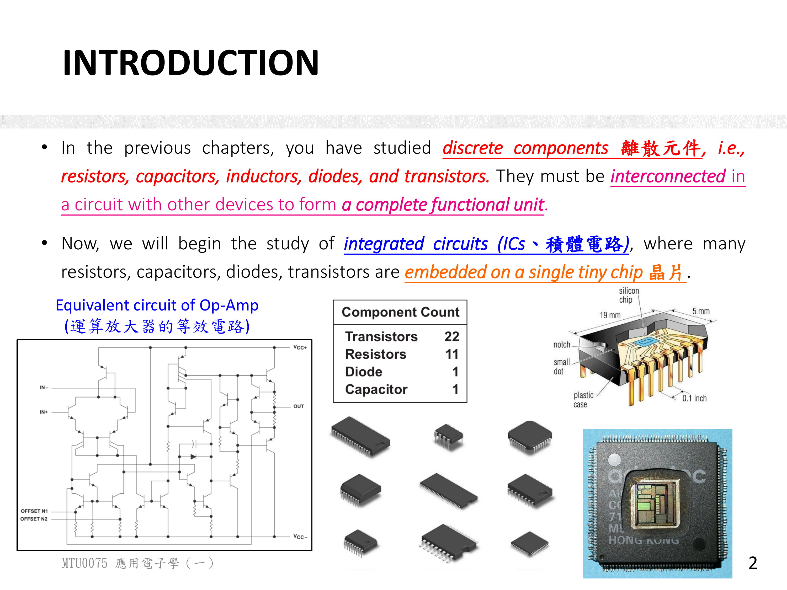

## INTRODUCTION (簡介)

* **Discrete Components (離散元件)**: Resistors, capacitors, inductors, diodes, and transistors. They must be interconnected in a circuit with other devices to form a complete functional unit.
* **Integrated Circuits (ICs, 積體電路)**: Many resistors, capacitors, diodes, and transistors are embedded on a single tiny chip (晶片).
* Equivalent circuit of Op-Amp (運算放大器的等效電路) consists of internal BJTs, resistors, capacitors, and diodes.

| Component | Count |
| :--- | :--- |
| Transistors | 22 |
| Resistors | 11 |
| Diode | 1 |
| Capacitor | 1 |

**note：**
* 離散元件 (Discrete Components) 如電阻、電容、電感、二極體和電晶體，必須與其他元件相互連接才能構成完整的功能電路。
* 積體電路 (ICs) 則是將許多電阻、電容、二極體和電晶體嵌入在單一微小晶片 (Chip) 上。
* Op-Amp 的內部等效電路包含差動輸入級、電流鏡、輸出驅動級等，由多個 BJT、電阻、電容和二極體組成。

---

**📄 Slide 03**

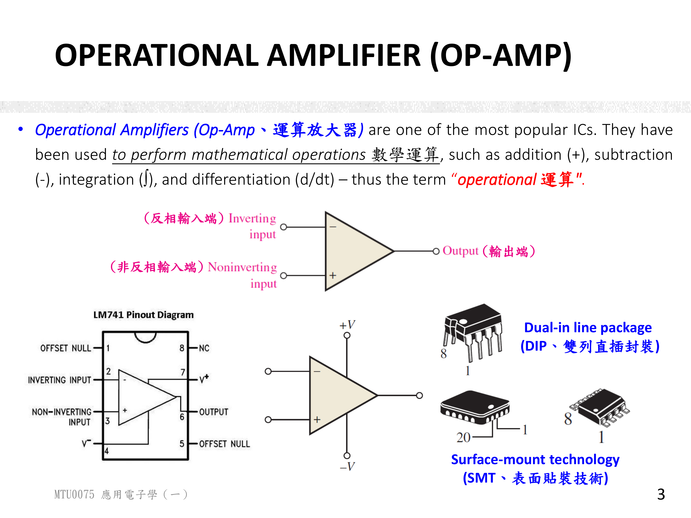

## OPERATIONAL AMPLIFIER (OP-AMP) OVERVIEW (運算放大器概述)

* **Op-Amp** (Operational Amplifier, 運算放大器) is one of the most popular ICs.
* Used to perform mathematical operations (數學運算): addition (+), subtraction (-), integration ($\int$), differentiation ($d/dt$).
* The term "operational" (運算) stems from its ability to perform these mathematical tasks.

### Op-Amp Symbol and Terminals

* **Inverting input (反相輸入端)**: Marked with minus sign (-)
* **Noninverting input (非反相輸入端)**: Marked with plus sign (+)
* **Output (輸出端)**: Single output at the triangle's apex
* **Power supply**: $+V$ and $-V$ terminals

### LM741 Pinout (8-pin DIP)

| Pin | Function |
| :--- | :--- |
| 1 | OFFSET NULL |
| 2 | INVERTING INPUT |
| 3 | NON-INVERTING INPUT |
| 4 | $V^-$ (Negative Supply) |
| 5 | OFFSET NULL |
| 6 | OUTPUT |
| 7 | $V^+$ (Positive Supply) |
| 8 | NC (No Connection) |

### Package Types

* **DIP (Dual-in-line Package, 雙列直插封裝)**: Two rows of pins through holes in PCB.
* **SMT (Surface-Mount Technology, 表面貼裝技術)**: Components mounted directly onto PCB surface.

**note：**
* 運算放大器 (Op-Amp) 是最常見的積體電路之一，名稱來自其能執行數學運算（加法、減法、積分、微分）的能力。
* Op-Amp 的電路符號為三角形，有兩個輸入端（反相輸入端 "-" 和非反相輸入端 "+"）及一個輸出端。
* LM741 是 8 腳位 DIP 封裝的經典 Op-Amp：腳位 2 為反相輸入，腳位 3 為非反相輸入，腳位 6 為輸出，腳位 7 和 4 分別為正負電源。
* 常見封裝有 DIP（雙列直插封裝，穿孔式）和 SMT（表面貼裝技術，表面黏著式）。

---

**📄 Slide 04**

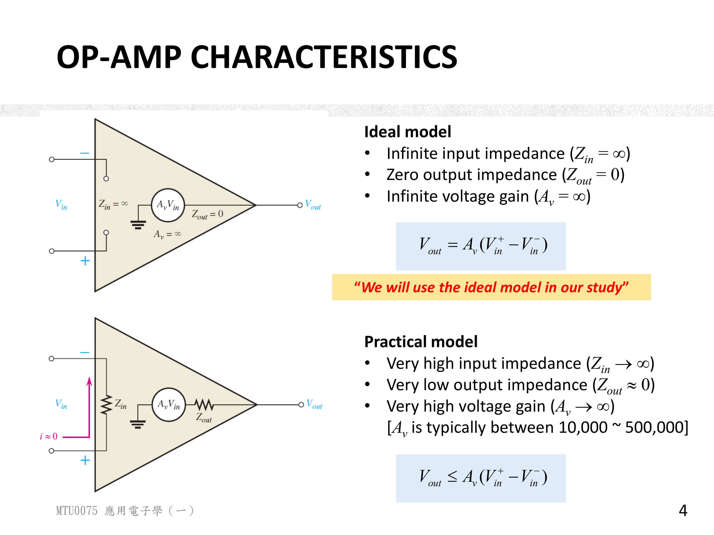

## OP-AMP CHARACTERISTICS (運算放大器特性)

### Ideal Model (理想模型)

* Infinite input impedance: $Z_{in} = \infty$
* Zero output impedance: $Z_{out} = 0$
* Infinite voltage gain: $A_v = \infty$

$$V_{out} = A_v(V_{in}^+ - V_{in}^-)$$

> "We will use the ideal model in our study."

### Practical Model (實際模型)

* Very high input impedance: $Z_{in} \to \infty$
* Very low output impedance: $Z_{out} \approx 0$
* Very high voltage gain: $A_v \to \infty$ (typically 10,000 ~ 500,000)
* Input current $i \approx 0$

$$V_{out} \le A_v(V_{in}^+ - V_{in}^-)$$

**note：**
* 理想 Op-Amp 的三大特性：
  * 輸入阻抗 $Z_{in} = \infty$（輸入端不消耗電流）
  * 輸出阻抗 $Z_{out} = 0$（輸出電壓不受負載影響）
  * 電壓增益 $A_v = \infty$（極大的開迴路增益）
* 輸出公式：$V_{out} = A_v(V_{in}^+ - V_{in}^-)$，即輸出電壓等於增益乘以兩輸入端的電壓差。
* 實際模型的 $A_v$ 通常在 10,000 ~ 500,000 之間，輸入電流 $i \approx 0$。
* 課程中將使用理想模型進行分析。

---

**📄 Slide 05**

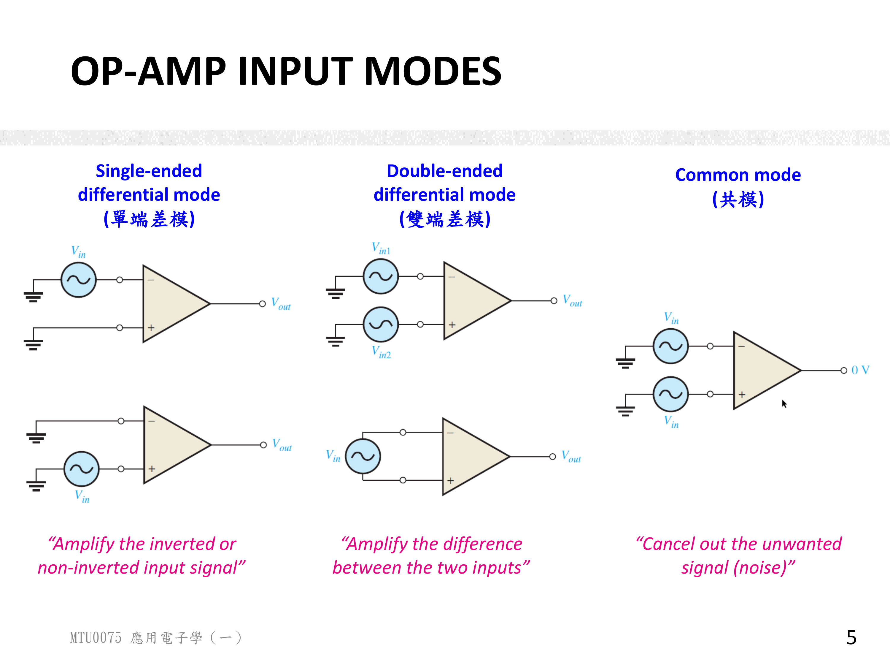

## OP-AMP INPUT MODES (運算放大器輸入模式)

| Mode | Description |
| :--- | :--- |
| **Single-ended differential mode** (單端差模) | "Amplify the inverted or non-inverted input signal." One input is grounded while signal $V_{in}$ is applied to the other. |
| **Double-ended differential mode** (雙端差模) | "Amplify the difference between the two inputs." Two separate input signals ($V_{in1}$ and $V_{in2}$) are applied to both inputs. |
| **Common mode** (共模) | "Cancel out the unwanted signal (noise)." Same signal $V_{in}$ is applied to both inputs simultaneously. Ideal output = 0 V. |

**note：**
* Op-Amp 的三種輸入模式：
  * **單端差模 (Single-ended)**：一個輸入端接地，訊號只加在另一個輸入端，放大該單端訊號。
  * **雙端差模 (Double-ended)**：兩個輸入端各加一個訊號，放大兩訊號的差值。
  * **共模 (Common mode)**：兩個輸入端加上相同的訊號，理想情況下輸出為 0V，此特性可消除雜訊。

---

**📄 Slide 06**

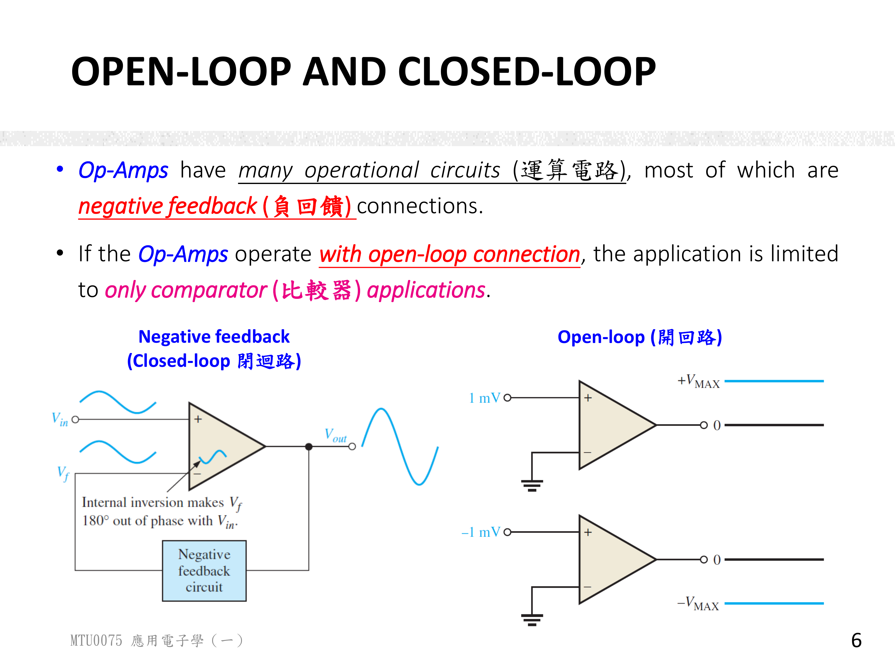

## OPEN-LOOP AND CLOSED-LOOP (開迴路與閉迴路)

### Negative Feedback - Closed-loop (負回饋 - 閉迴路)

* Most operational circuits for Op-Amps use **negative feedback** (負回饋) connections.
* A portion of the output signal is fed back to the inverting input.
* The feedback voltage $V_f$ is $180^\circ$ out of phase with the input voltage $V_{in}$.

### Open-loop (開迴路) - Comparator

* If Op-Amps operate with open-loop connection, the application is limited to **comparator** (比較器) applications.
* Even a very small input difference (e.g., 1 mV) causes the output to saturate at $+V_{MAX}$ or $-V_{MAX}$.

**note：**
* **閉迴路 (Closed-loop)**：大多數 Op-Amp 運算電路使用負回饋（Negative Feedback），將輸出的一部分回授到反相輸入端。回授電壓 $V_f$ 與輸入電壓 $V_{in}$ 相位差 $180^\circ$。
* **開迴路 (Open-loop)**：不使用回饋時，Op-Amp 只能用於比較器 (Comparator) 應用。由於開迴路增益極大，極小的輸入差（如 1 mV）就會使輸出飽和在最大正電壓或最大負電壓。

---

**📄 Slide 07**

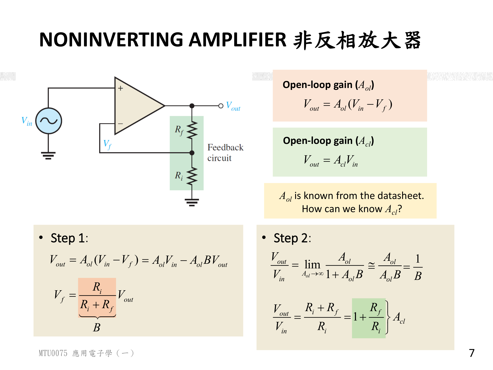

## NONINVERTING AMPLIFIER (非反相放大器) - Derivation

* **Open-loop gain**: $V_{out} = A_{ol}(V_{in} - V_f)$
* **Closed-loop gain**: $V_{out} = A_{cl}V_{in}$

### Step 1: Feedback Factor ($B$)

The feedback voltage is determined by the voltage divider:

$$V_f = \left(\frac{R_i}{R_i + R_f}\right)V_{out}$$

The feedback factor:

$$B = \frac{R_i}{R_i + R_f}$$

Substituting: $V_{out} = A_{ol}V_{in} - A_{ol}BV_{out}$

### Step 2: Closed-loop Gain

$$\frac{V_{out}}{V_{in}} = \lim_{A_{ol} \to \infty} \frac{A_{ol}}{1 + A_{ol}B} \cong \frac{A_{ol}}{A_{ol}B} = \frac{1}{B}$$

$$A_{cl} = \frac{V_{out}}{V_{in}} = \frac{R_i + R_f}{R_i} = 1 + \frac{R_f}{R_i}$$

> $A_{ol}$ is known from the datasheet. The closed-loop gain $A_{cl}$ depends only on the external resistors $R_f$ and $R_i$.

**note：**
* 非反相放大器的閉迴路增益推導：
  * 回授電壓 $V_f$ 由分壓器決定：$V_f = \frac{R_i}{R_i + R_f}V_{out}$
  * 回授因子 $B = \frac{R_i}{R_i + R_f}$
  * 當 $A_{ol} \to \infty$ 時，$\frac{V_{out}}{V_{in}} \approx \frac{1}{B}$
* 最終公式：$A_{cl} = 1 + \frac{R_f}{R_i}$
* 關鍵結論：閉迴路增益只取決於外部電阻 $R_f$ 和 $R_i$，與 Op-Amp 內部的開迴路增益 $A_{ol}$ 無關。

---

**📄 Slide 08**

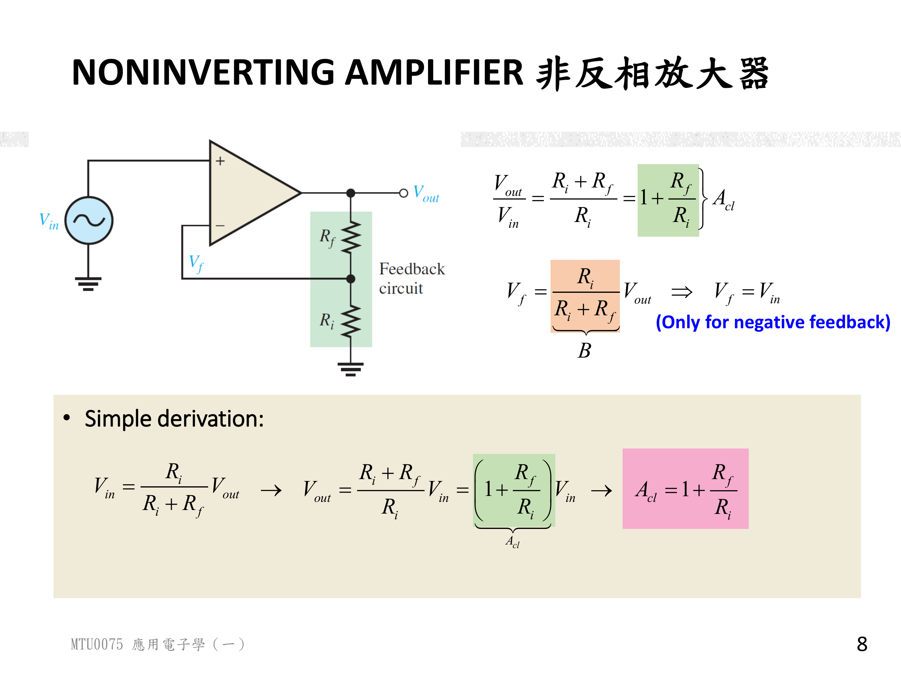

## NONINVERTING AMPLIFIER (非反相放大器) - Simple Derivation

### Key Equations

$$A_{cl} = \frac{V_{out}}{V_{in}} = 1 + \frac{R_f}{R_i}$$

$$V_f = \left(\frac{R_i}{R_i + R_f}\right)V_{out}$$

Under negative feedback: $V_f = V_{in}$

### Simple Derivation

Starting from the assumption that $V_f = V_{in}$ (virtual short in negative feedback):

1. Express $V_{in}$ using the voltage divider at the inverting input:

$$V_{in} = \frac{R_i}{R_i + R_f}V_{out}$$

2. Rearrange to solve for $V_{out}$:

$$V_{out} = \frac{R_i + R_f}{R_i}V_{in} = \left(1 + \frac{R_f}{R_i}\right)V_{in}$$

3. Define the closed-loop gain:

$$A_{cl} = 1 + \frac{R_f}{R_i}$$

**note：**
* 非反相放大器的簡易推導：
  * 在負回饋條件下，虛擬短路使得 $V_f = V_{in}$（即反相輸入端與非反相輸入端電壓相等）。
  * 由分壓關係：$V_{in} = \frac{R_i}{R_i + R_f}V_{out}$
  * 整理得：$V_{out} = (1 + \frac{R_f}{R_i})V_{in}$
  * 閉迴路增益：$A_{cl} = 1 + \frac{R_f}{R_i}$
* 此增益永遠大於或等於 1（當 $R_f = 0$ 時 $A_{cl} = 1$，即為電壓隨耦器）。

---

**📄 Slide 09**

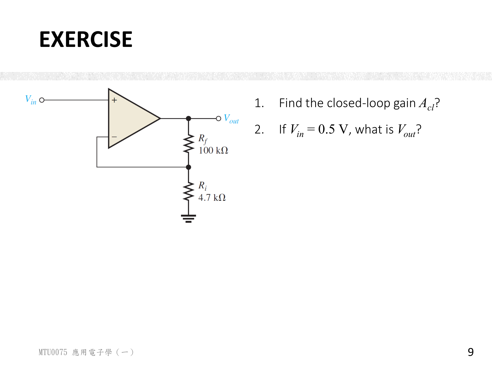

## EXERCISE - Noninverting Amplifier (練習 - 非反相放大器)

**Given:**
* Configuration: Non-inverting amplifier
* $R_f = 100\text{ k}\Omega$
* $R_i = 4.7\text{ k}\Omega$

**Questions:**

1. Find the closed-loop gain $A_{cl}$?

$$A_{cl} = 1 + \frac{R_f}{R_i} = 1 + \frac{100\text{ k}\Omega}{4.7\text{ k}\Omega} = 1 + 21.28 = 22.28$$

2. If $V_{in} = 0.5\text{ V}$, what is $V_{out}$?

$$V_{out} = A_{cl} \times V_{in} = 22.28 \times 0.5\text{ V} = 11.14\text{ V}$$

**note：**
* 已知 $R_f = 100\text{ k}\Omega$、$R_i = 4.7\text{ k}\Omega$ 的非反相放大器：
  * 閉迴路增益：$A_{cl} = 1 + \frac{100}{4.7} = 1 + 21.28 = 22.28$
  * 當輸入電壓 $V_{in} = 0.5\text{ V}$ 時，輸出電壓 $V_{out} = 22.28 \times 0.5 = 11.14\text{ V}$

---

**📄 Slide 10**

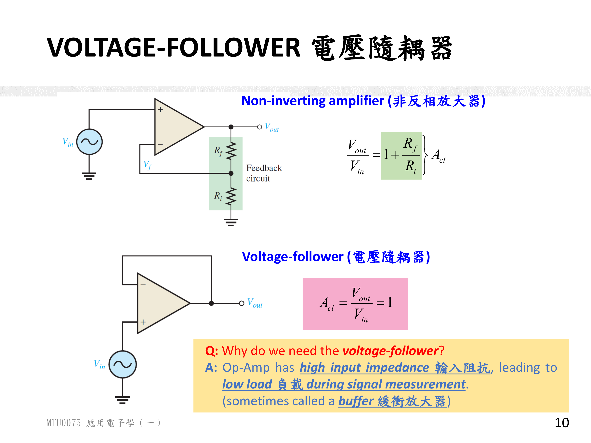

## VOLTAGE-FOLLOWER (電壓隨耦器)

* Derived from a non-inverting amplifier where the feedback is a direct connection (short circuit) from output to inverting input.
* The output voltage follows the input voltage exactly: $V_{out} = V_{in}$.

$$A_{cl} = \frac{V_{out}}{V_{in}} = 1$$

> **Q**: Why do we need the voltage-follower?
> **A**: Op-Amp has **high input impedance** (輸入阻抗), leading to **low load** (負載) during signal measurement. It is sometimes called a **buffer** (緩衝放大器).

**note：**
* 電壓隨耦器 (Voltage-Follower) 是非反相放大器的特例：將輸出直接短路連接到反相輸入端（$R_f = 0$，$R_i = \infty$）。
* 閉迴路增益 $A_{cl} = 1$，輸出電壓完全跟隨輸入電壓：$V_{out} = V_{in}$。
* 電壓隨耦器的主要用途是作為**緩衝器 (Buffer)**：利用 Op-Amp 極高的輸入阻抗，在量測訊號時對訊號源產生極小的負載效應，同時以極低的輸出阻抗驅動後級電路。

---

**📄 Slide 11**

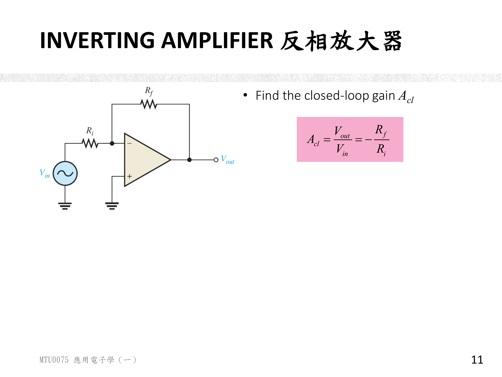

## INVERTING AMPLIFIER (反相放大器)

* Find the closed-loop gain $A_{cl}$:

$$A_{cl} = \frac{V_{out}}{V_{in}} = -\frac{R_f}{R_i}$$

> The negative sign indicates that the output is inverted ($180^\circ$ phase shift) with respect to the input.

**note：**
* 反相放大器 (Inverting Amplifier) 的閉迴路增益公式：
  * $A_{cl} = -\frac{R_f}{R_i}$
  * 負號表示輸出與輸入反相（相位差 $180^\circ$）。
* 與非反相放大器不同，反相放大器的增益可以小於 1（當 $R_f < R_i$ 時），也可等於或大於 1。
* 反相輸入端為**虛擬接地 (Virtual Ground)**，電位視為 0V。

---

**📄 Slide 12**

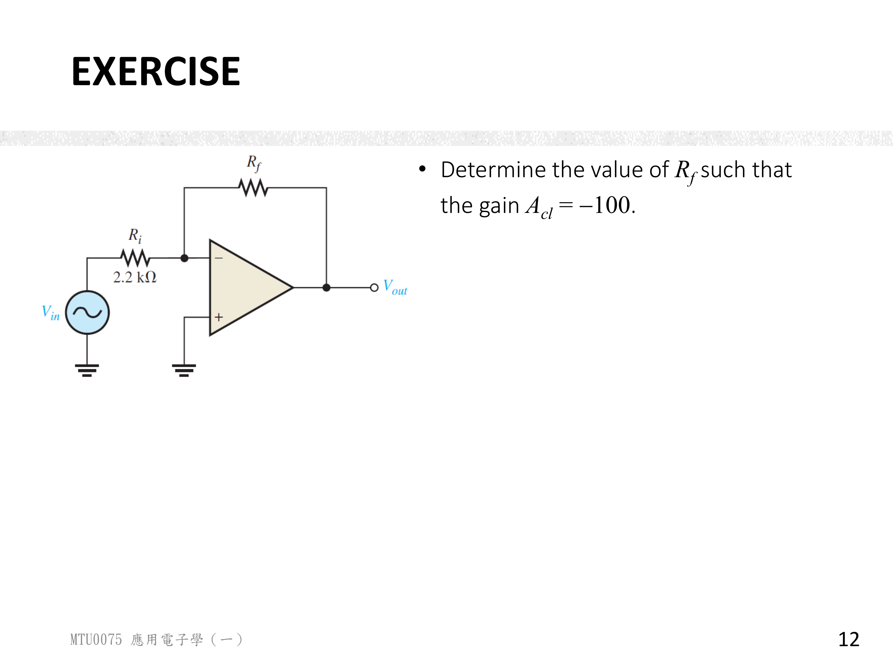

## EXERCISE - Inverting Amplifier (練習 - 反相放大器)

**Given:**
* Configuration: Inverting amplifier
* $R_i = 2.2\text{ k}\Omega$
* $A_{cl} = -100$

**Goal:** Determine the value of $R_f$.

$$A_{cl} = -\frac{R_f}{R_i}$$

$$-100 = -\frac{R_f}{2.2\text{ k}\Omega}$$

$$R_f = 100 \times 2.2\text{ k}\Omega = 220\text{ k}\Omega$$

**note：**
* 已知反相放大器的 $R_i = 2.2\text{ k}\Omega$，要求增益 $A_{cl} = -100$：
  * 由公式 $A_{cl} = -\frac{R_f}{R_i}$ 得 $-100 = -\frac{R_f}{2.2\text{ k}\Omega}$
  * 解得 $R_f = 100 \times 2.2\text{ k}\Omega = 220\text{ k}\Omega$

---

**📄 Slide 13**

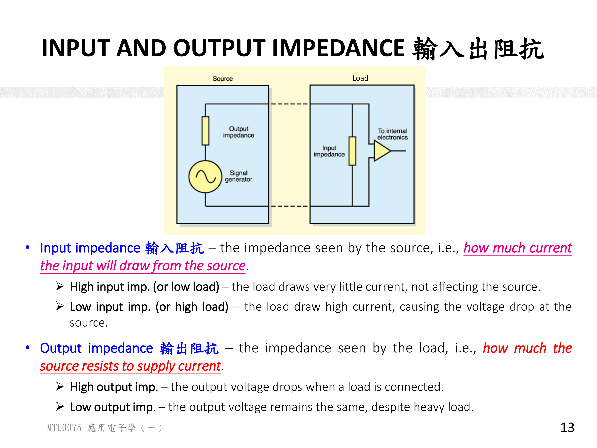

## INPUT AND OUTPUT IMPEDANCE (輸出入阻抗)

### Input Impedance (輸入阻抗)

The impedance seen by the source, representing how much current the input will draw from the source.

* **High input impedance (low load)**: The load draws very little current, not affecting the source.
* **Low input impedance (high load)**: The load draws high current, causing a voltage drop at the source.

### Output Impedance (輸出阻抗)

The impedance seen by the load, representing how much the source resists to supply current.

* **High output impedance**: The output voltage drops when a load is connected.
* **Low output impedance**: The output voltage remains the same, despite a heavy load.

**note：**
* **輸入阻抗 (Input Impedance)**：從訊號源看進去的阻抗，代表輸入端從訊號源抽取多少電流。
  * 高輸入阻抗（低負載）→ 抽取電流極小 → 不影響訊號源
  * 低輸入阻抗（高負載）→ 抽取電流大 → 造成訊號源電壓下降
* **輸出阻抗 (Output Impedance)**：從負載看進去的阻抗，代表輸出端供應電流的能力。
  * 高輸出阻抗 → 接上負載後輸出電壓下降
  * 低輸出阻抗 → 接上負載後輸出電壓幾乎不變

---

**📄 Slide 14**

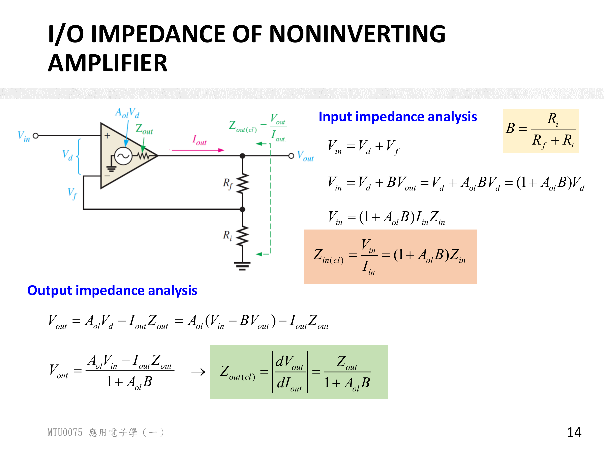

## I/O IMPEDANCE OF NONINVERTING AMPLIFIER (非反相放大器的輸出入阻抗)

### Feedback Fraction

$$B = \frac{R_i}{R_i + R_f}$$

### Input Impedance (Closed-Loop)

$$Z_{in(cl)} = (1 + A_{ol}B)Z_{in}$$

The closed-loop input impedance is increased by the factor $(1 + A_{ol}B)$.

### Output Impedance (Closed-Loop)

$$Z_{out(cl)} = \frac{Z_{out}}{1 + A_{ol}B}$$

The closed-loop output impedance is reduced by the factor $(1 + A_{ol}B)$.

**note：**
* 非反相放大器的輸出入阻抗公式：
  * 回授因子：$B = \frac{R_i}{R_i + R_f}$
  * 閉迴路輸入阻抗：$Z_{in(cl)} = (1 + A_{ol}B)Z_{in}$，因 $(1 + A_{ol}B)$ 非常大，使得輸入阻抗被大幅提升。
  * 閉迴路輸出阻抗：$Z_{out(cl)} = \frac{Z_{out}}{1 + A_{ol}B}$，因 $(1 + A_{ol}B)$ 非常大，使得輸出阻抗被大幅降低。
* 負回饋使 Op-Amp 的輸入阻抗更高、輸出阻抗更低，這是理想放大器的特性。

---

**📄 Slide 15**

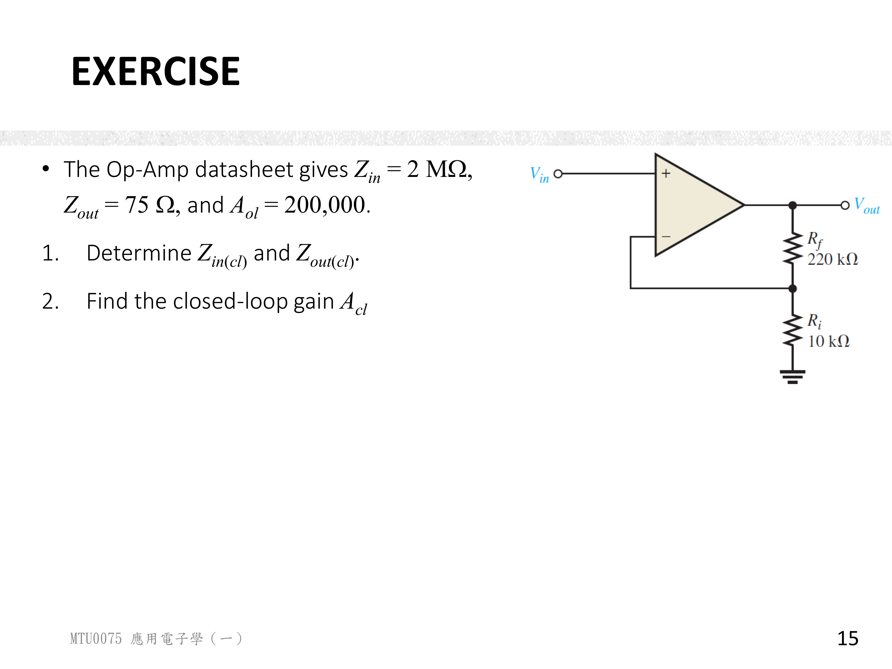

## EXERCISE - Noninverting I/O Impedance (練習 - 非反相放大器阻抗)

**Given:**
* $Z_{in} = 2\text{ M}\Omega$, $Z_{out} = 75\text{ }\Omega$, $A_{ol} = 200{,}000$
* $R_f = 220\text{ k}\Omega$, $R_i = 10\text{ k}\Omega$

**Step 1:** Calculate $B$:

$$B = \frac{R_i}{R_i + R_f} = \frac{10\text{ k}\Omega}{10\text{ k}\Omega + 220\text{ k}\Omega} = \frac{10}{230} \approx 0.0435$$

**Step 2:** Determine $Z_{in(cl)}$:

$$Z_{in(cl)} = (1 + A_{ol}B)Z_{in} = (1 + 200{,}000 \times 0.0435) \times 2\text{ M}\Omega = 8701 \times 2\text{ M}\Omega \approx 17.4\text{ G}\Omega$$

**Step 3:** Determine $Z_{out(cl)}$:

$$Z_{out(cl)} = \frac{Z_{out}}{1 + A_{ol}B} = \frac{75\text{ }\Omega}{8701} \approx 0.0086\text{ }\Omega$$

**Step 4:** Find $A_{cl}$:

$$A_{cl} = 1 + \frac{R_f}{R_i} = 1 + \frac{220\text{ k}\Omega}{10\text{ k}\Omega} = 23$$

**note：**
* 已知 $Z_{in} = 2\text{ M}\Omega$、$Z_{out} = 75\text{ }\Omega$、$A_{ol} = 200{,}000$、$R_f = 220\text{ k}\Omega$、$R_i = 10\text{ k}\Omega$：
  * 回授因子 $B = \frac{10}{230} \approx 0.0435$
  * 閉迴路輸入阻抗 $Z_{in(cl)} = (1 + 8700) \times 2\text{ M}\Omega \approx 17.4\text{ G}\Omega$（極高）
  * 閉迴路輸出阻抗 $Z_{out(cl)} = \frac{75}{8701} \approx 0.0086\text{ }\Omega$（極低）
  * 閉迴路增益 $A_{cl} = 23$

---

**📄 Slide 16**

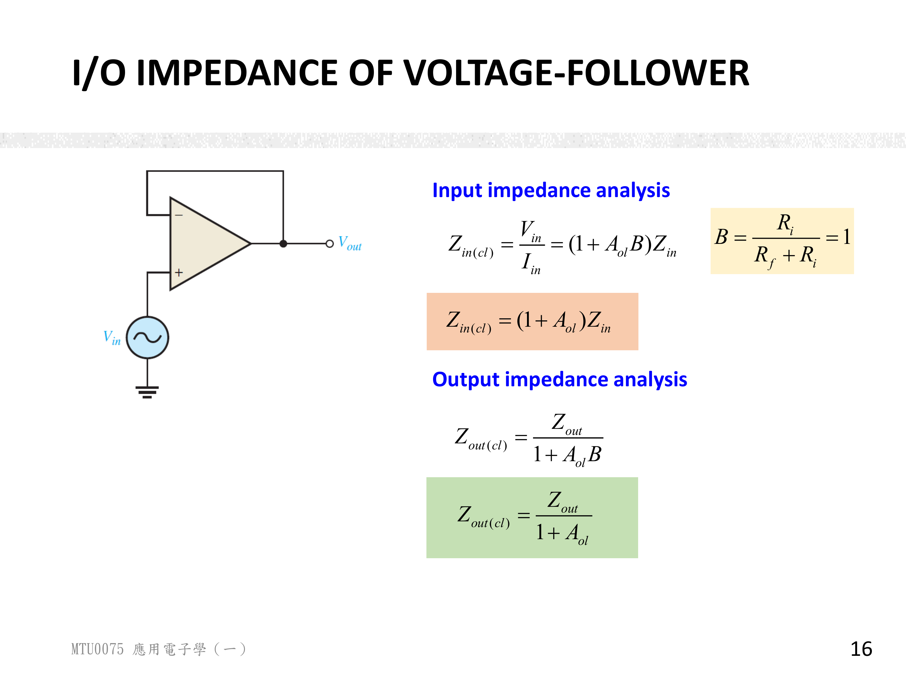

## I/O IMPEDANCE OF VOLTAGE-FOLLOWER (電壓隨耦器的輸出入阻抗)

For a voltage-follower, the feedback factor $B = 1$ (since $R_i = \infty$, $R_f = 0$).

### Input Impedance

$$Z_{in(cl)} = (1 + A_{ol}B)Z_{in} = (1 + A_{ol})Z_{in}$$

### Output Impedance

$$Z_{out(cl)} = \frac{Z_{out}}{1 + A_{ol}B} = \frac{Z_{out}}{1 + A_{ol}}$$

> The voltage-follower provides the **maximum improvement** in impedance characteristics because $B = 1$ (the largest possible feedback factor).

**note：**
* 電壓隨耦器的回授因子 $B = 1$（因為輸出直接連接到反相輸入端）。
* 閉迴路輸入阻抗：$Z_{in(cl)} = (1 + A_{ol})Z_{in}$，因 $A_{ol}$ 極大，輸入阻抗被提升至近乎無限大。
* 閉迴路輸出阻抗：$Z_{out(cl)} = \frac{Z_{out}}{1 + A_{ol}}$，輸出阻抗被壓低至近乎零。
* 電壓隨耦器提供**最大的阻抗改善**，因為 $B = 1$ 是所有回授組態中最大的回授因子，是最佳的緩衝器選擇。

---

**📄 Slide 17**

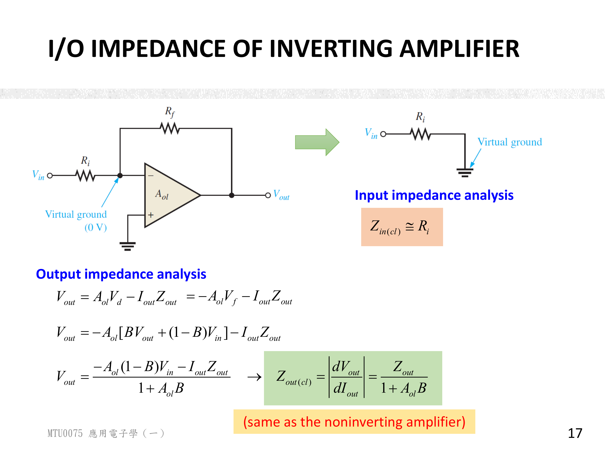

## I/O IMPEDANCE OF INVERTING AMPLIFIER (反相放大器的輸出入阻抗)

### Input Impedance

The input impedance of an inverting amplifier is approximately equal to the input resistor $R_i$ because the inverting input terminal is a **virtual ground** ($0\text{ V}$).

$$Z_{in(cl)} \cong R_i$$

### Output Impedance

$$Z_{out(cl)} = \frac{Z_{out}}{1 + A_{ol}B}$$

(Same formula as the noninverting amplifier.)

**note：**
* 反相放大器的阻抗特性：
  * **輸入阻抗**：$Z_{in(cl)} \approx R_i$，因為反相輸入端為**虛擬接地 (Virtual Ground)**，電位為 0V，所以從輸入端看進去的阻抗就約等於 $R_i$。
  * **輸出阻抗**：$Z_{out(cl)} = \frac{Z_{out}}{1 + A_{ol}B}$，與非反相放大器相同。
* 與非反相放大器相比，反相放大器的輸入阻抗較低（受限於 $R_i$），這是反相放大器的主要缺點。

---

**📄 Slide 18**

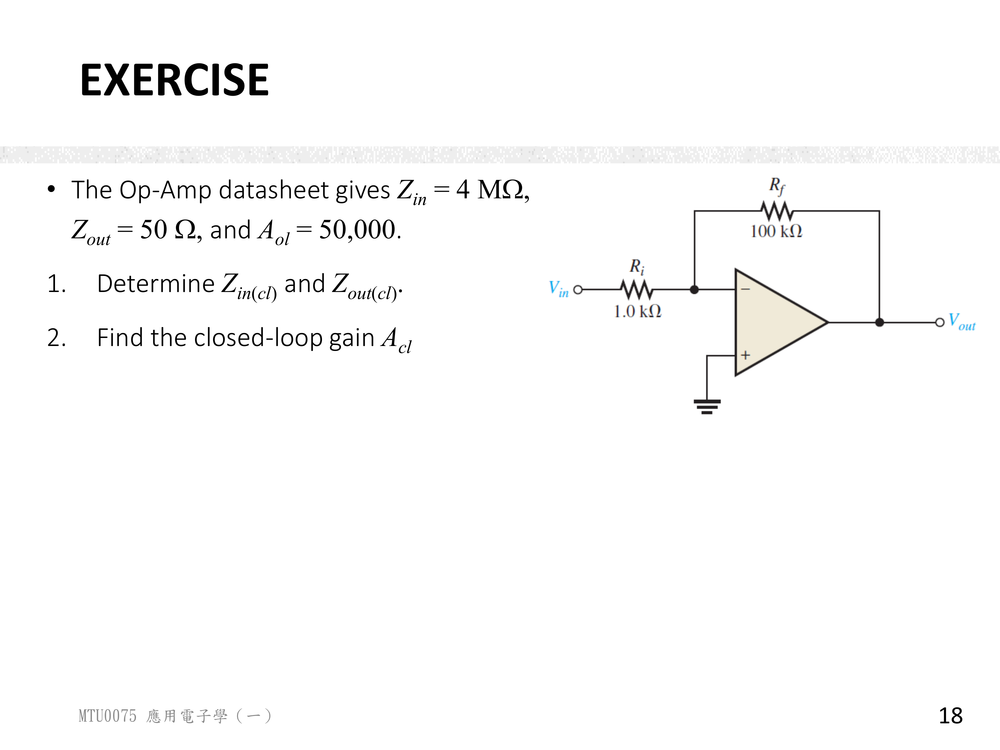

## EXERCISE - Inverting I/O Impedance (練習 - 反相放大器阻抗)

**Given:**
* $Z_{in} = 4\text{ M}\Omega$, $Z_{out} = 50\text{ }\Omega$, $A_{ol} = 50{,}000$
* $R_i = 1.0\text{ k}\Omega$, $R_f = 100\text{ k}\Omega$

**Step 1:** Calculate $B$:

$$B = \frac{R_i}{R_i + R_f} = \frac{1.0\text{ k}\Omega}{1.0\text{ k}\Omega + 100\text{ k}\Omega} = \frac{1}{101} \approx 0.0099$$

**Step 2:** Determine $Z_{in(cl)}$:

$$Z_{in(cl)} \cong R_i = 1.0\text{ k}\Omega$$

**Step 3:** Determine $Z_{out(cl)}$:

$$Z_{out(cl)} = \frac{Z_{out}}{1 + A_{ol}B} = \frac{50\text{ }\Omega}{1 + 50{,}000 \times 0.0099} = \frac{50}{496} \approx 0.101\text{ }\Omega$$

**Step 4:** Find $A_{cl}$:

$$A_{cl} = -\frac{R_f}{R_i} = -\frac{100\text{ k}\Omega}{1.0\text{ k}\Omega} = -100$$

**note：**
* 已知 $Z_{in} = 4\text{ M}\Omega$、$Z_{out} = 50\text{ }\Omega$、$A_{ol} = 50{,}000$、$R_i = 1.0\text{ k}\Omega$、$R_f = 100\text{ k}\Omega$：
  * 回授因子 $B = \frac{1}{101} \approx 0.0099$
  * 閉迴路輸入阻抗 $Z_{in(cl)} \approx R_i = 1.0\text{ k}\Omega$（遠低於非反相放大器）
  * 閉迴路輸出阻抗 $Z_{out(cl)} = \frac{50}{496} \approx 0.101\text{ }\Omega$（極低）
  * 閉迴路增益 $A_{cl} = -100$

---

**📄 Slide 19**

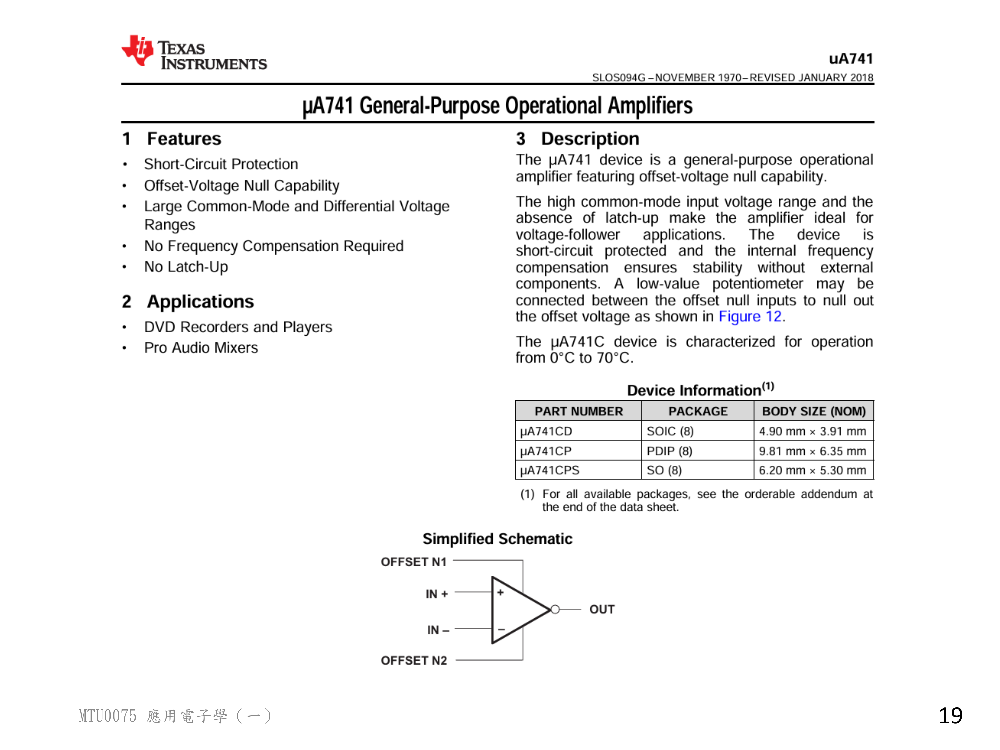

## uA741 General-Purpose Operational Amplifiers (uA741 通用型運算放大器)

### Features

* Short-Circuit Protection (短路保護)
* Offset-Voltage Null Capability (偏移電壓歸零功能)
* Large Common-Mode and Differential Voltage Ranges (大共模與差模電壓範圍)
* No Frequency Compensation Required (無需頻率補償)
* No Latch-Up (無閂鎖效應)

### Applications

* DVD Recorders and Players
* Pro Audio Mixers

### Description

The uA741 device is a general-purpose operational amplifier featuring offset-voltage null capability.

**note：**
* uA741 是最經典的通用型運算放大器之一，由 Texas Instruments (TI) 生產。
* 主要特點：短路保護、偏移電壓可調零、大共模與差模電壓範圍、無需額外頻率補償、無閂鎖效應。
* 應用場合：DVD 錄放影機、專業音響混音器等。

---

**📄 Slide 20**

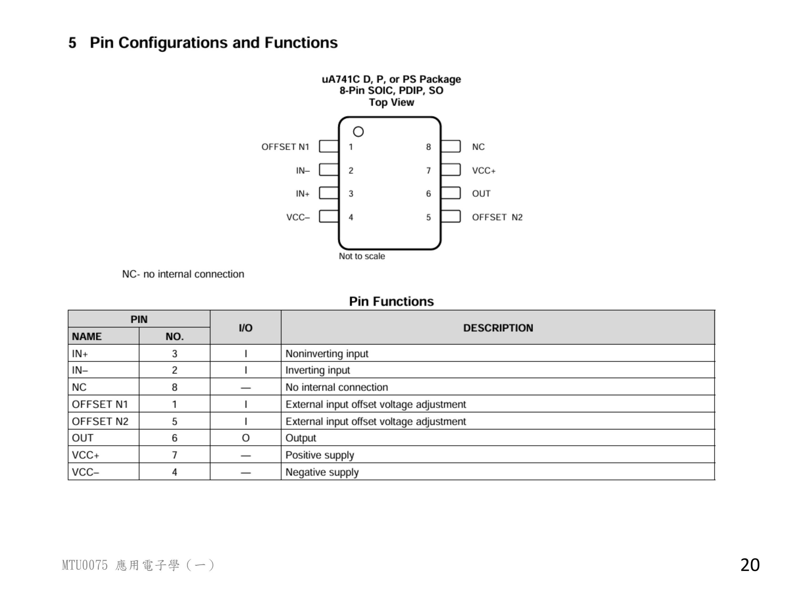

## uA741 PIN CONFIGURATION AND FUNCTIONS (uA741 腳位配置與功能)

### Pin Configuration (8-Pin SOIC, PDIP, SO)

| Pin | Name | Function |
| :--- | :--- | :--- |
| 1 | OFFSET N1 | External input offset voltage adjustment |
| 2 | IN- | Inverting input (反相輸入) |
| 3 | IN+ | Noninverting input (非反相輸入) |
| 4 | VCC- | Negative supply (負電源) |
| 5 | OFFSET N2 | External input offset voltage adjustment |
| 6 | OUT | Output (輸出) |
| 7 | VCC+ | Positive supply (正電源) |
| 8 | NC | No internal connection (未連接) |

### Pin Functions

| Pin Name | Pin No. | I/O | Description |
| :--- | :--- | :--- | :--- |
| IN+ | 3 | I | Noninverting input |
| IN- | 2 | I | Inverting input |
| NC | 8 | -- | No internal connection |
| OFFSET N1 | 1 | I | External input offset voltage adjustment |
| OFFSET N2 | 5 | I | External input offset voltage adjustment |
| OUT | 6 | O | Output |
| VCC+ | 7 | -- | Positive supply |
| VCC- | 4 | -- | Negative supply |

**note：**
* uA741 的 8 腳位封裝（SOIC、PDIP、SO）：
  * 腳位 2 (IN-)：反相輸入端
  * 腳位 3 (IN+)：非反相輸入端
  * 腳位 6 (OUT)：輸出端
  * 腳位 7 (VCC+)：正電源
  * 腳位 4 (VCC-)：負電源
  * 腳位 1 和 5 (OFFSET N1/N2)：外部偏移電壓調整
  * 腳位 8 (NC)：未連接

---

**📄 Slide 21**

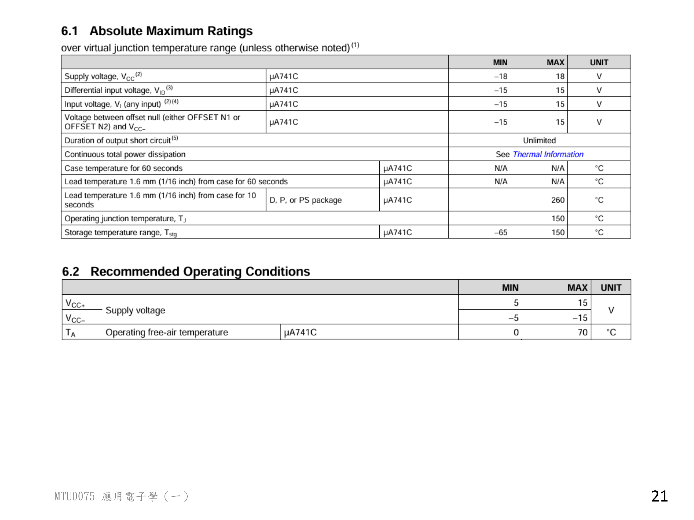

## uA741 ABSOLUTE MAXIMUM RATINGS AND RECOMMENDED CONDITIONS (uA741 絕對最大額定值與建議條件)

### Absolute Maximum Ratings

| Parameter | MIN | MAX | UNIT |
| :--- | :---: | :---: | :---: |
| Supply voltage $V_{CC}$ | -18 | 18 | V |
| Differential input voltage $V_{ID}$ | -15 | 15 | V |
| Input voltage $V_I$ (any input) | -15 | 15 | V |
| Output short-circuit duration | Unlimited | | |
| Operating junction temperature $T_J$ | | 150 | $^\circ$C |
| Storage temperature range $T_{stg}$ | -65 | 150 | $^\circ$C |

### Recommended Operating Conditions

| Parameter | MIN | MAX | UNIT |
| :--- | :---: | :---: | :---: |
| $V_{CC+}$ Supply voltage | 5 | 15 | V |
| $V_{CC-}$ Supply voltage | -5 | -15 | V |
| $T_A$ Operating free-air temperature | 0 | 70 | $^\circ$C |

**note：**
* uA741 的絕對最大額定值：
  * 電源電壓：$\pm 18\text{ V}$（不可超過）
  * 差動輸入電壓：$\pm 15\text{ V}$
  * 輸入電壓：$\pm 15\text{ V}$
  * 輸出短路保護：無時間限制
* 建議操作條件：
  * 電源電壓：$\pm 5\text{ V}$ 到 $\pm 15\text{ V}$
  * 操作溫度：$0^\circ\text{C}$ 到 $70^\circ\text{C}$

---

**📄 Slide 22**

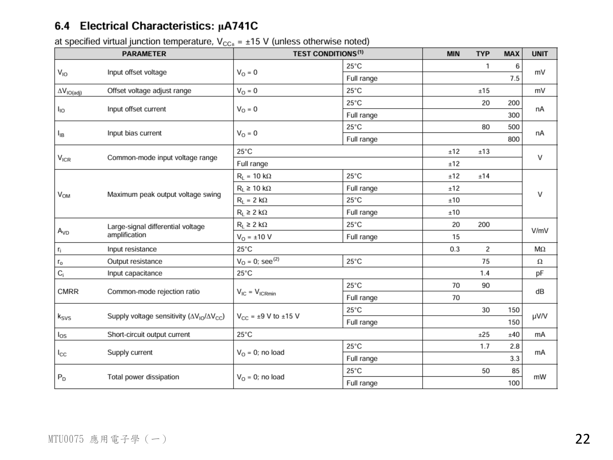

## uA741 ELECTRICAL CHARACTERISTICS (uA741 電氣特性)

at $V_{CC\pm} = \pm 15\text{ V}$, $T_A = 25^\circ\text{C}$ (unless otherwise noted)

| Parameter | Symbol | MIN | TYP | MAX | UNIT |
| :--- | :--- | :---: | :---: | :---: | :---: |
| Input offset voltage | $V_{IO}$ | | 1 | 6 | mV |
| Input offset current | $I_{IO}$ | | 20 | 200 | nA |
| Input bias current | $I_{IB}$ | | 80 | 500 | nA |
| Common-mode input voltage range | $V_{ICR}$ | $\pm 12$ | $\pm 13$ | | V |
| Maximum peak output voltage swing ($R_L = 10\text{ k}\Omega$) | $V_{OM}$ | $\pm 12$ | $\pm 14$ | | V |
| Large-signal differential voltage amplification | $A_{VD}$ | 20 | 200 | | V/mV |
| Input resistance | $r_i$ | 0.3 | 2 | | M$\Omega$ |
| Output resistance | $r_o$ | | 75 | | $\Omega$ |
| Input capacitance | $C_i$ | | 1.4 | | pF |
| Common-mode rejection ratio | CMRR | 70 | 90 | | dB |
| Short-circuit output current | $I_{OS}$ | | $\pm 25$ | $\pm 40$ | mA |
| Supply current (no load) | $I_{CC}$ | | 1.7 | 2.8 | mA |
| Total power dissipation (no load) | $P_D$ | | 50 | 85 | mW |

**note：**
* uA741 的關鍵電氣特性（典型值 @ $\pm 15\text{ V}$，$25^\circ\text{C}$）：
  * 輸入偏移電壓：1 ~ 6 mV
  * 輸入偏壓電流：80 ~ 500 nA
  * 輸入電阻：0.3 ~ 2 M$\Omega$（典型 2 M$\Omega$）
  * 輸出電阻：75 $\Omega$
  * 開迴路增益（Large-signal differential voltage amplification）：20 ~ 200 V/mV（典型 200 V/mV = 200,000）
  * 共模抑制比 (CMRR)：70 ~ 90 dB
  * 輸入電容：1.4 pF
  * 最大輸出電壓擺幅：$\pm 12$ ~ $\pm 14$ V（$R_L = 10\text{ k}\Omega$）

---

**📄 Slide 23**

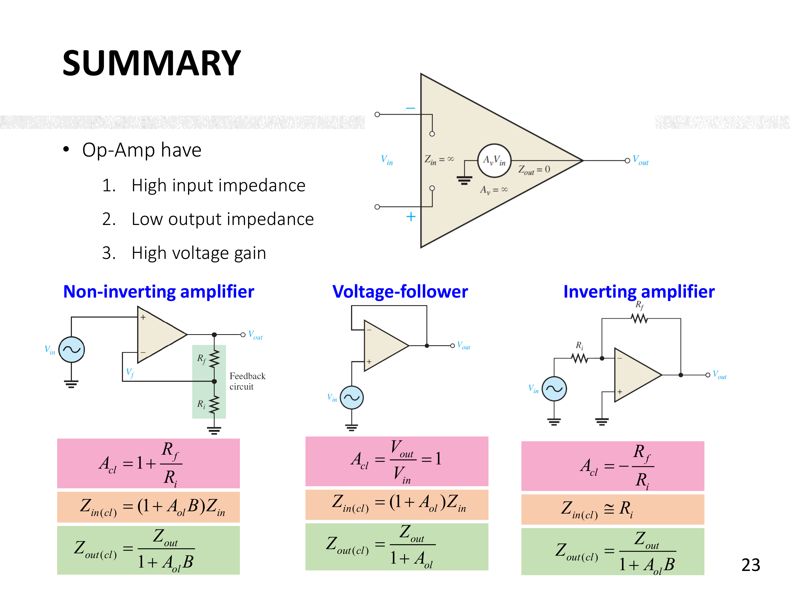

## SUMMARY (總結)

Op-Amps have:
1. High input impedance (高輸入阻抗)
2. Low output impedance (低輸出阻抗)
3. High voltage gain (高電壓增益)

### Three Amplifier Types Summary

| | Non-inverting Amplifier | Voltage-Follower | Inverting Amplifier |
| :--- | :--- | :--- | :--- |
| **Gain** $A_{cl}$ | $1 + \frac{R_f}{R_i}$ | $1$ | $-\frac{R_f}{R_i}$ |
| **Input Impedance** $Z_{in(cl)}$ | $(1 + A_{ol}B)Z_{in}$ | $(1 + A_{ol})Z_{in}$ | $\cong R_i$ |
| **Output Impedance** $Z_{out(cl)}$ | $\frac{Z_{out}}{1 + A_{ol}B}$ | $\frac{Z_{out}}{1 + A_{ol}}$ | $\frac{Z_{out}}{1 + A_{ol}B}$ |

**note：**
* Op-Amp 的三大特性：高輸入阻抗、低輸出阻抗、高電壓增益。
* 三種放大器總整理：
  * **非反相放大器**：$A_{cl} = 1 + \frac{R_f}{R_i}$（增益 $\ge 1$），輸入阻抗被大幅提升，輸出阻抗被大幅降低。
  * **電壓隨耦器**：$A_{cl} = 1$，$B = 1$ 提供最大的阻抗改善，是最佳的緩衝器。
  * **反相放大器**：$A_{cl} = -\frac{R_f}{R_i}$（增益可正可負），輸入阻抗約等於 $R_i$，輸出阻抗同樣被降低。

---

---

## 章節重點總結 (Chapter Summary)

本章介紹運算放大器 (Op-Amp) 的基本特性、三種基本電路組態及其輸出入阻抗分析：

### 1. Op-Amp 基本概念
* **離散元件 vs 積體電路**：Op-Amp 是一種積體電路 (IC)，內部包含多個 BJT、電阻、電容和二極體。
* **理想模型**：$Z_{in} = \infty$、$Z_{out} = 0$、$A_v = \infty$。
* **輸出公式**：$V_{out} = A_v(V_{in}^+ - V_{in}^-)$。
* **輸入模式**：單端差模、雙端差模、共模。

### 2. 開迴路與閉迴路
* **閉迴路 (負回饋)**：將輸出的一部分回授到反相輸入端，使增益穩定且可由外部電阻控制。
* **開迴路**：增益極大，只適用於比較器 (Comparator) 應用。

### 3. 非反相放大器 (Noninverting Amplifier)
* 增益：$A_{cl} = 1 + \frac{R_f}{R_i}$
* 回授因子：$B = \frac{R_i}{R_i + R_f}$
* 輸入阻抗：$Z_{in(cl)} = (1 + A_{ol}B)Z_{in}$（大幅提升）
* 輸出阻抗：$Z_{out(cl)} = \frac{Z_{out}}{1 + A_{ol}B}$（大幅降低）

### 4. 電壓隨耦器 (Voltage-Follower)
* 增益：$A_{cl} = 1$（$V_{out} = V_{in}$）
* 用途：緩衝器 (Buffer)，提供極高輸入阻抗與極低輸出阻抗。
* $B = 1$，阻抗改善最大。

### 5. 反相放大器 (Inverting Amplifier)
* 增益：$A_{cl} = -\frac{R_f}{R_i}$（輸出反相）
* 輸入阻抗：$Z_{in(cl)} \cong R_i$（受限於輸入電阻）
* 輸出阻抗：$Z_{out(cl)} = \frac{Z_{out}}{1 + A_{ol}B}$

### 6. uA741 資料手冊
* 通用型 Op-Amp，8 腳位 DIP 封裝。
* 建議電源：$\pm 5\text{ V}$ 到 $\pm 15\text{ V}$（最大 $\pm 18\text{ V}$）。
* 典型開迴路增益：200,000（200 V/mV）。
* 典型輸入電阻：2 M$\Omega$，輸出電阻：75 $\Omega$。

[Source: Ch9_Operational_Amplifier.pdf](../course-materials/Ch9_Operational_Amplifier.pdf)